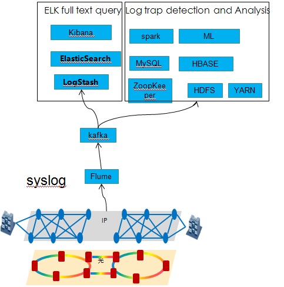

# Network Artificial Intelligence

# Team

| **Name** | **Organization** | **Email** |
| --- | --- | --- |
| Robin Lee | Huawei Techonologies | [lizhenbin@huawei.com](mailto:lizhenbin@huawei.com) |
| Jiang Rui | Huawei Techonologies | [jiangrui1@huawei.com](mailto:Partick.Liu@huawei.com) |
| Jin Gan | Huawei Techonologies | [Jin.Gan1@huawei.com](mailto:Jin.Gan@huawei.com) |

# Introduction

Artificial Intelligence is an important technical trend in the industry. The two key aspects of Artificial Intelligence are  
 perception and cognition. Artificial Intelligence has evolved from an early non-learning expert system to a learning-

capable machine learning era. In recent years, the rapid development of the deep learning branch based on the n-

eural network and the maturity of the big data technology and software distributed architecture make the Artificial

Intelligence in many fields (such as transportation, medical treatment, education, etc.) have been applied. With the

development of network, it is necessary to introduce artificial intelligence technology to achieve self-adjustment, self-  
 optimization, self-recovery of the network through collection of huge data of network state and machine learning. T-he

areas of machine learning which are easier to be used in the network field may include: troubleshooting of network pr-

oblems, network traffic prediction, traffic optimization adjustment, security defense, security auditing, etc., to imple-

ment network perception and cognition.

# What we do

# Project Plan

# Meetings
