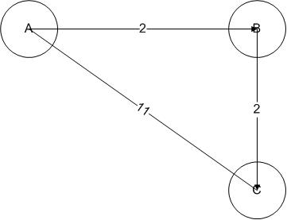
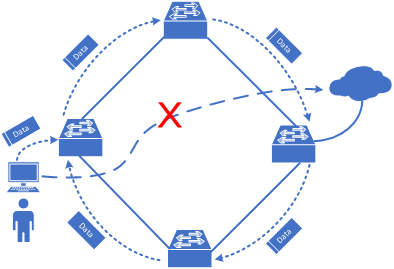
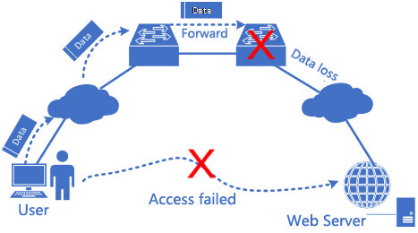
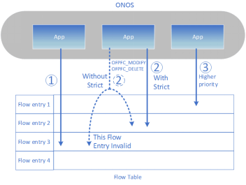

# Network TroubleShooting Module

# 

# Overview

    The goal of the project is to implement a Troubleshooting module into the ONOS platform. It aims to improve the reliability of  SDN networks and mainly helps solve three problems:

* Routing loop
* Routing black hole
* App conflict

# Introduction

    The following illustrates details of the three problems we mentioned above and what proposed to do to detect these problems :

### Routing Loop

    A routing loop is a common problem with various types of networks, particularly computer networks. They are formed when an error occurs in the operation of the routing algorithm, and as a result, in a group of nodes, the path to a particular destination forms a loop.  
    In the simplest version, a routing loop of size two, node A thinks that the path to some destination (call it C) is through its neighbouring node, node B. At the same time, node B thinks that the path to C starts at node A.  
    Thus, whenever traffic for C arrives at either A or B, it will loop endlessly between A and B, unless some mechanism exists to prevent that behaviour.

    Through analyzing flow entries of the whole network, we can detect whether routing loops exist in the network, in real time. We are then able to provide detailed information of faulted flow entries. Moreover, we can show the characteristics of the data flows that will trigger the Loop Storm.

### Routing black hole

    In networking, black holes refer to places in the network where incoming or outgoing traffic is silently discarded (or "dropped"), without informing the source that the data did not reach its intended recipient.

    By analyzing flow entries of each hop at the data path, we can reappear the path and find out the switch nodes where the routing black hole exists. Finally, we can give you some suggestions on the reason why the path is faulted, and provide relative flow contents and debug information.

### App conflict

    App conflicts offen occur in SDN network because of inconsistent policies which are instructed by different applicatons. After detecting network failures, we will provide timestamps of deploying the flow entries and detailed stack information of procedure calls to help engineers solve the related app conflict problem.

# Proposed work

### Algorithms

    In the network troubleshooting module ,two algorithms are proposed to designed and realized to detect the problems mentioned ablove:

* Routing Loop Detection Algorithm
* Routing Black Hole Detection Algorithm

### User Interfaces

There are several ways proposed to be realized in the troubleshooting module that an operator can interact with this module :

* CLI : The administrative interface to manage the troubleshooting module.
* GUI : Show infomation of the problem detected by troubleshooting module.
* REST API : A RESTful interface that can be used by the other module.

# Contributors

| Name | Organization | Email |
| --- | --- | --- |
| Maojianwei | BUPT.FNL | maojianwei2020@[gmail.com](http://gmail.com) |
| Wangzenan | BUPT.FNL | 1023386898@[qq.com](http://qq.com) |
| Caorui | BUPT.FNL | [ruicao@bupt.edu.cn](mailto:ruicao@bupt.edu.cn) |
