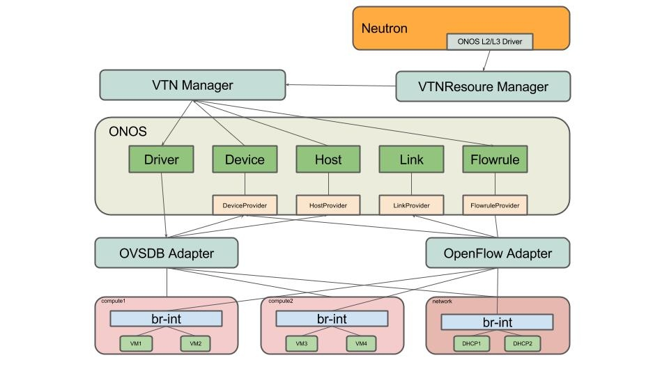
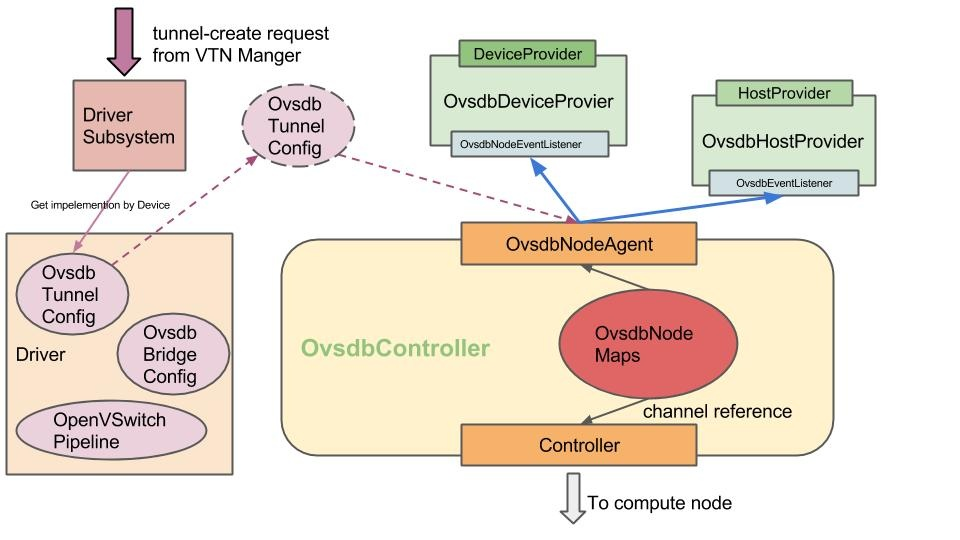
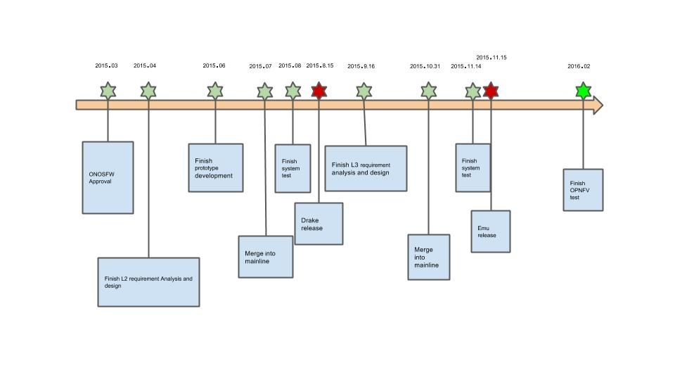

# ONOS Framework (ONOSFW) for OPNFV

# Team

| **Name** | **Organization** | **Email** |
| --- | --- | --- |
| Patrick Liu | Huawei Techonologies | [Partick.Liu@huawei.com](mailto:Partick.Liu@huawei.com) |
| Jiang Rui | Huawei Techonologies | [jiangrui1@huawei.com](mailto:Partick.Liu@huawei.com) |
| Jiang Chuncheng | Huawei Techonologies | [jiangchuncheng@huawei.com](mailto:jiangchuncheng@huawei.com) |
| Li Shuai | Huawei Techonologies | [lishuai12@huawei.com](mailto:lishuai12@huawei.com) |
| Lu Kai | Huawei Techonologies | [lukai1@huawei.com](mailto:lukai1@huawei.com) |
| Xu Zhang | Huawei Techonologies | [xuzhang.xuzhang@huawei.com](mailto:xuzhang.xuzhang@huawei.com) |
| Zhang Yuanyou | Huawei Techonologies | [zhangyuanyou@huawei.com](mailto:zhangyuanyou@huawei.com) |
| Zhou Bo | Huawei Techonologies | [bob.zh@huawei.com](mailto:bob.zh@huawei.com) |

# Introduction

ONOSFW, short for ONOS Framework, is an project in OPNFV.

See following link for the details.  [ONOS Framework Project Link](https://wiki.opnfv.org/onosfw);

The architecture of ONOSFW as below:

# What we do

## Neutron L2/L3 driver plugin

## VTN Resource manager

It's a application.

* Provider REST services for Neutron.
* Provider distributed store for Neutron resources.
* Provider unified API for other applications

## VTN manager

It's also a application. Takes charge of listening event from ONOS core or VTN resource manager application and applying configurations to network elements.

Details as below:

* Listens the event that Neutron compute node and network node , both named *Controller* , are detected or vanished, and then applies or remove configuration(tunnel and OVS) via driver subsystem.
* Listens the event that OVS is detected or vanished, and then applies or removes the default forwarding rules into OVS.
* Listens the event that Host is detected or vanished, and then applies or removes L2 rules into OVS.
* Listens the event that floating IP、route、route interface are changed, and then applies or removes L3 rules into OVS

## Core Enhancement

New behaviors and their OVSDB-based implementation are added in driver subsystem.

*TunnelConfig:*Behaviour for handling various drivers for tunnel configuration.

*OvsdbTunnelConfig*: OVSDB-based implementation of tunnel config behaviour.

*BridgeConfig:*Behaviour for handling various drivers for bridge configurations.

*OvsdbBridgeConfig*: OVSDB-based implementation of bridge config behaviour.

*OpenVSwitchPipeline:*Behaviour for handling traffic under Virtual data center scenario.

## OVSDB Adapter

Class diagram as below:

# Project Plan

## Road map

## Drake Release

### Goals

* Support communications among VMs within the same network in L2 via overlay technology. e.g. Vxlan.

## Emu Release

### Goals

* Support communications among VMs within the same tenant across different networks
* Support tenant VM Internet access
* Support VM migrations
* Refactor VTN Manager application and VTN resource manager application

* Enhance the fault-tolerant capacity

# The usage of ONOSFW

* Click link：<http://forum.onosfw.com/t/how-to-integrate-onos-with-openstack/68>

# Video

* ONOSFW L2 Function Flash video：<https://www.youtube.com/watch?v=7bxjWrR4peI>
* ONOSFW L2 Function Demo video：<https://www.youtube.com/watch?v=qP8nPYhz_Mo>
* ONOSFW L3 Function Demo video：<https://www.youtube.com/watch?v=R0H-IibpVxw>
