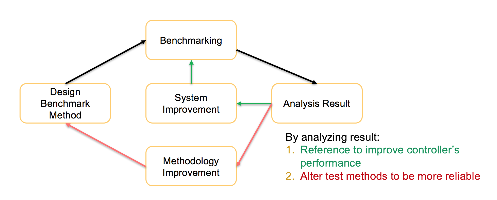

# ONOS Performance Benchmark and Improvement

# 

# Team

| Name | Organization | Email |
| --- | --- | --- |
| Mu Yubo | CAICT | [muyubo@mail.ritt.com.cn](mailto:muyubo@mail.ritt.com.cn) |
| Song Fei | CAICT | [songfei@ritt.cn](mailto:songfei@ritt.cn) |
| Ma Junfeng | CAICT | [majunfeng@ritt.cn](mailto:majunfeng@ritt.cn) |
| Ji Ye | sdn.Lab | [jiye@sdnlab.com](mailto:jiye@sdnlab.com) |
| Li Rong | sdn.Lab | [lirong@sdnlab.com](mailto:lirong@sdnlab.com) |
| You Wang | ON Lab | [you@onlab.us](mailto:you@onlab.us) |
| Jin Gan | Huawei | [Jin.Gan@huawei.com](mailto:Jin.Gan@huawei.com) |
| Li Xiaoguang | Huawei | [lixiaoguang5@huawei.com](mailto:lixiaoguang5@huawei.com) |
| Sojan Koshy | Huawei | [sojan.koshy@huawei.com](mailto:sojan.koshy@huawei.com) |
| Guo Wen | Huawei | [guowen@huawei.com](mailto:guowen@huawei.com) |
| Jiang Rui | Huawei | [henry.jiangrui@huawei.com](mailto:henry.jiangrui@huawei.com) |
| Zhou Bo | Huawei | [bob.zh@huawei.com](mailto:bob.zh@huawei.com) |
| Tang Zhijun | BII | [zjtang@biigroup.cn](mailto:zjtang@biigroup.cn) |
| Li Zhen | BII | [zli@biigroup.com](mailto:zli@biigroup.com) |
| Zhang Pan | BII | [pzhang@biigroup.cn](mailto:pzhang@biigroup.cn) |
| Yang Hong | BII | [hyang@biigroup.cn](mailto:hyang@biigroup.cn) |

# Introduction

We want to set up a long team performance testing project in ONOS community.There are four partners will join in this project. They are CAICT, SDNlab, ON.Lab, BII and Huawei. We wish to use the benchmark result as a reflection of ONOS’s performance and a reference to improve ONOS.

# What we do

Publish a test case list for controller performance testing.

Publish a performance test report of ONOS, ODL controller.

Fix performance bug in ONOS.

# Architecture

# Project Plan

We will test performance of controller include northbound and southbound components. The performance bug found in this project will report to community and help to fix this with community.

## Road map

* Research test requirements and test methods of  SDN controller
* Evaluation of functionality and performance of open source controller
* Improve performance of ONOS

## Tools

Slack讨论组链接：<https://onosperformance.slack.com/>
