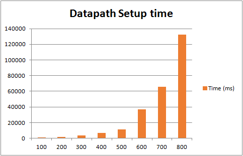

# Test 10：End-to-End Flow Setup Time

# Description

In this test, we set up a linear topology, and create two hosts in the first and the last two switches, and then analyze the datapath build time between this two hosts.If the time is more than 5 minutes,  then it was deemed to can't support so many switches.

This test will create multiple switches connected to one controller. Datapath depends on the flow tables needed, through some triggering means (such as ping) will trigger the flows download, when all the switches have these flow table entries, datapath can be setup successfully.

By capture, the time can be caculated by the packets below

      1、The first packet\_in packet

      2、The last flow\_mod packet

The test was done by different number of switches with the sequence of 100、200、300、400 ... ...

# Suggestions

1. The topo of the switches  
   Linear topology can show the datapath performance best. Mabe there's no linear topology in your IXIA tester version, create a ring topology first and then transformed into a linear topology.
2. The trigger mode  
   Through the topology in the first and last two hosts to do the operation of ping can trigger the flow download.

# Preparation

* **Features install**

  |  |
  | --- |
  | `onos> feature:install onos-drivers`  `onos> feature:install onos-openflow`  `onos> feature:install onos-openflow-base`  `onos> feature:install onos-app-fwd`  `onos> feature:install onos-lldp-provider`  `onos> feature:install onos-host-provider` |

# Test steps

      1. Config IxNetwork with switches (first with 100) with linear topology and two hosts in the first and last switch.

      2. Start the controller with the features install.

      3. Start the OF protocol of the switch.

      4. Wait until the channel is established and Echo message interaction started.

      5. Start the capture of IxNetwork.

      6. Enable the traffic between this two hosts, wait until the hosts can ping through each other.

      7. Stop the capture, analyse the messages captured. Write down the time of the first packet\_in message T1 and the time of the last flow mod message T2. Caculate the time of Datapath seted up T=T2-T1

      8. Clean the configuration of controllers and IxNetwork.

      9. Repeat test step 1-8 for three times.

      10. Restart the test with another number of switches.

# Test Results

* **Datapath Setup Time**

  | switches | First (ms) | Second (ms) | Third (ms) | Avg (ms) |
  | --- | --- | --- | --- | --- |
  | 100 | 1200 | 1169 | 1164 | 1178 |
  | 200 | 1809 | 1745 | 1659 | 1738 |
  | 300 | 3100 | 3363 | 3357 | 3273 |
  | 400 | 5478 | 7171 | 7177 | 6609 |
  | 500 | 10983 | 12946 | 10624 | 11518 |
  | 600 | 30633 | 32603 | 46932 | 36723 |
  | 700 | 69950 | 68673 | 58760 | 65794 |
  | 800 | 131691 | 122576 | 142910 | 132392 |

After 800 switches, datapath can't setup in 5 minutes so we conclude that the maximum number is 800 switches.

* **Histogram of Datapath Setup Time**  
  ****

As the histogram shown, the time increases significantly with the number of switches.
