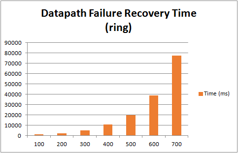
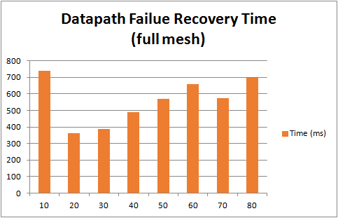

# Test 11：Datapath Failure Recovery Time

# Description

In a network environment, reliability plays a very important role. If one link fails, the traffic flowing through the link will switch to other paths. This test case is used to test the time it takes for the path to switch. If the time is more than 5 minutes, then it was deemed to can't support so many switches.

In this test, we chose two types of topologies, ring, and full mesh. In the ring topology, we select any two adjacent switches, and create one host in each switch, enable traffic between this two host, and then disconnect the link of this two switches to observe the traffic recovery time. In full mesh topology, the steps are consistent with the above, except that you can select any other two switches and disconnect them.

This test will create multiple switches with ring or full mesh topology connected to one controller. Datapath depends on the flow tables needed, after the link disconnectd, the flows download to the switches in another path will start, when all the switches have these flow table entries, datapath can be recovery successfully.

By capture, the time can be caculated by the packets below

      1、The port status packet

      2、The last flow\_mod packet

The test was done by different number of switches with the sequence of 100、200、300、400 ... ...(ring), and 10、20、30、40 ... ...(full mesh)

# Suggestions

1. The traffic enable mode  
   Through the two hosts to do the operation of ping can trigger the flow download.
2. The default datapath   
   The default datapath should be the optimal path that should be disconnected.

# Preparation

* **Features install**

  |  |
  | --- |
  | `onos> feature:install onos-drivers`  `onos> feature:install onos-openflow`  `onos> feature:install onos-openflow-base`  `onos> feature:install onos-app-fwd`  `onos> feature:install onos-lldp-provider`  `onos> feature:install onos-host-provider` |

# Test steps

      1. Config IxNetwork with switches (first with 100 (ring) or 10 (full mesh) ) with ring or full mesh topology and two hosts in the adjacent switches (ring) or any other two switches (full mesh).

      2. Start the controller with the features install.

      3. Start the OF protocol of the switch.

      4. Wait until the channel is established and Echo message interaction started.

      5. Enable the traffic between this two hosts, wait until the hosts can ping through each other.

      6. Start the capture of IxNetwork.

      7. Disconnect the link of this two switches, and wait until the traffic recovery

      8. Stop the capture, analyse the messages captured. Write down the time of the port status message T1 and the time of the last flow mod message T2. Caculate the time of Datapath recovery time T=T2-T1

      9. Clean the configuration of controllers and IxNetwork.

      10. Repeat test step 1-9 for three times.

      11. Restart the test with another number of switches.

# Test Results

* **Datapath Failure Recovery Time (ring)**

  | Switches | First (ms) | Second (ms) | Third (ms) | Avg (ms) |
  | --- | --- | --- | --- | --- |
  | 100 | 1381 | 951 | 857 | 1063 |
  | 200 | 2365 | 2128 | 1844 | 2112 |
  | 300 | 5556 | 5103 | 4531 | 5063 |
  | 400 | 10527 | 9063 | 12007 | 10532 |
  | 500 | 18281 | 22523 | 18142 | 19649 |
  | 600 | 35883 | 45297 | 35568 | 38916 |
  | 700 | 95209 | 76759 | 59439 | 77136 |
* **Datapath Failure Recovery Time (full mesh)**

  | Switches | First (ms) | Second (ms） | Third (ms) | Avg (ms) |
  | --- | --- | --- | --- | --- |
  | 10 | 702 | 704 | 857 | 739 |
  | 20 | 304 | 443 | 336 | 361 |
  | 30 | 488 | 334 | 341 | 388 |
  | 40 | 375 | 387 | 700 | 487 |
  | 50 | 311 | 691 | 706 | 569 |
  | 60 | 971 | 587 | 522 | 660 |
  | 70 | 512 | 483 | 721 | 572 |
  | 80 | 524 | 794 | 776 | 698 |
* **Histogram of Datapath Failure Recovery Time**  
    
  ****

As the result shown, in ring topology, datapath failure recovery time increase significantly with the number of switches. But in full mesh topology, the time is no diffenence with the number of switches.
