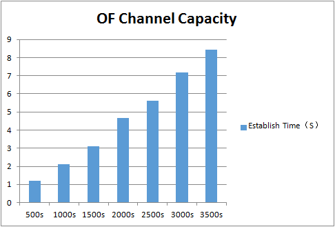
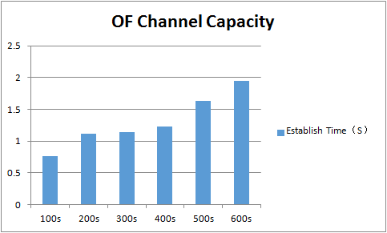

# Test 1：OpenFlow Channel Capacity

# Description

The purpose of the test is to measure the performance of OpenFlow controller channels with a single or cluster controllers. Multiple switches are setuped up by IxNetwork, and directly connected to controllers by TCP connection.

There are two items we should measure:

      1、The establish time of these switches;

      2、The maximum number of OF channels can be support coinstantaneous by controllers.

We measure the establish time by the time interval between the first Hello Message and the last Hello Message of these switches.The maximum number of OF channels measure by a time interval  without any session flap, and the time interval is recommended as 5 minutes.

For single mode, we done the test repeated by different number of switches with the sequence of 500、1000、1500、2000 ……

For cluster mode, we done the test repeated by different number of switches with the sequence of 100、200、300、400 ……

# Suggestions

1. If the OF sessions are restricted to 1000 or 1024, please check the following points:  

   a) DPID configured by IxNetwork, they should exclusive with each switch.

   b) File descriptor of the OS which running the controllers(default with 1024).

   c)  ARP tables volume of the OS which running the controllers(default with 1024).
2. In order to test out the best performance of controllers, several ports of IxNetwork are suggested. In the test below, we used four ports to do the test, each ports with same number of switches, forexample, 500 switches test, we configed 125 switches each port.

# Preparation

* **Cluster formed(Three nodes)**

  ```
  $ $ONOS_INSTALL_DIR/bin/onos-form-cluster OC1 OC2 OC3
  ```
* **Features install**

  ```
  onos> feature:install onos-drivers
  onos> feature:install onos-openflow
  onos> feature:install onos-openflow-base
  ```

# Test steps

      1. Config IxNetwork with multiple switches equally by four ports (first time with 500(single mode) or 100(cluster mode)).

      2. Start the controller with the features install.

      3. Start the capture of IxNetwork ports.

      4. Start all of the OF protocol of the switches simultaneous.

      5. Wait until all of the channels are established and Echo message interaction started，then stop the capture.If all of the sessions can't be established in 5 minutes means the controller can't support those OF channels.

      6. If step 5 is successful, then wait for 5 minutes and check whether the established channels are stable without any flap, and the Echo messages sended are equal with received.

      7. If step 6 has passed, analyse the establish time from the messages captured by four ports and write down the result.

      8. Clean the configuration of controllers and IxNetwork.

      9. Repeat the test with same switches for three times.

      10. Restart the test with another number of switches.

# Test Results

* **Single Mode**

  | Devices | First | Second | Third | Average(S) |
  | --- | --- | --- | --- | --- |
  | 500s | 1.02 | 1.42 | 1.17 | 1.20 |
  | 1000s | 2.13 | 2.18 | 2.03 | 2.11 |
  | 1500s | 2.56 | 3.42 | 3.39 | 3.12 |
  | 2000s | 4.74 | 4.42 | 4.86 | 4.67 |
  | 2500s | 5.74 | 5.39 | 5.72 | 5.62 |
  | 3000s | 6.38 | 7.54 | 7.61 | 7.18 |
  | 3500s | 7.64 | 9.05 | 8.65 | 8.45 |

  After 3500 switches, the OF channels become unstable, the flap sessions come frequently with the increase of time. So the maximum number of OF Channel with single controller is 3500.

  

  We can see from the histogram, the establish time is linear growth with the number of OF switches.
* **Cluster Mode(Three nodes)**

  | Devices | First | Second | Thrid | Average(S) |
  | --- | --- | --- | --- | --- |
  | 100s | 1.25 | 0.52 | 0.52 | 0.76 |
  | 200s | 1.7 | 0.85 | 0.81 | 1.12 |
  | 300s | 1.21 | 0.89 | 1.33 | 1.14 |
  | 400s | 1.23 | 1.27 | 1.19 | 1.23 |
  | 500s | 1.52 | 1.76 | 1.6 | 1.63 |
  | 600s | 2.31 | 2.08 | 1.45 | 1.95 |

  
