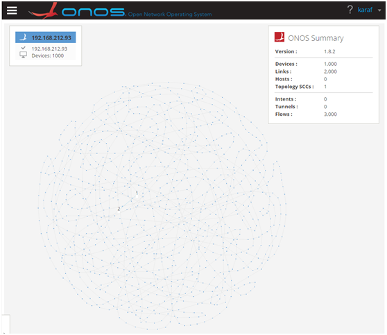
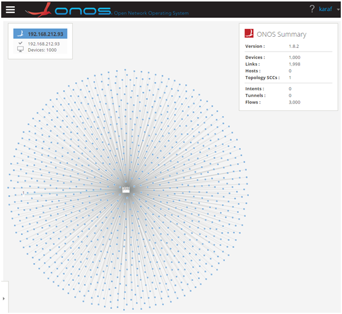
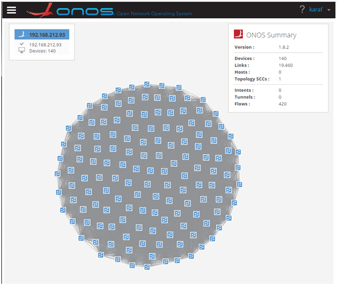

# Test 2：OpenFlow Topo Capacity

# Description

In the controller, topology management has a very important role, it is the base of many applications. Here, we test the scale performance of the controller topology through ixia tester. We focus on the scale of the topology, rather than the time required to show the topology, because the implementation of different controllers is not the same, can not use a rigorous and common way to measure.

Because there's sevel bug in ONOS 1.6, and was fixed in ONOS 1.8, so we use ONOS 1.8 version to do the test.

There's three type of topology include, ring、hub and spoke、full mesh.

To determine whether the topology is stable, first, the topology can be fully presented, and second, the sessions without any flap.

# Suggestions

The test was done by different number of switches with the sequence shown following:

1. Ring: 100、200、300、400 ... ...
2. Hub and sopke: 100、200、300、400 ... ...
3. Full mesh: 10、20、30、40 ... ...

# Preparation

* **Features install**

  |  |
  | --- |
  | `onos> feature:install onos-drivers-default`  `onos> feature:install onos-providers-openflow-base`  `onos> feature:install onos-providers-lldp` |

# Test steps

      1. Config IxNetwork with switches (first with 100 (ring and hub-spoke) or 10 (full mesh)) with specified topology.

      2. Start the controller with the features install.

      3. Start the OF protocol of the switch.

      4. Wait until the channel is established and Echo message interaction started.

      5. Observe whether the topology can be fully presented in UI in five minutes.

      6. If step 5 success, then observe the topology is stable for five minutes and the sessions with any flap. If failed restart this test with less switches.

      7. if step 6 passed, clean the configuration of controllers and IxNetwork and repeat test step 1-6 for three times.

      8. Restart the test with another number of switches.

# Test Results

* **Ring Topology**

  | Switches | Topo stable | Session flap |
  | --- | --- | --- |
  | 100 | Y | N |
  | 200 | Y | N |
  | 300 | Y | N |
  | 400 | Y | N |
  | 500 | Y | N |
  | 600 | Y | N |
  | 700 | Y | N |
  | 800 | Y | N |
  | 900 | Y | N |
  | 1000 | Y | N |
* **Hub and Spoke Topology**

  | Switches | Topo stable | Session flap |
  | --- | --- | --- |
  | 100 | Y | N |
  | 200 | Y | N |
  | 300 | Y | N |
  | 400 | Y | N |
  | 500 | Y | N |
  | 600 | Y | N |
  | 700 | Y | N |
  | 800 | Y | N |
  | 900 | Y | N |
  | 1000 | Y | N |
* **Full Mesh Topology**

  | Switches | Topo stable | Session flap |
  | --- | --- | --- |
  | 10 | Y | N |
  | 20 | Y | N |
  | 30 | Y | N |
  | 40 | Y | N |
  | 50 | Y | N |
  | 60 | Y | N |
  | 70 | Y | N |
  | 80 | Y | N |
  | 90 | Y | N |
  | 100 | Y | N |
  | 110 | Y | N |
  | 120 | Y | N |
  | 130 | Y | N |
  | 140 | Y | N |
* **Topo Display（1000 switches with ring）**  
  ****
* **Topo Display**（1000 switches with hub and spoke）****  
  ****
* **Topo Display****（140 switches with full mesh）******  
  
