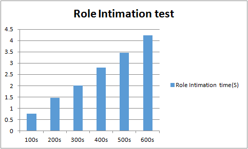

# Test 3：The Role Intimation Time for Controller Cluster At Setup

# Description

This test case is designed to test cluster mode. It is used to test the time to complete the role assignment to the controller.

The time contain two parts：

      1、The establish time of the connection of these switches.

      2、The role calculation time of ONOS.

We measure this time by the first hello message and the last role request message of the controllers and switches.

The test was done with multiple switches with the sequence of 100、200、300、400 ... ...

# Suggestions

1. If the OF sessions are restricted to 1000 or 1024, please check the following points:  

   a) DPID configured by IxNetwork, they should exclusive with each switch.

   b) File descriptor of the OS which running the controllers(default with 1024).

   c)  ARP tables volume of the OS which running the controllers(default with 1024).
2. In order to test out the best performance of controllers, several ports of IxNetwork are suggested. In the test below, we used four ports to do the test, each ports with same number of switches, forexample, 100 switches test, we configed 25 switches each port.

# Preparation

* **Cluster formed(Three nodes)**

  + **3 mode**

    |  |
    | --- |
    | `$ $ONOS_INSTALL_DIR/bin/onos-form-cluster OC1 OC2 OC3` |
  + **5 mode**

    |  |
    | --- |
    | `$ $ONOS_INSTALL_DIR/bin/onos-form-cluster OC1 OC2 OC3 OC4 OC5` |
  + **7 mode**

    |  |
    | --- |
    | `$ $ONOS_INSTALL_DIR/bin/onos-form-cluster OC1 OC2 OC3 OC4 OC5 OC6 OC7` |
* **Features install**

  |  |
  | --- |
  | `onos> feature:install onos-drivers`  `onos> feature:install onos-openflow`  `onos> feature:install onos-openflow-base` |

# Test steps

      1. Config IxNetwork with multiple switches equally by four ports (first time with 100).

      2. Start the controller with the features install.

      3. Start the capture of IxNetwork ports.

      4. Start all of the OF protocol of the switches simultaneous.

      5. Wait until all of the channels are established and Echo message interaction started，then stop the capture.

      6. Analyse the role intimation time from the messages captured by four ports and write down the result.

      7. Clean the configuration of controllers and IxNetwork.

      8. Repeat test step 1-7 with same switches for three times.

      9. Restart the test with another number of switches.

# Test Results

* **Three nodes**

  | Devices | First | Second | Third | Average(S) |
  | --- | --- | --- | --- | --- |
  | 100s | 0.682 | 0.731 | 0.861 | 0.76 |
  | 200s | 1.408 | 1.461 | 1.510 | 1.46 |
  | 300s | 1.944 | 2.148 | 1.938 | 2.01 |
  | 400s | 2.353 | 3.026 | 3.039 | 2.81 |
  | 500s | 3.578 | 3.263 | 3.576 | 3.47 |
  | 600s | 4.237 | 4.220 | 4.243 | 4.23 |

  

  As shown in the histogram, the result is linear with the number of switches. When the number of switches after more than 600, the sessions is not support good enough, session flap occurs.
