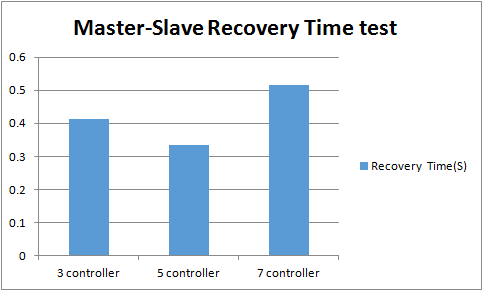

# Test 4：Master-Slave Recovery Time for Controller Cluster

# Description

When the controller can not provide services when the problem occurs, it reflects the importance of the cluster, of course, reliability is one of the advantages of the cluster.

This test is designed to test when a node in the cluster fails, how quickly it will take for other nodes to take over the switch belong to the fail node ago.

This case is tested by one switch connected to a cluster controller, this cluster may be 3、5、7 ... ...

During the test, we continue to send packet\_in packets from the switch to the cluster. And then shutdown down the controller which is the master role of this switch. After the new role\_request message is delivered, stop the capture and caculate the time by the last responded packet\_in message and the first role\_request message.

# Suggestions

1. The transmission frequency of packet\_in  
   We suggest the packet\_in interval is 50ms, that is 20 copies of packet\_in messages are send in one second, and this can be configured in IxNetwork.
2. How to shutdown the controller(ONOS)
   1. Active approach

      ```
      onos> system:shutdown
      ```
   2. Passive approach

      ```
      $ sudo killall -9 java
      ```
3. How to confirm the master role of the switch

   ```
   onos> devices
   ```

# Preparation

* **Cluster formed**  
  + **3 mode**

    |  |
    | --- |
    | `$ $ONOS_INSTALL_DIR/bin/onos-form-cluster OC1 OC2 OC3` |
  + **5 mode**

    |  |
    | --- |
    | `$ $ONOS_INSTALL_DIR/bin/onos-form-cluster OC1 OC2 OC3 OC4 OC5` |
  + **7 mode**

    |  |
    | --- |
    | `$ $ONOS_INSTALL_DIR/bin/onos-form-cluster OC1 OC2 OC3 OC4 OC5 OC6 OC7` |
* ****Features install****

  |  |
  | --- |
  | `onos> feature:install onos-drivers`  `onos> feature:install onos-openflow`  `onos> feature:install onos-openflow-base`  `onos> feature:install onos-app-fwd` |

# Test steps

      1. Config IxNetwork with one switch. Set the packet\_in messages of the switch, the interval is 50ms, total 100000 packets, using ICMP or ARP packets.

      2. Start the controller with the features install.

      3. Start the OF protocol of the switch.

      4. Wait until all of the channels are established and Echo message interaction started.

      5. Enable packet\_in and check whether the packet\_in sended and packet\_out received are the same.

      6. If step 5 passed, confirm the master controller of this switch, here we use Cm to represent.

      7. Start the capture of IxNetwork.

      8. Shutdown controller Cm, and wait until packet\_in messages start response again.

      9. Stop the capture, analyse the messages captured and write down the result.

      10. Clean the configuration of controllers and IxNetwork.

      11. Repeat test step 1-10 for three times.

      12. Restart the test with another nodes of cluster.

# Test Results

* **One switch with different cluster modes**

  | Cluster Mode | First | Second | Third | Average（S） |
  | --- | --- | --- | --- | --- |
  | 3 controller | 0.284 | 0.488 | 0.465 | 0.412 |
  | 5 controller | 0.341 | 0.284 | 0.376 | 0.334 |
  | 7 controller | 0.495 | 0.496 | 0.553 | 0.515 |

  

  As we can see from the histogram, the result is a millisecond level, there is no big difference between different cluster modes.
