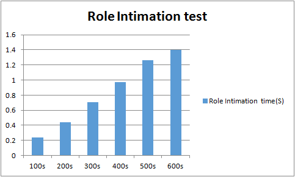

# Test 5：The Role Intimation Time for Controller Cluster After Master Failover

# Description

In cluster mode, each controller node manages some switches, and for these switches the controller acts as the master role. Of course, other controller nodes for these switches is also not without meaning, they have been playing the role of slave. When the master controller shutdown or other reasons cause it can not work, those slave controllers will change the role become master. Under normal circumstances, they will master these switches equally.

This test case will config multiple switches connected to a cluster controllers. By shutdown one of the controllers to measure how long it will take for the role intimation time of the cluster.

During the role intimation, there will be lots of role\_request packets, the results can be calculate by the time difference between the first role\_request message and the last role\_request message.

The number of nodes in the cluster and the number of switches are the variables of this test. The switches tested are with the sequence of 100、200、300、400 ... ...

# Suggestions

1. If the OF sessions are restricted to 1000 or 1024, please check the following points:  

   a) DPID configured by IxNetwork, they should exclusive with each switch.

   b) File descriptor of the OS which running the controllers(default with 1024).

   c)  ARP tables volume of the OS which running the controllers(default with 1024).
2. In order to test out the best performance of controllers, several ports of IxNetwork are suggested. In the test below, we used four ports to do the test, each ports with same number of switches, forexample, 100 switches test, we configed 25 switches each port.
3. How to shutdown the controller(ONOS)
   1. Active approach

      |  |
      | --- |
      | `onos> system:shutdown` |
   2. Passive approach

      |  |
      | --- |
      | `$ sudo killall -``9` `java` |

# Preparation

* **Cluster formed**  
  + **3 mode**

    |  |
    | --- |
    | `$ $ONOS_INSTALL_DIR/bin/onos-form-cluster OC1 OC2 OC3` |
  + **5 mode**

    |  |
    | --- |
    | `$ $ONOS_INSTALL_DIR/bin/onos-form-cluster OC1 OC2 OC3 OC4 OC5` |
  + **7 mode**

    |  |
    | --- |
    | `$ $ONOS_INSTALL_DIR/bin/onos-form-cluster OC1 OC2 OC3 OC4 OC5 OC6 OC7` |
* **Features install**

  |  |
  | --- |
  | `onos> feature:install onos-drivers`  `onos> feature:install onos-openflow`  `onos> feature:install onos-openflow-base` |

# Test steps

      1. Config IxNetwork with multiple switches equally by four ports (first time with 100).

      2. Start the controller with the features install.

      3. Start the OF protocol of the switch.

      4. Wait until all of the channels are established and Echo message interaction started.

      5. Start the capture of IxNetwork.

      6. Shutdown anyone node of the cluster, wait until all of the Echo messages interaction recover.

      7. Stop the capture. Analyse the role intimation time from the messages captured by four ports and write down the result.

      8. Clean the configuration of controllers and IxNetwork.

      9. Repeat test step 1-8 with same switches for three times.

      10. Restart the test with another number of switches.

# Test Results

* **Three nodes**

  | Devices | First | Second | Thrid | Averages（S） |
  | --- | --- | --- | --- | --- |
  | 100S | 0.231 | 0.229 | 0.245 | 0.235 |
  | 200S | 0.387 | 0.428 | 0.511 | 0.442 |
  | 300S | 0.564 | 0.824 | 0.755 | 0.714 |
  | 400S | 0.852 | 1.157 | 0.901 | 0.970 |
  | 500S | 1.202 | 1.430 | 1.144 | 1.259 |
  | 600S | 1.716 | 1.266 | 1.215 | 1.399 |

  

  As shown in the histogram, the result is linear with the number of switches. When the number of switches after more than 600, the sessions is not support good enough, session flap occurs.
