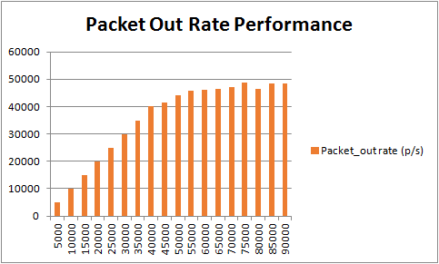
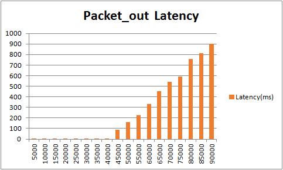

# Test 6：Packet Out Rate Performance

# Description

Packet\_out is one of the most important content of SDN controller. It is the most frequent message between the controller and the openflow switch.

This test will create a switch connected to a controller, through the switch, we send different rates of packet\_in message to the controller to measure the controller's processing power of packet\_in.

There's two content should measure:

      1、The maximum packet\_out rate

      2、The latency of packet\_out

We configure one million packet\_in packets on the IxNetwork and send them to the controller through different rates to analyze the packet\_out rate and latency.

The rate is in accordance with the sequence 5000、10000、15000、20000 ... ...

Auxiliary channel is not support by ONOS, wo use primary channel here.

# Suggestions

1. The transmission frequency of packet\_in  
   We suggest the packet\_in interval is 50ms, that is 20 copies of packet\_in messages are send in one second, every copy contains numbers of packet\_in packets, and this can be configured in IxNetwork.
2. Environment  
   This test result depends on the test environment, the results measured in different environments will be very different, in the VM environment and the physical environment the results of the test difference of nearly 10 times.

# Preparation

* **Features install**

  |  |
  | --- |
  | `onos> feature:install onos-drivers`  `onos> feature:install onos-openflow`  `onos> feature:install onos-openflow-base`  `onos> feature:install onos-app-fwd` |

# Test steps

      1. Config IxNetwork with one switch and two hosts. Set the packet\_in messages of the switch, the interval is 50ms, total 1000000 packets, using ICMP or ARP packets.

      2. Start the controller with the features install.

      3. Start the OF protocol of the switch.

      4. Wait until the channel is established and Echo message interaction started.

      5. Start the capture of IxNetwork.

      6. Enable packet\_in, wait until all of the packet\_in messages are sent and  no packet\_out messages receive.

      7. Stop the capture, analyse the messages captured. First verify the number of packet\_out message N, N should be equal to 1 million, if N is less than 1 million, restart this test with smaller packet\_in rate. Second, calculate the time difference between the first packet\_out message and the last packet\_out message T, the packet\_out rate can be calculated by N/T. Third, calculate the time delay of each packet\_in-packet\_out pair as t1、t2、t3 ... ... , of course this can be caculate by decentralized way(select ten sets of pairs), at last calculate the latency by t1+t2+t3 ... ... /N.

      8. Clean the configuration of controllers and IxNetwork.

      9. Repeat test step 1-9 for five times.

      10. Restart the test with another packet\_in rate.

# Test Results

IxNetwork current packet\_in rate is only up to 30000 p/s, can not measure the maximum packet\_in processing rate of controller. Therefore, we use BII test suite tested results to show.

* **Packet\_out rate and latency**

  | Packet\_in rate (p/s) | Packet\_out rate (p/s) | Latency(ms) |
  | --- | --- | --- |
  | 5000 | 5002 | 1.13 |
  | 10000 | 10010 | 0.6 |
  | 15000 | 14999 | 1.06 |
  | 20000 | 19945 | 2.49 |
  | 25000 | 24968 | 0.84 |
  | 30000 | 29876 | 1.73 |
  | 35000 | 34853 | 3.56 |
  | 40000 | 40260 | 6.62 |
  | 45000 | 41425 | 89.88 |
  | 50000 | 44123 | 159.55 |
  | 55000 | 45825 | 227.57 |
  | 60000 | 46168 | 331.21 |
  | 65000 | 46558 | 451.97 |
  | 70000 | 47024 | 540.5 |
  | 75000 | 48766 | 590.97 |
  | 80000 | 46436 | 754.88 |
  | 85000 | 48437 | 810.88 |
  | 90000 | 48586 | 901.75 |
  | 95000 | 48232 | Packet loss occurs |
  | 100000 | 45921 | Packet loss occurs |
* **Histogram of Packet\_out rate**

  
* **Histogram of Packet\_out latency**  
    
  

As we can see from the result, the maximum packet\_out rate is 40000-50000 p/s, when the packet\_in rate exceeds 40000 p/s, latency will increase with the rate of packet\_in greatly increased. When packet\_in rate exceeds 90000 p/s, packet loss occurs.

Therefore, we conclude that the best processing performance of packet\_out of ONOS is less than or equal to 40000 p/s.

#
