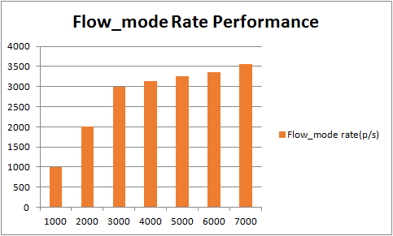
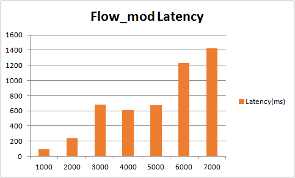

# Test 7：Flow Setup Rate at Reactive Mode

# Description

Flow\_mod is one of the most important business packets. The controller send various flows to openflow switches by flow\_mod, and the switch determines how to process the received service packets based on these flows.

This test will create a switch connected to a controller, through the switch, we send different rates of packet\_in message to the controller, and the controller will feedback with flow\_mod.

There's two content should measure:

      1、The maximum flow\_mod rate

      2、The latency of flow\_mod

We configure one hundred thousand packet\_in packets on the IxNetwork and send them to the controller through different rates to analyze the flow\_mod rate and latency.

The rate is in accordance with the sequence 1000、2000、3000、4000 ... ...

# Suggestions

1. The transmission frequency of packet\_in  
   We suggest the packet\_in interval is 50ms, that is 20 copies of packet\_in messages are send in one second, every copy contains numbers of packet\_in packets, and this can be configured in IxNetwork.
2. Environment  
   This test result depends on the test environment, the results measured in different environments will be very different, in the VM environment and the physical environment the results of the test difference of nearly 10 times.

# Preparation

* **Features install**

  |  |
  | --- |
  | `onos> feature:install onos-drivers`  `onos> feature:install onos-openflow`  `onos> feature:install onos-openflow-base`  `onos> feature:install onos-app-fwd`  `onos> feature:install onos-host-provider` |

# Test steps

      1. Config IxNetwork with one switch and two hosts. Set the packet\_in messages of the switch, the interval is 50ms, total 100000 packets, using ICMP packets.

      2. Start the controller with the features install.

      3. Start the OF protocol of the switch.

      4. Wait until the channel is established and Echo message interaction started.

      5. Start the capture of IxNetwork.

      6. Enable packet\_in, wait until all of the packet\_in messages are sent and  no flow\_mod messages receive.

      7. Stop the capture, analyse the messages captured. First verify the number of flow\_mod message N, N should be equal to 100000, if N is less than 1 million, restart this test with smaller packet\_in rate. Second, calculate the time difference between the first flow\_mod message and the last flow\_mod message T, the flow\_mod rate can be calculated by N/T. Third, calculate the time delay of each packet\_in-flow\_mod pair as t1、t2、t3 ... ... , of course this can be caculate by decentralized way(select ten sets of pairs), at last calculate the latency by t1+t2+t3 ... ... /N.

      8. Clean the configuration of controllers and IxNetwork.

      9. Repeat test step 1-9 for five times.

      10. Restart the test with another packet\_in rate.

# Test Results

* **Flow\_mod rate and latency**

  | Packet\_in rate(p/s) | Flow\_mode rate(p/s) | Latency(ms) |
  | --- | --- | --- |
  | 1000 | 1005 | 89.6 |
  | 2000 | 1998 | 241.5 |
  | 3000 | 2997 | 683.1 |
  | 4000 | 3126 | 612.2 |
  | 5000 | 3254 | 673.3 |
  | 6000 | 3361 | 1233 |
  | 7000 | 3556 | 1421 |
* **Histogram of Flow\_mod rate**  
  
* ****Histogram of Flow\_mod latency****  
  

As the results shown, the maximum rate of flow\_mod is 3000-4000 p/s, and the latency increase with the rase of packet\_out.
