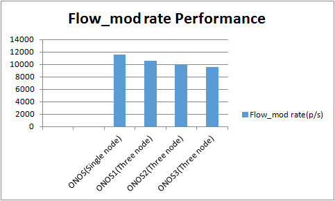
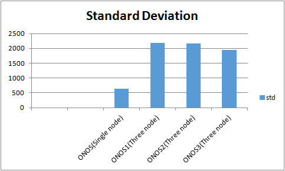

# Test 8：Flow Setup Rate at Proactive Mode

# Description

This test is described in more detail in the following links, which we refer to:

Test plan: [Experiment F Plan - Flow Subsystem Burst Throughput](../../../system-test-plans-and-results/test-plans/test-plan-performance-and-scale-out-scpf/experiment-f-plan-flow-subsystem-burst-throughput.md)

Test result: [Master: Experiment F - Flow Subsystem Burst Throughput](../../../system-test-plans-and-results/test-results/onos-master/master-performance-and-scale-out/master-experiment-f-flow-subsystem-burst-throughput.md)

The difference is that we use the IXIA tester to simulate openflow switches, total 100 switches was set and 100000 flows for each switch, the results show below.

# Test Results

* **Flow\_mode Rate**

  |  | Flow\_mode rate(P/S)  Single mode(ONOS) | Flow\_mode rate(P/S)  Three mode(ONOS1) | Flow\_mode rate(P/S)  Three mode(ONOS2) | Flow\_mode rate(P/S)  Three mode(ONOS3) |
  | --- | --- | --- | --- | --- |
  | **First** | 10760 | 13112 | 12569 | 8941 |
  | **Second** | 11414 | 8383 | 7865 | 11244 |
  | **Third** | 11892 | 8558 | 7376 | 8477 |
  | **Fourth** | 12029 | 7983 | 7790 | 9028 |
  | **Fifth** | 12174 | 13387 | 13087 | 7666 |
  | **Sixth** | 11319 | 9126 | 8905 | 8335 |
  | **Seventh** | 11225 | 14442 | 13546 | 7906 |
  | **Eighth** | 12585 | 10446 | 9748 | 12318 |
  | **Ninth** | 12065 | 10456 | 9878 | 8406 |
  | **Tenth** | 10413 | 9638 | 9237 | 13580 |
  | **Avg** | 11587 | 10553 | 10000 | 9590 |
  | **Std** | 644 | 2188 | 2165 | 1939 |

* **Histogram of Flow\_mod rate**  
  
* **Histogram of Flow\_mod std**  
  ****

As the histograms show, in the case of three nodes, flow\_mod is three times the case of a single node, but the standard deviation is much higher than single node.
