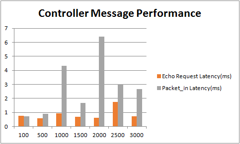

# Test 9：Controller Message Processing Latency

# Description

The purpose of the test is to measure the performance of OpenFlow controller messages performance with a single controller. Multiple switches are setuped up by IxNetwork, and directly connected to controllers by TCP connection.

The performance is measured by the time of the controller handles different types of  messages, such as Echo Request and Packet\_in.

When the sessions of the controller and switches are stable, we started collecting data, and the result can be statistics by discrete method.

We done the test repeated by different number of switches with the sequence of 100、500、1000、1500、2000 ……

# Suggestions

1. If the OF sessions are restricted to 1000 or 1024, please check the following points:  

   a) DPID configured by IxNetwork, they should exclusive with each switch.

   b) File descriptor of the OS which running the controllers(default with 1024).

   c)  ARP tables volume of the OS which running the controllers(default with 1024).
2. The transmission frequency of Echo Request and Packet\_in  
   a) The default Echo message transmission frequency of IXIA tester is 10 s/p per switch  
   b) The Packet\_out message transmission frequency of IXIA tester was seted as 20 s/p per switch
3. Environment  
   This test result depends on the test environment, the results measured in different environments will be very different, in the VM environment and the physical environment the results of the test difference of nearly 10 times.

# Preparation

* **Features install**

  |  |
  | --- |
  | `onos> feature:install onos-drivers`  `onos> feature:install onos-openflow`  `onos> feature:install onos-openflow-base`  `onos> feature:install onos-app-fwd` |

# Test steps

      1. Config IxNetwork with multiple switches equally by four ports (first time with 100), set the packet\_in messages of the switch 20 packets per switch per second, using ICMP or ARP packets.

      2. Start the controller with the features install.

      3. Start the OF protocol of the switch.

      4. Wait until the channel is established and Echo message interaction started.

      5. Enable packet\_in, wait until the packet\_in messages and packet\_out messages stable.

      6. Start the capture of IxNetwork for 2-5 minutes.

      7. Stop the capture, analyse the messages captured. First of all, select N1 numbers of  switch from those of switches through discrete way, then select N2 sets of packets of each switch by discrete way, third calculate the average of all of those packets pairs.

      8. Clean the configuration of controllers and IxNetwork.

      10. Restart the test with another number of switches.

# Test Results

* **Echo Request and Packet\_in latency**

  | Number of Switches | Echo Request Latency(ms) | Packet\_in Latency(ms) |
  | --- | --- | --- |
  | 100 | 0.768 | 0.714 |
  | 500 | 0.598 | 0.912 |
  | 1000 | 0.950 | 4.310 |
  | 1500 | 0.682 | 1.676 |
  | 2000 | 0.604 | 6.410 |
  | 2500 | 1.732 | 3.008 |
  | 3000 | 0.722 | 2.666 |
* **Histogram of  Echo Request and Packet\_in latency**

  ****
