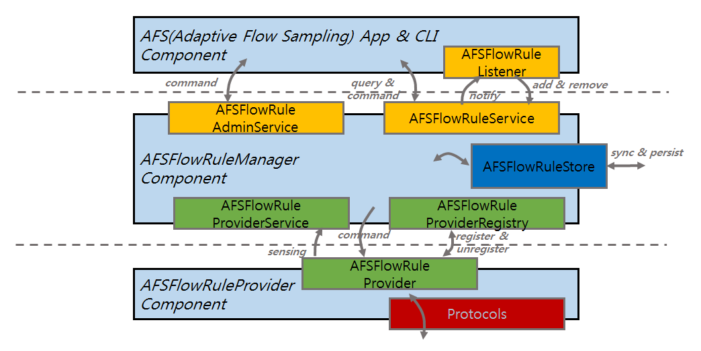
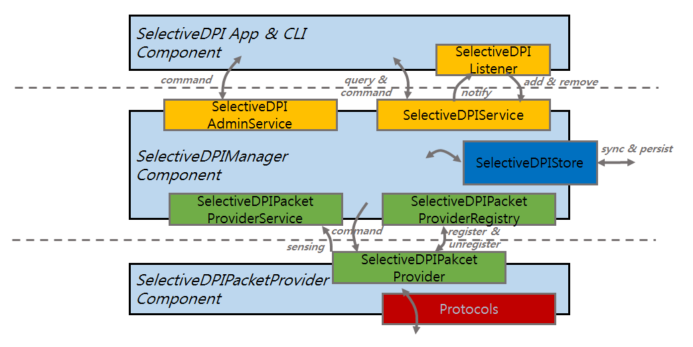
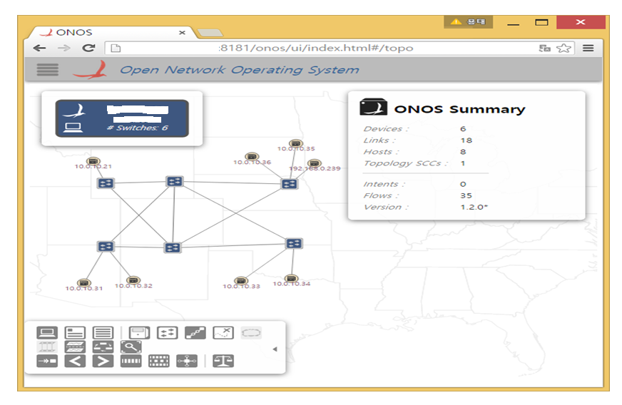

# OPEN-TAM: Traffic Analysis and Monitoring

Our goal is to implement OPEN-TAM functionality.  It enables analyzing and monitoring various types of traffic associated with ONOS. It includes but not limited to the control and management traffic as well as user data traffic between hosts in ONOS networks. Our proposed OPEN-TAM functionality will eventually provide deep operational visibility of ONOS-based networks in real-time.

### Team

| Name | Organization | Email |
| --- | --- | --- |
| Taesang Choi | ETRI, South Korea | [choits@etri.re.kr](mailto:choits@etri.re.kr) |
| Chunglae Cho | ETRI, South Korea | [clcho@etri.re.kr](mailto:clcho@etri.re.kr) |
| Sangsik Yoon | ETRI, South Korea | [ssyoon90@etri.re.kr](mailto:ssyoon90@etri.re.kr) |
| Sejun Song | UMKC | songsej@umkc.edu |

### Introduction

Network traffic monitoring is a fundamental function that can be used to operate and manage network stably and efficiently. Many network management systems(i.e., Traffic Engineering System, Network Planning System, Performance & Fault Management System,  QoS Provisioning System, Charging & Billing System, etc.) requires accurate network resource status information in real-time. In order to provide such information in inexpensive but accurate way on ONOS environment, we propose adaptive flow monitoring subsystem with an efficient sampling algorithm and selective DPI (Deep Packet Inspection) subsystem in ONOS.  We are planning to develop our proposed subsystems in two phases for OPEN-TAM subproject.

   - Development Phase 1 : Adaptive(Efficient) Flow Sampling Service

   - Development Phase 2 : Open Selective-DPI Service

### Development Phase 1 : Adaptive(Efficient) Flow Sampling Service (~Aug. 31)

* Current Problem Statement  
  Current FlowRule service collects all flow information from all devices at every time interval(default 10 seconds). This mechanism may cause ***performance degradation issue*** at each collection time in a large-scale real carrier network due to the number of switches and its associated flows (for example; WAN: ~500 Routers, ~10K ports, ~1-10M flows per port). To overcome performance problem in a simple way, we can maintain collection time interval value with a large number. It then generates another critical issue: ***lack of accuracy***.
* In this phase, we will develop an effective flow monitoring scheme called, ***Adaptive(Efficient) Flow Sampling Service*** that can minimize collection computing overhead and provide more accurate flow statistics
* AFS Service Architecture and Development Modules

### 

### Development Pahse 2 : Open Selective-DPI Service (~Oct.31)

* Current Problem Statement  
  Current ONOS flow can be classified and selected by lower-level FlowSelection criteria based on FlowRule entry (eg., ports, ether\_type, vlan\_id, 5-tuple, etc.). There is ***no application classification s***ervice for ONOS data plane user-data.
* In this Phase, we will develop a ***Selective DPI service*** that can filter data plane user-data traffic redirected by the controller and classify them with application level granularity by using a open source DPI s/w.  
  Some potential application of Open S-DPI can be detailed application traffic analysis and service chaining classification, etc.   
  We will take phased approach from a simple application to complex ones.

* Open Selective-DPI Service Architecture and Development Modules

### ONOS OPEN-TAM Development Testbed Environment in ETRI SDN Research Lab (South Korea)

* ONOS Cardinal 1.2.0 Release is installed at Ubuntu 14.04.2
* 6 OVS 1.4.6 version switches and several Openstack hosts
* ETRI OPEN-TAM Testbed Topology GUI

### Technical Materials

* Proposal document : [ETRI OPEN-TAM Subproject Proposal and Development Plan.pdf](../../assets/etri-tamsubprojectdeveplan.pdf)

### Meetings and Minutes

* 1st meeting (Feb. 26, Thurs, online) : Discussion on the sub-project scope
* 2nd meeting (June 29, Mon, online) : Discussion on the development plan of the sub-project
