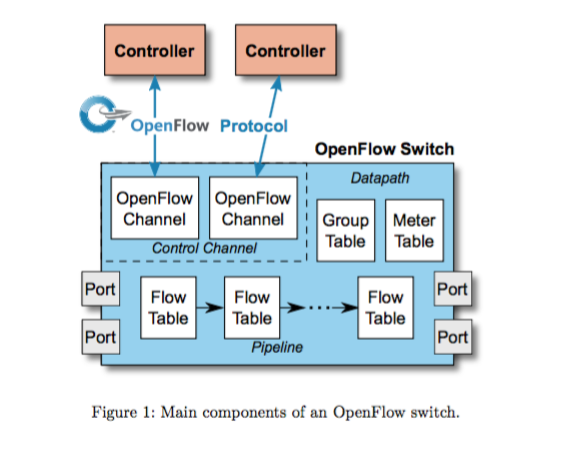
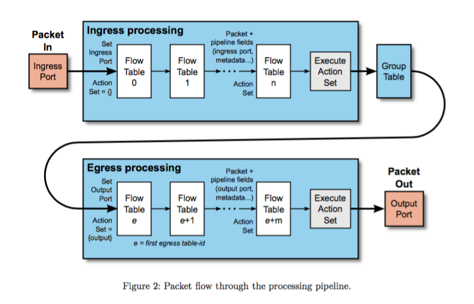

# OpenFlow 1.5 Implementation

## OpenFlow 1.5 Implementation

In this implementation , onos openflow stack is updated  with openflow1.5 extension . While we are updating openflow protocol, we have to think about core mechanism.

In 1.5 ; there are new enhancements .For example , flow table is added to handle egress port processing  .We have to discuss how we handle this enhancements described below.

In this proposal ; firstly , we are

* Updating onos-loxigen  with openflow 1.5 integration .
* Updating openflow NBI  with openflow 1.5 handling .
* Creating test cases to handle openflow 1.5 scenarios

**Optical Port Enhancement :**

A new set of port properties adds support for Optical ports, they include fields to configure and monitor the transmit and receive frequency of a laser, as well as its power .Those new properties can be used to configure and monitor either optical port or optical ports on circuit switches.

* Optical port mod property ofp\_port\_mod\_prop\_optical to configure optical ports.
* Optical port stats property ofp\_port\_stats\_prop\_optical to monitor optical ports.
* Optical port description property ofp\_port\_desc\_prop\_optical to describe optical port capabilities.

**Flow Monitoring :**

The OpenFlow protocol defines a multi-controller scheme where multiple controllers can manage a switch. Flow monitoring allows a controller to monitor in real time the changes to any subsets of the flow table done by other controllers. The flow monitoring framework allows a controller to define a number of monitors, each selecting a subset of the flow tables. Each monitor includes a table id and a match pattern that defines the subset monitored. When any flow entry is added, modified or removed in one of the subsets defined by a flow monitor, an event is sent to the controller to inform it of the change.

**Role Status :**

When a controller elected itself to “master” role, the previous master controller is demoted to “slave” role, however that controller was not informed about it. In version 1.4, the Role Status message enables the switch to inform a controller about changes to its role

**Eviction :**

Most flow tables have finite capacity. In previous versions of the specification, when a flow table is full, new flow entries are not inserted in the flow table and an error is returned to the controller. However, reaching that point is pretty problematic, as the controller needs time to operate on the flow table and this may cause a disruption of service. Eviction adds a mechanism enabling the switch to automatically eliminate entries of lower importance to make space for newer entries .This enables smoother degradation of behaviour when the table is full.

* Table-mod flag OFPTC\_EVICTION to enable or disable eviction on a table.
* Flow-mod importance to optionally denote the importance of a flow entry for eviction.
* Table-desc eviction property ofp\_table\_mod\_prop\_eviction to describe the type of eviction performed by the switch.

**Vacancy**

Vacancy events add a mechanism enabling the controller to get an early warning based on a capacity threshold chosen by the controller. This allows the controller to react in advance and avoid getting the table full.

* Table status event OFPT\_TABLE\_STATUS with reasons OFPTR\_VACANCY\_DOWN and OFPTR\_VACANCY\_UP to inform controller of vacancy change.
* Hysteresis mechanism to avoid spurious events using two threshold, vacancy\_down and vacancy\_up.
* Table-mod vacancy property to set vacancy thresholds, ofp\_table\_mod\_prop\_vacancy.

**Bundle**

Add the bundle mechanism, enabling to apply a group of OpenFlow message as a single operation. This enables the quasi-atomic application of related changes, and to better synchronise changes across a series of switches.

* Bundle control message OFPT\_BUNDLE\_CONTROL to create, destroy and commit bundles.
* Bundle add message OFPT\_BUNDLE\_ADD\_MESSAGE to add an OpenFlow message into a bundle.
* Bundle error type OFPET\_BUNDLE\_FAILED to report bundle operation errors.

**Openflow Ports**

IANA allocated to ONF the TCP port number 6653 to be used by the OpenFlow switch protocol. All uses of the previous port numbers, 6633 and 976, should be discontinued. OpenFlow switches and OpenFlow controllers must use 6653 by default

**Packet Type**

Previous versions , All packets must be Ethernet packets.Version 1.5 introduces a packet aware pipeline, enabling processing of other types of packets, such as IP packets or PPP packets . A new OXM pipeline field identifies the packet type. The packet type is defined in an extensible manner, it uses multiple namespaces defined by other standards and allows experimenter packet types.

**Extensible flow entry statistics**

Previous versions of the specification use a fixed structure for flow entry statistics. Version 1.5 introduces a flexible encoding, OpenFlow eXtensible Statistics (OXS), to encode any arbitrary flow entry statistics . Existing flow entry statistics are redefined as standard OXS fields.

* OXS TLV format to express flow entry statistics, based on OXM and compatible with OXM for simpler implementation.
* Express existing flow entry statistics as standard OXS fields : flow duration, flow count, packet count, byte count.
* Introduce new standard flow entry statistic : flow idle time.
* Enable arbitrary class based or experimenter based flow entry statistics.
* Use OXS in all messages carrying flow entry statistics : flow removed message, flow statistics multipart, flow aggregate multipart.
* Introduce lightweight flow statistics multipart, rename existing flow statistics as flow description.

**Statistics Trigger**

Polling flow entry statistics can induce high overhead and utilisation for the switch. A new statistics trigger mechanism enable statistics to be automatically sent to the controller based on various statistics thresholds New instruction OFPIT\_STAT\_TRIGGER to define a set of statistics thresholds using OXS.

* Statistics trigger flags to allow periodic thresholds.
* Efficient batching of statistics threshold to the controller using the lightweight flow statistics multipart.

**Copying Oxm Fields**

The existing Set-Field action allows to set a header field or pipeline field with a static value. The new Copy-Field action allows to copy the value from one header or pipeline field into another header or pipeline field.

**Enhancing group buckets**

In previous versions of the specification, group operations can only change the entire set of group buckets in a group. Two new group commands enable the insertion or removal of specific group buckets without impacting the other group buckets in the group .

**Scheduled Bundles**

The previous version of the specification introduced bundle messages. A bundle is a sequence of Open- Flow modification requests from the controller that is applied as a single OpenFlow operation. The current specification extends the bundle feature, allowing:

* Scheduled bundles: a bundle commit message may include an execution time, specifying when the switch is expected to commit the bundle.

* Bundle features request: allows a controller to query a switch about its bundle capabilities, in- cluding whether it supports atomic bundles, ordered bundles, and scheduled bundles.

**Port Change**

In previous versions of the specification, the port status message was sent to the controllers only in case the port state changed or if the configuration was changed outside OpenFlow. On the other hand, if one controller changed the configuration, no port status message was sent to the controllers. This is problematic in multi-controller setup, as other controllers can’t be notified of port configuration changes done by one controller.
