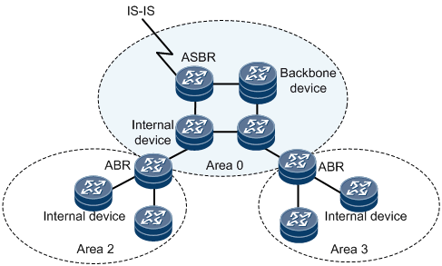

# OSPF as SBI

### **Team**

| Name | Email |
| --- | --- |
| Dhruv Dhody | [dhruv.dhody@huawei.com](mailto:dhruv.dhody@huawei.com) |
| KalyankumarAsangi | [kalyana@huawei.com](mailto:kalyana@huawei.com) |
| Kiran | [Kiran.Ramachandra@cognizant.com](mailto:Kiran.Ramachandra@cognizant.com) |
| Tej | [Tejeshwer.Degala@cognizant.com](mailto:Tejeshwer.Degala@cognizant.com) |
| Shankhadeep | [Shankhadeep.Karmakar@cognizant.com](mailto:Shankhadeep.Karmakar@cognizant.com) |
| SunishV.K. | [Sunish.VK@cognizant.com](mailto:Sunish.VK@cognizant.com) |
| ManikandanKuppusamy | [Manikandan-3.Kuppusamy-3@cognizant.com](mailto:Manikandan-3.Kuppusamy-3@cognizant.com) |
| Chidambar Babu | [Chidambar.Babu@cognizant.com](mailto:Chidambar.Babu@cognizant.com) |
| Ashok Singh | [Ashok.Singh2@cognizant.com](mailto:Ashok.Singh2@cognizant.com) |
| Mohamed Rahil | [MohamedRahil.R@cognizant.com](mailto:MohamedRahil.R@cognizant.com) |

### **Overview**

This project adds Open Shortest Path First (OSPF) Protocol as a southboundplug-inin ONOS controller to collect the topology information of the network. This network topology can be used by other applications like PCE.

### **Demo Video**

## **Proposed work**

Add OSPF South Bound plugin to learn the Link state topology of the network and update ONOS's "L3 topology" system along with the TE information. Implement OSPF Controller, which acts as an OSPF Router to listen to the Link State Advertisements (LSAs) being exchanged between the various routers in the network. A channel handler will be created for each OSPF Interface session to maintain the state machine and state of each neighboring router. Implement OSPF message handler, which will encode and decode OSPF messages between ONOS OSPF SBI and OSPF Neighbor on the network. Currently the Point-to-Point and Broadcast networks will be supported. The implementation will support storing of Type1 to Type5 LSAs and have the capability to generate Type1 and Type2 LSAs. Implement OSPF LS topology provider to update "L3 topology" system of ONOS core when any node or link gets added/deleted or modified. All communication between OSPFLinkstateprovider and ONOS Core uses Provider Service interface.

### Information on OSPF

Open Shortest Path First (OSPF) is an interior gateway protocol (IGP) for routing Internet Protocol (IP) packets solely within a single routing domain, such as an autonomous system. It gatherslinkstate information from available routers and constructs a topology map of the network.

OSPF detects changes in the topology, such as link failures, and converges on a new loop-free route within seconds. It computes the shortest path tree for each route using a method based on Dijkstra's algorithm, a shortest path first algorithm.

In a link-state routing protocol, each router maintains a database describing the topology.  This database is referred to as the link-state database. Each participating router has an identical database.  Each individual piece of this database is a particular router's local state (e.g., the router's usable interfaces and reachable neighbors). The router distributes its local state throughout the Autonomous System by flooding.

All routers run the exact same algorithm, in parallel.  From the link-state database, each router constructs a tree of shortest paths with itself as root.  This shortest-path tree gives the route to each destination in the Autonomous System.  Externally derived routing information appears on the tree as leaves.

OSPF allows sets of networks to be grouped together.  Such a grouping is called an area.  The topology of an area is hidden from the rest of the Autonomous System.  This information hiding enables a significant reduction in routing traffic.

Further a class of link state advertisements (LSAs), called Opaque LSAs provide a generalized mechanism to allow for the extensibility of OSPF.  Traffic engineering (TE) is one such opaque capability.

OSPF can also act as an SBI for SDN controller, and can be quite useful in some scenarios

-       Passive learning of topology

* Including learning of topology change
* Link down
* etc

-       Populating TE data base

* Node, Links , Bandwidth etc

-       Learning Segment Routing information

-       Router Capability Discovery

-       Flowspec

-       Other opaque information with OSPF as a mechanism to flood it

It should be noted that OSPF on ONOS(SDN controller) doesn’t need to be a full OSPF implementation as needed by a router (as per RFC 2328).

The OSPF SBI in ONOS needs to support at minimum –

-       Support for configuration and display

* OSPF router id
* OSPF enabled on interfaces / network with areainformation
* Suitable display information

-       Support for following network types

P2P, Broadcast  
  
-       Formation of OSPF peer

* OSPF FSM
* DB Synchronization
* DR election
* Packet processing
* Interface Handling
* Neighbor Handli
* ng
* F
* looding
* Aging

-       Self Generation of routerand network LSA

-       Learning all LSA and Maintain Link State DB (LSDB)

* Support multiple area

 Support for Opaque LSA

* TE population
  + Including mechanism to easily extend for GMPLS, WSON, Flowspec etc

Following documents outline the procedure to run OSPF as SBI and connect with the routers that support OSPF.

[ospf\_user\_manual.docx](../../assets/ospf_user_manual_v2.docx)

Link to c program-> <https://github.com/nickadlakha/isis_ospf>
