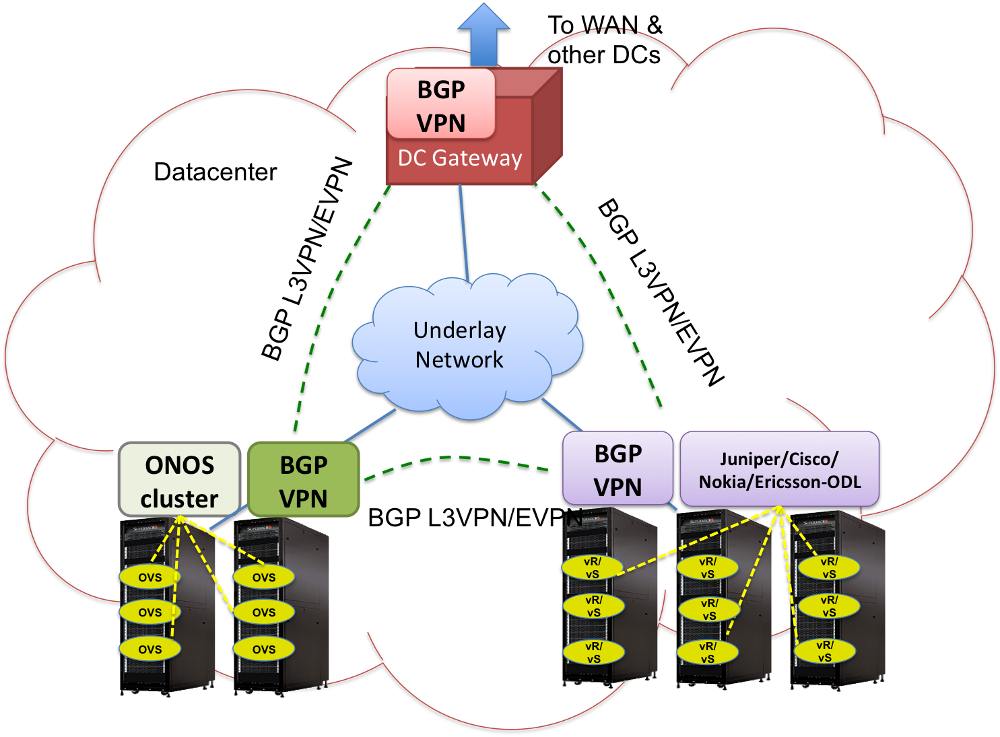

# Overlay VPNs and Gluon

## Introduction

The overlay VPN project will seek to build out a simpler, lightweight implementation of MPLS based BGP-VPNs using SDN principles. Customer IP packets (L3VPN) or Ethernet frames (EVPN) will be isolated from each other using MPLS VPN labels and separate VRF lookups. The well-known control plane for BGP-VPNs will interface with a high-performance, highly scalable ONOS cluster, to program hypervisor switch VRFs for L3 VPNs and EVPNs. With the use of BGP, the ONOS controlled racks will interwork with racks controlled by other vendor solutions for overlays (eg. Cisco, Juniper, Ericsson and Nokia), as well as any hardware WAN gateway (see Fig. 1). On the northbound side, all SDN based solutions will interact with OpenStack using the Gluon framework.

## Team

| Name | Organization | Email |
| --- | --- | --- |
| Robert Tao | Huawei | roberttao@[huawei.com](http://huawei.com) |
| Patrick Liu | Huawei | patrick.liu@[huawei.com](http://huawei.com) |
| Vikram Choudhary | Huawei | vikram.choudhary@[huawei.com](http://huawei.com) |
| Saurav Das | ONF | saurav.das@opennetworking.org |
| Jonathan Hart | ON.Lab | jono@onlab.us |
| Sudeep Kumar Singh | Tech Mahindra | ss00102863@[techmahindra.com](http://techmahindra.com) |
| Gaurav Sadh | Tech Mahindra | gs00347734@[techmahindra.com](http://techmahindra.com) |
| Harish Chalageri | Tech Mahindra | hc00121538@[techmahindra.com](http://techmahindra.com) |
| Sanyasi Upadhya | Tech Mahindra | us00122226@[techmahindra.com](http://techmahindra.com) |
|  |  |  |

# Gluon EVPN Quickstart Guide

This Quickstart will walk you through setting up your end to end Gluon EVPN environment.

## Pre-requisites:

You will need a computer with at least 16GB of RAM and at least 500GB of free hard disk space. A faster processor or solid-state drive will speed up the virtual machine boot time, and a larger screen will help to manage multiple terminal windows.

The computer can run Windows, Mac OS X, or Linux – all work fine with VirtualBox, the only software requirement.

Using virtual box create two virtual machines.

In each virtual machine, you need to have compute, openstack controller and ONOS controller nodes.

## Set up your Development Environment

      In both virtual machines, Configure the below mentioned steps.

1. Download and install the etcd database. Steps are mentioned in below shell script  
   [start\_etcd.sh](../../assets/start_etcd.sh)
2. Download gluon code for setting up the protonserver. Steps are mentioned in below shell script  
   [start\_gluon.sh](../../assets/start_gluon.sh)
3. Download onos and bring up the onos controller. Follow the below link  
   [Building ONOS](#)
4. Download openstack and bring up the openstack. Follow the below link  
   <https://docs.openstack.org/devstack/latest/>
5. Integrate onos with openstack  
   Execute ovs-vsctl set-manager tcp:**controlleripaddress**:6640 command in compute node.
6. Setup BGP peer between onos controllers  
   Method: POST

   The URL pat: [HTTP: // 192.168.212.32: 8181 / Onos / V1 / Network / the Configuration /](https://translate.google.com/translate?hl=en&prev=_t&sl=zh-CN&tl=en&u=http://192.168.212.32:8181/onos/v1/network/configuration/)

   Headers: Content-Type

   Values: application / json

   Body:

   {

   "Apps": {

   "Org.onosproject.provider.bgp.cfg": {

   "Bgpapp": {

   "routerId": "192.168.212.32",

   "LocalAs": 100,

   "MaxSession": 20,

   "HoldTime": 90,

   "EvpnCapability": true,

   "bgpPeer": [{ "peerIp ": "192.168.212.31", "remoteAs": 100, "peerHoldTime": 90, "connectMode": "active"}

   ]

   }}

   }}}

   }}  
     
   Once the development environment setup is ready then verify the gluon ONOS functionality.

## Verify the gluon ONOS functionality:

     1) Use below attached document for verifying the gluon ONOS functionality.

          [Gluon\_ONOS\_Configuration\_Guide.odt](../../assets/gluon_onos_configuration_guide.odt)
