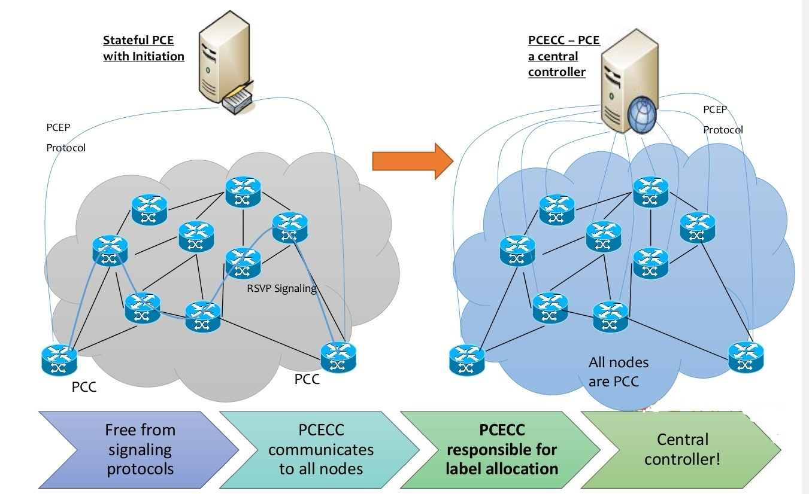
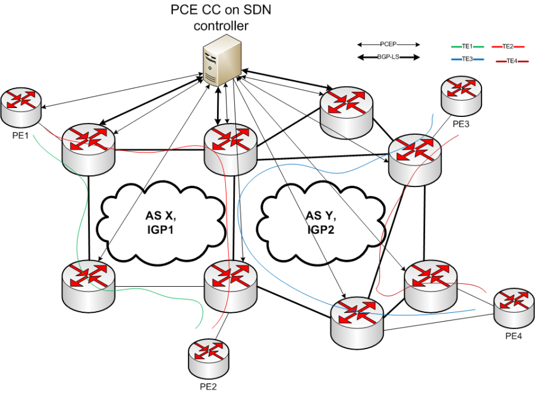
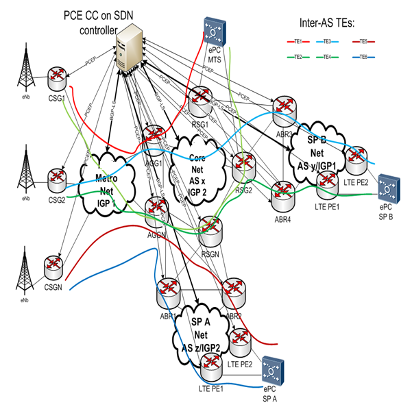
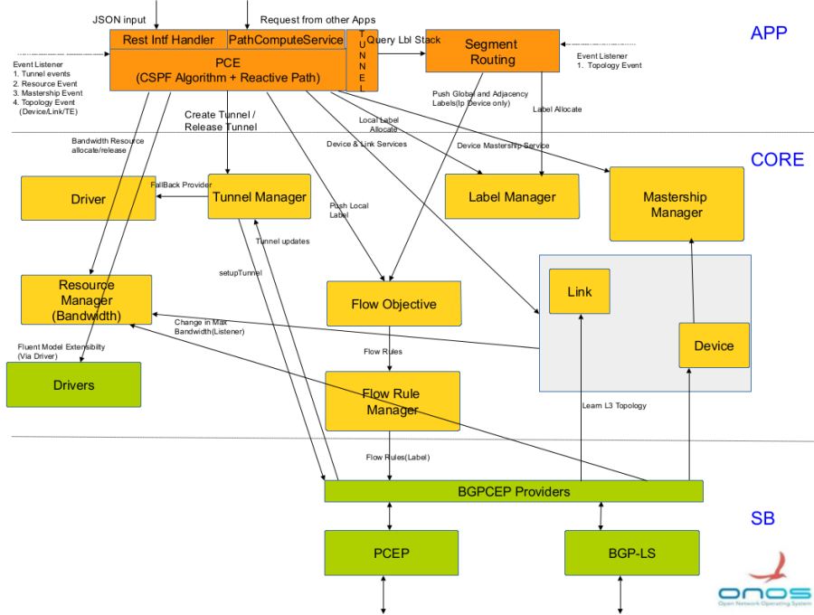

# PCECC as SDN Transition Solution

## **Team (Alphabetical)**

|  |  |  |
| --- | --- | --- |
| **Name** | **Organization** | **Email** |
| Avantika | Huawei Technologies | [avantika.s@huawei.com](mailto:avantika.s@huawei.com) |
| Kalyankumar Asangi | Huawei Technologies | [kalyana@huawei.com](mailto:kalyana@huawei.com) |
| Mahesh Poojary | Huawei Technologies | [mahesh.poojary@huawei.com](mailto:mahesh.poojary@huawei.com) |
| Mahesh Raju Somalaraju | Huawei Technologies | [mahesh.somalaraju@huawei.com](mailto:mahesh.somalaraju@huawei.com) |
| Patrick Liu | Huawei Technologies | [Partick.Liu@huawei.com](mailto:Partick.Liu@huawei.com) |
| Priyanka B | Huawei Technologies | [priyanka.b@huawei.com](mailto:priyanka.b@huawei.com) |
| Satish Karunanithi | Huawei Technologies | [satishk@huawei.com](mailto:satishk@huawei.com) |
| Suchitra H N | Huawei Technologies | [suchitra.hn@huawei.com](mailto:suchitra.hn@huawei.com) |

**Abbreviations**

|  |  |
| --- | --- |
| LSP | Label Switched Path |
| TE | Traffic Engineering |
| PCECC | PCE as Central Controller |
| BE | Best Effort |
| SR | Segment Routing |

## **Introduction**

In current legacy networks, the path computations are distributed to ingress nodes, with existing MPLS labels having local meaning. That is, labels are allocated by the downstream node to the upstream node. Such labels are identified only by the neighboring upstream node and downstream node. The label allocation is done locally and signaled via the LDP/RSVP-TE/BGP protocols.   
 The labels need to be maintained per LSP at every node and LSP state need to maintained at every node, impacting the scalability of such signaled networks.   
Shortcomings of existing technology

1. The complexity of deployment and maintenance.
2. It is not easy to add new services/application oriented service to the existing network architecture.
3. Uses Distributed architecture.

PCE is an entity (component, application or network node), that is capable of computing a network path or route based on a network graph (TED) and applying computational constraints.

A stateful PCE is the one which along with network state (TEDB), also stores the state of all the computed paths or LSPs and their resources (LSP-DB).

Segment Routing, applied to the existing data plane, offers the ability to tunnel services (VPN, VPLS, VPWS) from an ingress PE to an egress PE, without any signaling protocols like LDP and RSVP-TE.  Each path is specified as a set of "segments" which can either be advertised by link-state routing protocols (IS-IS or OSPF) or by using PCE as a central controller (PCECC), where PCE uses PCEP protocol to allocate and download labels centrally.

Using PCECC, which a SDN transition solution, the agility of the network is improved. Any change in network can be programmed using PCECC to learn the change and react to it quickly and efficiently.

### **Use cases**

1. PCECC on Controller for TE load balancing & global optimization
   1. Need for precise TE load balancing (LB)
   2. We can dynamically adjust tunnels and their bandwidth by PCE CC means.  
        
      

1. PCECC on Controller for Mobile SPs  
   All mobile SPs have to have Inter-AS TEs towards eNbs in network and vice verse.

 

## **Feature description**

1. A path computation algorithm which can compute path based on specified constraints.
2. Learning the existing state of the LSPs in the network.
3. Label allocation for segments in the network.
4. Computing and establishing paths based on segment routing.

## **Proposed Architecture**

Figure 1 illustrates the proposed architecture. Several components are reused from the existing ONOS architecture.   
 

## **Component Description**

### **Application**

#### PCE Application

1. This component will be responsible for doing constrained based shortest path computation.
2. It's the interface for applications or REST interface to set up MPLS tunnel.

#### Segment Routing Application

1. It listens on topology notifications and assigns global node labels & adjacency labels for SR based solution. It prepares label stack for the computed E2E path.

### **Core**

#### Tunnel Manager

1. PCE app takes the service of Tunnel Manager to setup the path.
2. Tunnel manager is also responsible for distribution of tunnel information in ONOS Clustering case.
3. Learns the tunnel information from the network which are not initiated by Controller but learned via PCEP SB protocol from the network.

#### Label Manager

1. PCE App and Segment Routing App take the service of Label Manager to allocate and fetch unique labels for the devices and links.

#### New Resource Manager

1. Bandwidth as the continuous resource in new resource manager subsystem is maintained for each interface of the devices.
2. PCE APP updates this bandwidth (increase/decrease) based on Tunnel creation/deletion.

#### Mastership Manager

1. To check the mastership of the particular ingress device.

#### Flow Objective/Rule Manager

1. PCE App and Segment Routing App uses service of Flow Objective to push node labels/adjacency labels to Devices through PCEP protocol.

#### Driver *Manager* & Drivers *impl*

1. Driver extension to push or delete Labels (Selector and Treatment).
2. Driver Pipeline implementation labels.
3. Fallback provider by TunnelManager to take PCEP tunnel provider as the fall back provider.
4. Fluent Extention model for projecting Device and Links as L3 Device/L3 Link.

#### Device Manager

1. BGP-LS protocol learns the L3 topology, annotates the L3 specific info and adds this device to Core through device provider service.
2. This device info will be queried by PCE APP for calculating path.

#### Link Manager

1. BGP-LS protocol learns the L3 topology, annotates the L3 specific info and adds this Link to Core through link provider service.
2. This link info will be queried by PCE APP for calculating path.

### **South bound protocols and Adapter**

#### BGP-LS

BGP Link state protocol to learn the topology information of network with TE parameters.

#### PCEP

1. To setup MPLS tunnel using PCEP.
2. Learn all existing LSPs from the network.
3. Push label or label stack for SR based PCECC.

#### BGPCEP Provider

Here we are clubbing PCE provider and BGP provider as BGPCEP provider.  
 BGP has flow provider and PCEP as well needs flow provider for label.   
 Devices are learned from BGP. So by default Flow Manager will choose BGP as the default provider.   
 To override it, we keep a common provider between these 2 south bound protocols, and provider can be build with intelligence to use BGP or PCEP for the respective flows.

#### Limitations

1. All the ONOS instances should have session with every PCC.
2. Devices' links' cost/bandwidth should not be modified after initial config.

#### Usage

1. To setup a MPLS tunnels between routers using ONOS, ONOS should know about the topology.

BGP should provide this information to ONOS.

{  
    "apps": {

        "org.onosproject.provider.bgp.cfg": {

            "bgpapp": {

                "routerId": "172.16.0.22",

                "localAs": 100,

                "maxSession": 20,

                "lsCapability": true,

                "holdTime": 180,

                "largeAsCapability": false,

                "flowSpecCapability": "IPV4",

                "bgpPeer":[ {"peerIp": "172.16.3.15", "remoteAs": 100, "peerHoldTime": 120, "connectMode":"active"}

                ]

            }

        }

    }

}

This can be checked using devices and links commands respectively.

2. Configuration at router should be made to establish PCEP session with ONOS.

3. Next CLI/web/REST can be used to configure tunnels.

onos> pce-setup-path l3::routinguniverse=0:asn=100:domainid=-1408236785:isoid=5555.5555.0055 l3::routinguniverse=0:asn=100:domainid=-1408236785:isoid=6666.6666.0066 0 rsvp 

 Please note that 0 stands for RSVP signaled LSPs.

 You can find further help for CLI using pce-setup-path --help.

 onos> pce-query-path

path-id            : 0 

`source             : IpTunnelEndPoint{ip=5.5.5.5}`

`destination        : IpTunnelEndPoint{ip=6.6.6.6}`

`path-type          : MPLS`

`symbolic-path-name : rsvp`

`constraints:`

`cost            : TE_COST`

`bandwidth       : 0.0`

`onos>`

onos> pce-update-path -b 10 0

`onos> pce-query-path`

path-id            : 1 

`source             : IpTunnelEndPoint{ip=5.5.5.5}`

`destination        : IpTunnelEndPoint{ip=6.6.6.6}`

`path-type          : MPLS`

`symbolic-path-name : rsvp`

`constraints:`

`cost            : null`

`bandwidth       : 10.0`

`path-id            : 0`

`source             : IpTunnelEndPoint{ip=5.5.5.5}`

`destination        : IpTunnelEndPoint{ip=6.6.6.6}`

`path-type          : MPLS`

`symbolic-path-name : rsvp`

`constraints:`

`cost            : TE_COST`

`bandwidth       : 0.0`

`onos>`
