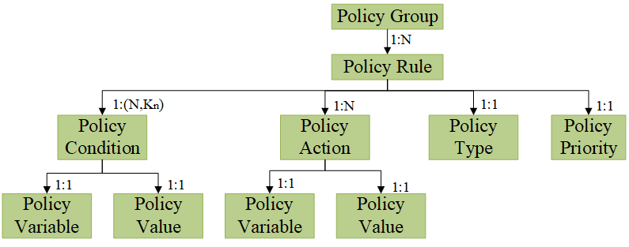
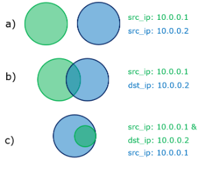
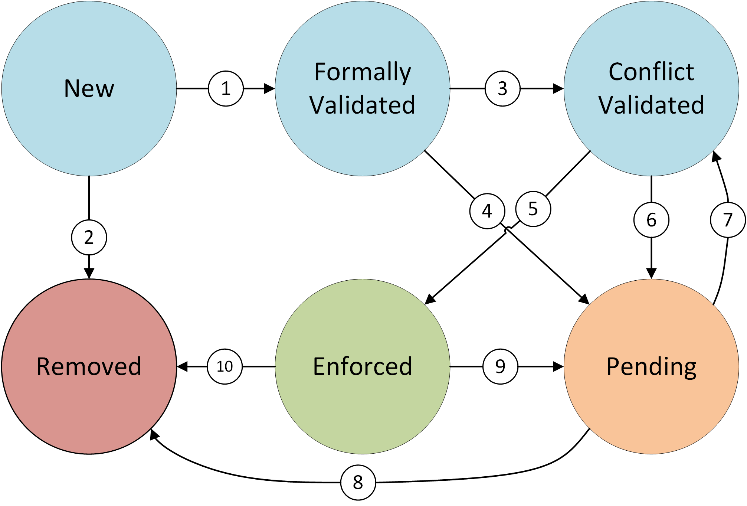
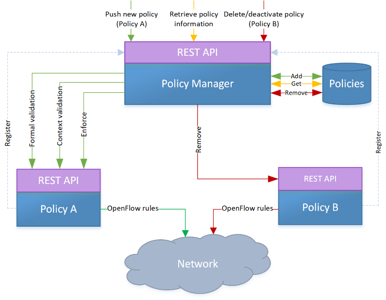
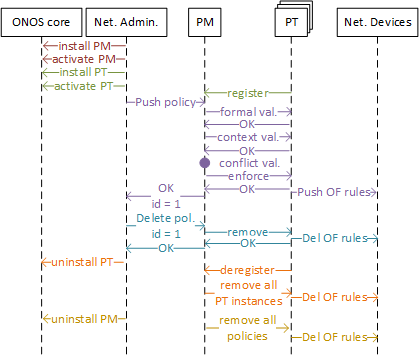

# POLICY FRAMEWORK FOR ONOS

# Team

| Name | Organization | Email |
| --- | --- | --- |
| Angelos Mimidis | Technical University of Denmark | [agmimi@fotonik.dtu.dk](mailto:agmimi@fotonik.dtu.dk) |
| Jose Soler | Technical University of Denmark | [joss@fotonik.dtu.dk](mailto:joss@fotonik.dtu.dk) |
| Ferran Canellas | Technical University of Denmark | [fcanellas94@gmail.com](mailto:fcanellas94@gmail.com) |
| Nestor Bonjorn | Technical University of Denmark | [nestorbonjorn@gmail.com](mailto:nestorbonjorn@gmail.com) |

# Introduction

This document describes a network policy framework (NPF) for ONOS, including its design, implementation and operation. The purpose of this NPF is to provide an abstraction layer that hides the technology-specific details of the control and data planes by providing a human-readable interface that simplifies the enforcement of low-level and technology-specific actions to the network (e.g. installation of OpenFlow rules, constraint monitoring, etc.). This prototype is integrated into the ONOS SDN controller and it is responsible for translating generic policies received through a dedicated REST API into OpenFlow (OF) flow rules.

The network policy framework has been tested with ONOS versions 1.13.2 and 1.15.0-rc2

# Acknowledgment

This work has been performed in the framework of the NGPaaS project, funded by the European Commission under the Horizon 2020 and 5G-PPP Phase2 programmes, under Grant Agreement No. 761 557 (<http://ngpaas.eu>).

# Source

The source code of the Network Policy Framework is currently available at:

* Policy Manager: <https://github.com/sdnpdtu/NPFManager>
* Firewall Policy: <https://github.com/sdnpdtu/NPF_PT_Firewall>
* Connectivity Policy: <https://github.com/sdnpdtu/NPF_PT_Connectivity>
* NAT Policy:  <https://github.com/sdnpdtu/NPF_PT_Nat>

# Design

The NPF was designed to support platform-wide and technology-agnostic policies. To this end, a policy model and a policy life cycle were defined. The former allows defining policies in a generic way regardless of the underlying technologies, while the latter defines the possible states of a policy as well as the logic to move from one state to another. These two concepts are summarized hereafter.

## Policy Model

The policy model used by the policy framework is based on the Policy Core Information Model (PCIM), defined in the IETF’s RFC 3060 [8] and RFC 3460 [9]. In it, each policy is characterized as a *Policy Rule*, which is associated to a specific *Policy Type*, and is comprised by a set of *Policy Conditions* and *Policy Actions*, each of them having a pair of a *Policy Variable* and a *Policy Value*. Moreover, the policy framework allows multiple *Policy Rules* to be added at the same time as a *Policy Group*. In this case, the *Policy Rules* are processed in priority order, based on a priority field that needs to be defined in each *Policy Rule*.

The set of *Policy Conditions* of a *Policy Rule* are represented as a 2-dimensional list, as illustrated in Fig. 1. This can be treated by the framework in two different ways:

* **Conjunctive Normal Form** (CNF): *Policy Conditions* are defined as the intersection of unions. For instance, , where  is a *Policy Condition*. The general CNF formula is expressed below, where 𝑁 represents the number of intersected clauses and 𝐾𝑛 the number of disjunctive elements in each of these clauses:

* **Disjunctive Normal Form** (DNF): *Policy Conditions* are defined as the union of intersections. For instance,. The general DNF formula is expressed below, where 𝑁 represents the number of united clauses and *Kn* the number of conjunctive elements in each of these clauses:

A single Policy Condition evaluates to true when a particular traffic matches the Policy Variable and the Policy Value. If the whole CNF or DNF expression of Policy Conditions evaluates to true, the corresponding Policy Actions are applied.

Note that any set of conditions expressed in CNF can be converted to DNF and vice versa. This is interesting because a policy expressed in DNF can be directly mapped to a set of flow rules as follows:

-        Each condition clause corresponds to a flow rule, where

-        Each condition corresponds to a parameter of the traffic to match

**Note** that the current version of the Policy Framework does **not** supported negated conditions when defining policies.

## Policy Life Cycle

The Policy Lifecycle manages the state of the network policies based on three validations: formal, context and conflict. The formal validation analyzes whether the structure of the policy is valid or not. The way it is analyzed is specific to the type of policy being pushed; however, a structured way would be the following:

1. Each of the Policy Conditions and Policy Actions is defined by a supported Policy Variable. Each policy type defines a set of supported variables that can be used to define Policy Conditions and Policy Actions.
2. The Policy Value associated with a Policy Variable is consistent. For example, if a Policy Condition has “src\_ip” as a Policy Variable, its Policy Value must have the format of an IP address.
3. The dependency requirements among Policy Variables is met. In some cases, several Policy Variables need to be defined at the same time, or the other way around, they cannot be defined at the same time. For example, if we want to allow the communication between two hosts, the corresponding policy must define the pair of addresses belonging to these hosts.
4. Specific requirements of the particular policy type. If the previous three steps are not enough, each policy type can define its custom validation.

The context validation analyzes if the resources involved in the policy are available or not. This analysis also depends on the type of policy being pushed. However, there are 3 different scenarios:

1. A resource must exist in the network. For example, if a policy defines that two hosts must be able to communicate, the addresses provided by the policy must belong to hosts attached to the network being controlled.
2. A resource must not exist in the network. For example, if a policy defines that a particular address has to be translate into another one, the new address must not be being used by another host.
3. Context validation is not needed. For example, a firewall policy does not need the resources to exist by the time the policy is pushed.

Formal and context validations only consider a particular policy instance. *Conflict Validation* is needed to make sure that this policy instance is not in conflict with existing policy instances already enforced in the network and; therefore, the behavior of the network is always the expected. In contrast to the first two validations, *Conflict Validation* is generic for all policy types. *Conflict Validation* comprises of two steps, *Conflict Identification* and *Conflict Resolution*. *Conflict Identification* is responsible for checking if a new policy instance is in conflict with any other existing policy instances. If this is true then the role of *Conflict Resolution* is to decide which policy instance is to prevail. With regards to *Conflict Identification,* two policy instances are considered conflicting if the following conditions are met:

1. They are of the **same type**. Enabling a cross-policy type conflict identification is a future work.
2. They have **dependent conditions**. A sufficient condition to check if two sets of conditions are independent is to check if they share at least one *Policy Variable* that has a different *Policy Value*. Thus, two sets of DNF conditions are dependent if any pair of DNF clauses is not independent.
3. They define **different actions**.

The dependency between Policy Conditions can be better understood with an example:

Two policies that define source and/or destination IP addresses as conditions are analyzed in 3 different scenarios:

a)     Both define a different source IP address so both conditions are independent.

b)     One condition defines the source IP and the other the destination IP. Applying the definition of independent policies, we see that they are dependent. In case we have traffic going from 10.0.0.1 to 10.0.0.2 both policies would match it.

The conditions of the green policy are contained within the conditions of the blue policy.

If, and only if, a conflict has been identified by the previous step, then the *Policy Resolution* is called by the framework. In order to resolve the identified conflict, the framework utilizes the priorities assigned to each of the conflicting policy instances. Given a conflict, one of the following scenarios can take place.

1. The new policy instance is of lower priority compared with the existing policy instances. In this case the existing policy instances will remain in the network and the new one will not be enforced.
2. The new policy instance is of higher priority. Here, the flow rules associated will the existing policy instances will be purged from the network and the new policy instance will be enforced in their place.
3. Both the new and existing policies instances have the same priority. In this case the workflow described in the first case will be followed.

Depending on the resolution of these three validations, a policy can be in any of the following six states:

* **New**: when a policy is pushed to the framework and has a valid JSON structure it is added in the New state.
* **Formally validated**: the policy definition is correct but it has not been yet context validated.
* **Context validated**: the policy has been formally validated and the resources involved in the policy are available.
* **Enforced**: the Policy Actions are being applied in the network for the traffic that matches the Policy Conditions.
* **Pending**: a formally validated policy, where either the context or the conflict validations failed. Whenever network conditions change or policies are added/removed from the framework, all policies in pending state will be re-evaluated (starting with the *Context Validation*)
* **Removed**: a policy that is not formally valid or that has been manually removed, is in the Removed state.

The logic that runs the different validation steps and handles the resulting state of the Policy Life-cycle is depicted in Figure 3.

When a policy is pushed to the framework by the administrator, the framework starts treating it in the New state. The first step is to convert the form of its Policy Conditions to DNF, so that the policy can be mapped to flow rules.  Then, the policy goes through a formal validation process, where the policy syntax and structure are evaluated. If it does not pass this validation, the policy is moved to the Removed state (2), but if it passes the formal validation, it is moved to the Formally validated state (1). Then, conflicting actions are analyzed. In case there is any conflict, the policy is moved to the Pending state (4), waiting for new circumstances to arise (7). If there is no conflict, the policy is moved to the Conflict Validated state (3). In this case, the policy goes through a context validation process, where the application of the policy in the system is evaluated in terms of available resources. If it does not pass this validation the policy is moved to the Pending state (6), whereas if it is context validated it is moved to the Enforced state (5). Only, in this case, the policy is enforced in the underlying system. Moreover, the administrator can request to deactivate an Enforced policy (9) (i.e., move it to the Pending state), as well as to remove a Pending (8) or Enforced (10) policy (i.e., move it to the Removed state), at any time. If an Enforced policy is either removed or deactivated, it is also un-deployed from the underlying system. Finally, a policy in *Pending* state tries to change its state (7) in two different scenarios, depending on how they reached the *Pending* state:

* **Validation failure** (4) or (6): these policies are attempted to be enforced every time there is a change in the framework (a policy is removed, the priority of a policy changed…).
* **Manual deactivation** (9):  these policies can only be enforced if they are manually reactivated.

# Implementation

## Policy Manager

In order to implement and validate the presented policy framework, a prototype has been developed. This prototype follows a modular approach and it is divided into two blocks:

* **Policy Manager (PM)**: An ONOS application that stores the policies and handles their lifecycle. Moreover, it also acts as the point of contact for network administrators through a REST API.
* **Policy Types (PTs)**: each policy type is implemented as an individual ONOS application, which implements the formal and context validations as well as the enforcement and removal of the corresponding flow rules from the network. The PT lifecycle (install, activate, deactivate, uninstall) is handled by ONOS core as they are ONOS-native applications.

This disaggregation between the PM and the PTs offers two advantages over a monolithic approach (everything as a single ONOS application):

1. When a PT has to be added, updated or removed, the PM does not have to be undeployed, then updated and redeployed. In this way, each PT is independent from each other and; therefore, there is no downtime for the policy framework as a whole.
2. Developers are not required to have in-depth knowledge about the internals of the PM. A PT can be developed, maintained and installed as an individual component and it only has to implement the aforementioned functionalities (policy model and lifecycle).

Figure 4 illustrates this design in detail. Both the PM and the PTs expose a REST API, which have different purposes. The former is a Northbound interface, meant for the interaction between the administrator of the system and the PM. This API allows CRUD operations for policy instances. The latter is an internal interface that is used by the PM when the functions implemented in a particular PT have to be called. With this approach, all generic actions/requests (e.g. request for a policy status) can be addressed to the PM, hence simplifying and generalizing the implementation of new policy types.

The GET requests are used to retrieve information about the policies installed in the framework and, as mentioned above, do not involve communication with the PTs. The POST request is used to push new policies to the framework in JSON format. Since this requires the validation and enforcement of the policies, this command will trigger POST requests to the REST API of the corresponding PT. Two PUT requests are available. One is used to register a PT in the PM and the other one is used to modify the priority of a policy. This process implies that this policy has to be removed from the network and pushed again with the new priority. For this reason, this endpoint also involves the validation and enforcement of a policy and; thus, the communication with the corresponding PT. Finally, DELETE requests are used to remove or deactivate a policy from the system, or to remove a PT. All of these endpoints return error/success messages. If an error occurs, not only the type of validation error is returned, but also specific details about the error so that it can be easily fixed.

Figure 5 depicts the internal operations of the PF, with respect to the interactions between the different involved entities. First, the installation of the PM is shown in red. Since it is a native ONOS application, the commands for installation and activation are sent to the ONOS core. A similar process is drawn in green for the installation of a PT. However, this process also includes the registration process of the PT in the PM so it can be used in the future. The process in purple shows the policy instantiation process. A policy instance is pushed by the network administrator, it is validated, and then a set of OF rules are installed in the network. Finally, the id assigned to the policy instance is returned to the network administrator for administration purposes. The process of policy instance removal is shown in blue. The network administrator requests to delete a policy instance with a specific id, and then the remove endpoint of the PT is used to purge the corresponding OF rules from the network. The process in orange corresponds to the PT removal, where the network administrator communicates with ONOS core to uninstall the PT. This triggers the de-registration of that PT from the PM, which eventually removes all the policy instances and flow rules corresponding to that PT from the PM and the underlying network. Finally, the yellow process corresponds to the PM removal, which uninstalls the PM and removes all the flow rules, associated with the PF, from the network devices.

## Policy Types

Three different PTs have been already implemented: Firewall, NAT and Connectivity

### Firewall Policy

This policy type implements a simple packet-filtering firewall, which allows a network administrator to block traffic that matches a set of specified parameters.

* **Supported conditions**: src\_ip, dst\_ip, src\_mac, dst\_mac, src\_port, dst\_port, tr\_prot, device
* **Supported actions**: allow
* **Formal validation**: all the provided conditions and actions are supported and their values have the appropriate format (IP address, MAC address, port, boolean…).
* **Context validation**: always valid. No need to make sure that the resources being blocked exist at the time of pushing the policy.
* **Enforcement**: a ForwardingObjective rule is created based on the Conditions and it is forwarded to the provided device or to all the devices in the network if a device is not provided.
* **Removal**: all the flow rules with an id based on the given policy id are removed.

### NAT Policy

This policy type implements a simple network address translation, which allows a network administrator to specify the address a host will have when communicating with hosts in another network.

* **Supported conditions**: host\_ip
* **Supported actions**: natted\_ip
* **Formal validation**: all the provided conditions and actions are supported, and their values have the appropriate format (IP address, MAC address, port, boolean…).
* **Context validation**: the provided host\_ip must exist and the provided natted\_ip must not exist.
* **Enforcement**: a ReactivePacketProcessor is implemented to process the packets in the network. The enforce and remove functions simply add/remove IP and MAC addresses from the translation tables.
* **Removal**: the host is removed from the translation tables.

### Connectivity policy

This policy allows to control the connectivity between a pair of hosts.

* **Supported conditions**: src\_ip, dst\_ip
* **Supported actions**: connect
* **Formal validation**: all the provided conditions and actions are supported, and their values have the appropriate format (IP address, MAC address, port, boolean…). Moreover, a pair of src\_ip and dst\_ip must be provided in each DNF clause**.**
* **Context validation**: both the src\_ip and dst\_ip must exist.
* **Enforcement**, a host-to-host intent is created, which is responsible for obtaining the path between the two hosts and reinstalling the appropriate flow rules. Moreover, if the path between the two hosts breaks, the intent is recompiled and a new path is provided.
* **Removal**: the intent is withdrawn from the network.

# Installation

Both the PM and the PTs are installed in ONOS as any other ONOS app. The only requirement is that the PM is previously installed in order to install a PT. Otherwise, a Runtime exception is thrown, as PTs are dependent on libraries/calls implemented in the PM.

# Operation

## Policy Manager

Using the Policy Manager is very simple. An administrator just needs to send a REST message to any endpoint.

In order to push a new policy framework, a POST request has to be sent to <http://localhost:8181/onos/policymanager/policies> passing the policy in JSON format. Example:

`{`

`"policies":`

`[`

`{`

`"priority":"3",`

`"type": "FIREWALL",`

`"form": "DNF",`

`"conditions":[[`

`{"variable": "src_mac",`

`"value": "00:0a:95:9d:68:12"}`

`]],`

`"actions":[`

`{"variable":"allow",`

`"value": "false"}]`

`}`

`]`

`}`

This JSON represents a Policy Group, where each policy within “policies” is a Policy Rule. For each policy rule, a priority (higher value, higher priority), the type, the form (CNF or DNF), the conditions (as a list of lists understood as CNF or DNF depending on the type) and the actions (as a list) must be provided.

The reply message is another JSON that contains the HTTP response code, a list of the policy ids assigned to the pushed policies, and a list of messages, specifying for each policy the success/error message.

The returned policy id varies depending on three cases:

* **New policy**: a new id is assigned.
* **Duplicated policy**: the id of the original policy is returned. The duplicated policy is not added to the framework though.
* **Formally invalid policy**: the returned id is 0, since this policy is not added to the framework.

## Policy Types

### Creation of New Policy Types

In order to create a new policy type, an ONOS app with a REST interface has to be created (like steps 4 and 5 of section 3.1.1). Then, in order to integrate it in the Policy Framework and be accessible by the Policy Manager, the following steps have to be performed (the order is not important):

* In the activation function, register the policy to the policy framework using the */onos/policymanager/policy/type/register/<policyType>* endpoint.
* Do the opposite for the deactivation function, using the endpoint */onos/policymanager/policy/type/deregister/<policyType>*
* For the deactivation you also need to retrieve all associated flow rules, and purge them from the network.
* For example, in the Firewall Policy it is done as follows:

`@Activate`  
`protected void activate() {`  
`log.info("Firewall Policy started");`  
`//The endpoint MUST match the policy type`  
`Response response = RESTtarget.path("policytype/register/firewall")`  
`.request(MediaType.APPLICATION_JSON)`  
`.put(Entity.text(""));`  
`if (response.getStatus() != Response.Status.OK.getStatusCode()){`  
`log.info("Policy Framework not found.");`  
`throw new RuntimeException();`  
`}`  
`log.info("Firewall policy type successfully registered.");`  
  
`}`  
  
`@Deactivate`  
`protected void deactivate() {`  
`log.info("Firewall Policy stopping");`  
`log.info("De-registering Firewall Policy from PM");`  
`Response response = RESTtarget.path("policytype/deregister/firewall").request(MediaType.APPLICATION_JSON).delete();`  
`String prsJSON = response.readEntity(String.class);`  
`log.info(prsJSON);`  
`PolicyRules prs = parsePolicyRules(prsJSON);`  
`for (PolicyRule pr:prs.getPolicyRules()) {`  
`remove(pr);`  
`}`  
`log.info("Firewall Policies Deleted");`  
`}`  
  
  
`public PolicyRules parsePolicyRules(String json) {`  
`ObjectMapper mapper = new ObjectMapper();`  
`mapper.disable(DeserializationFeature.FAIL_ON_UNKNOWN_PROPERTIES);`  
`PolicyRules policyRules = null;`  
`try {`  
`policyRules = mapper.readValue(json, PolicyRules.class);`  
`} catch (Exception e) {`  
`e.printStackTrace();`  
`}`  
`return policyRules;`  
`}`

* Make sure that the endpoint defined in the POM file has the form /onos/<policyType>policy, where <policyType> is the one defined in step 1. Example: *<web.context>/onos/firewallpolicy</web.context>*
* Add a dependency to the shared libraries’ package in the POM file:

`<dependency>`

`<groupId>eu.ngpaas</groupId>`

`<artifactId>ngpaas-pm-api</artifactId>`

`<version>1.0-SNAPSHOT</version>`

`</dependency>`

* In the AppWebResource file, the REST path of the class has to be empty (@Path(“”)). The, the four endpoints described in Table 2 have to be defined.

For the new conflict validation method, an endpoint called /rules (POST) has been developed, which given a policy it returns the Forwarding Objectives that would be enforced and a list of the devices where this enforcement would happen.

Note: when installing flow rules in the network it is recommended to install them defining an Application Id based on the policy id (currently the Application ID is defined as “Policy<PolicyID>”). In this way, with the new conflict validation it is possible to know the two flow rules that are conflicting, which Policy id (and, thus, the policy type) they have. Moreover, it also simplifies the remove function, since it is possible to remove all the flow rules with a given Application id, without needing to calculate again which flow rules have to be removed.

### Helper functions for validations

Given that some parts of the formal validation are common for all the PTs, a helper class called PolicyHelper in the shared libraries (eu.ngpaas.pmLib) contains useful functions that can be accessed by any PT:

* **validateVariables**(policyRule, validConditionVariables, validActionVariables): checks if the given policy rule’s variables are contained in the given lists of valid condition and action variables.
* **validateConditionValue**(policyRule, variable, type): checks if the values of all the variables matching the given variable are of the given type. For example, if we do: validateConditionsValue(policyRule, “src\_ip”, PolicyVariableType.IPV4) it will check that all the conditions that define a source ip are of type IPv4 (e.g. 10.0.0.1). The PolicyVariableType is an enum that currently supports 3 types of data: IPV4, MAC and PORT.
* **validateConditionValue**(policyRule, variable, validValues): the previous function is overloaded so that it can take a list of valid values instead of a type of data.
* **validateActionValue**(policyRule, variable, type): the same as the function above but for Policy Action variables.
* **validateActionValue**(policyRule, variable, validValues): the same as the previous function but for a list of valid values.
* **validateConditionVariableRelation**(policyRule, mustCoexistDict, mustNotCoexistDict): this function tries to simplify the process of validating that some variables exist or not at the same time.
  + *mustCoexistDict*: dictionary that has a PolicyVariable as a key and a list of lists of other Policy Variables (understood in DNF format) as value that represent the set of Policy Variables that must exist in the same clause as the Policy Variable given in the key.
  + *mustNotCoexistDict* dictionary that has a PolicyVariable as a key and a list of Policy Variables as value that represent the set of Policy Variables that cannot happen in the same clause as the PolicyVariable given as a key.

A simple example is in the Connectivity policy, in which a pair of source and destination addresses must be provided. However, this function allows much more complex relations.

* **validateActionVariableRelation**(policyRule, mustCoexistDict, mustNotCoexistDict): the same as the previous function but for Policy Action variables.

A similar work could be done for the Context validation since in most cases it only consists of checking if a host exists or not.

# REST API

|  |  |  |
| --- | --- | --- |
| **Policy Manager REST API endpoints** | | **Description** |
| **GET** | /policies | Lists all policy instances in the framework regardless of state |
| /policies/active | Lists only active policy instances |
| /policies/id/{id} | Returns the policy instance with the given id |
| /policies/state/{state} | Lists all policy instances in the given state |
| /policies/type/{type} | Lists all policy instances of a given type |
| /policies/types | Lists all registered policy types |
| /policies/num | Gets the total number of policy instances |
| /policies/activate/{id} | Activates the policy instance with the given id |
| **POST** | /policies | Pushes a policy instance to the framework |
| **PUT** | /policytype/register/{pt} | Register a policy type with the given name |
| /policies/{id}/priority/{np} | Changes the priority of the policy instance with the given id |
| **DELETE** | /policies/deactivate/{id} | Deactivates the policy instance with given id |
| /policies/{id} | Deletes the policy instance with given id |
| /policies | Deletes all policy instances |
| /policytype/deregister/{pt} | Deregisters the policy type of the given name |
