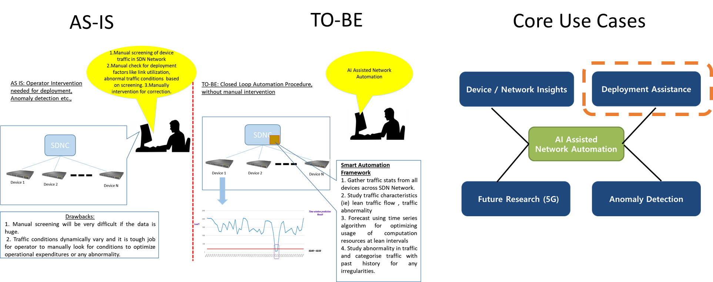
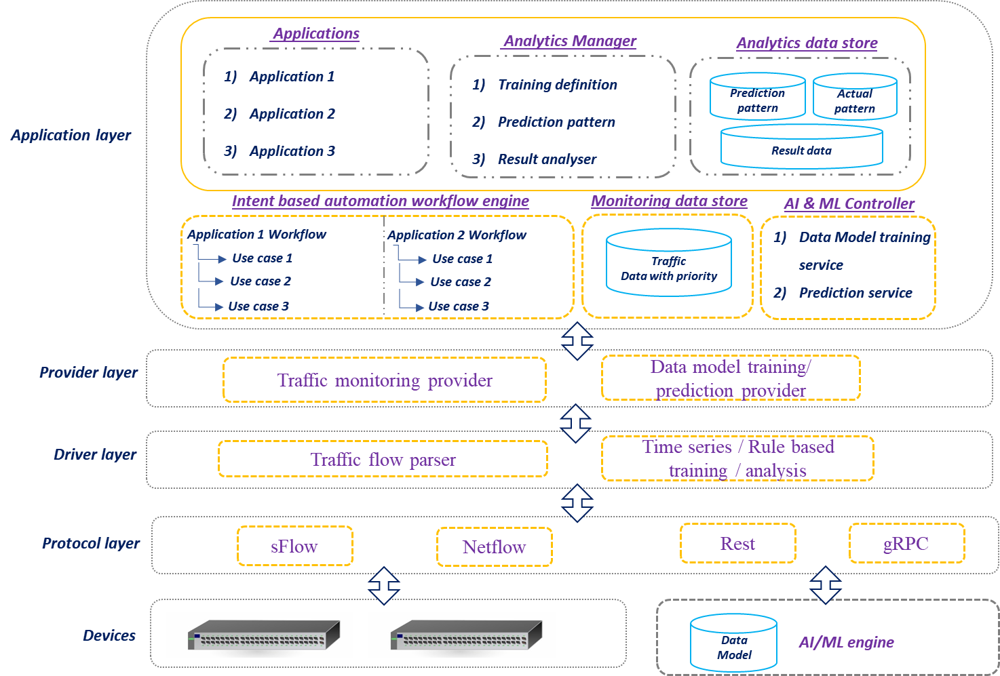
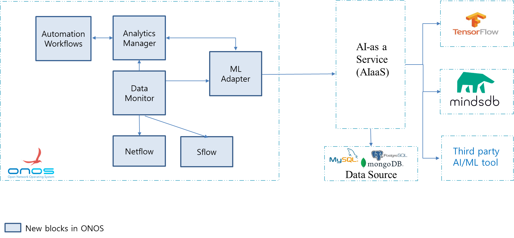
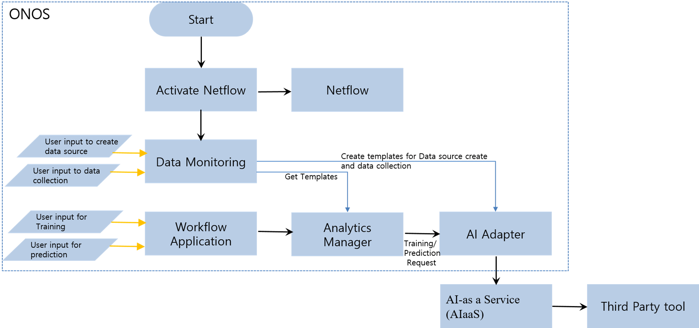
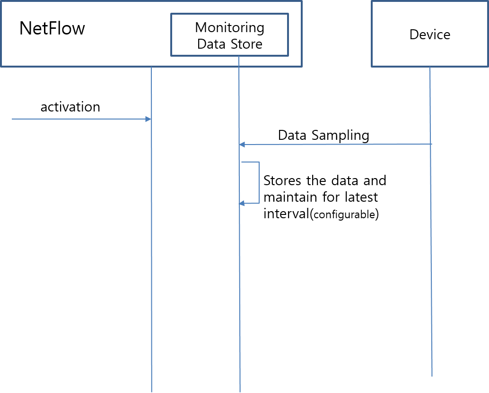
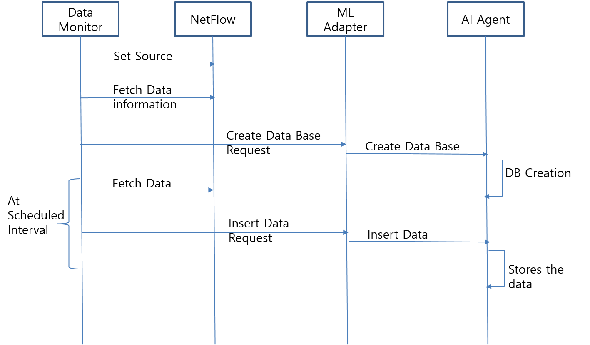
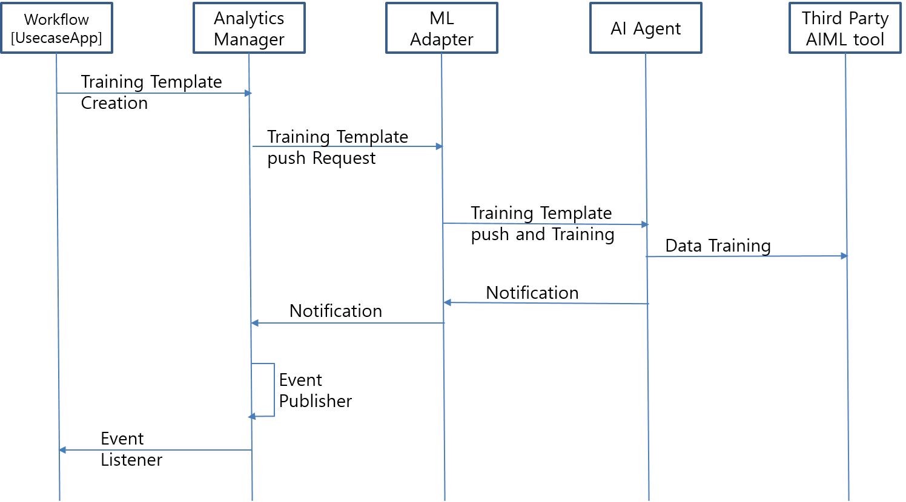
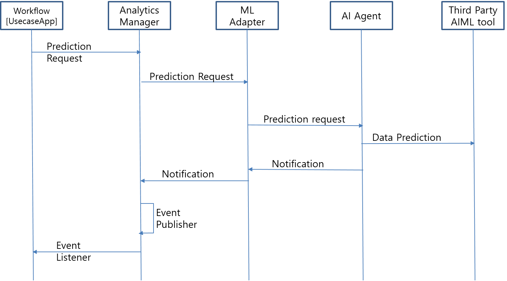
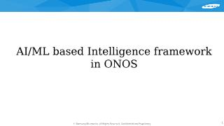

# SAFe: Smart Automation Framework

# **Team**

| **S****no** | **Name** | **Organization** | **Module** | **Email** |
| --- | --- | --- | --- | --- |
| **1** | **Jaegon Kim** | **Samsung Electronics Co., Ltd, Korea** | **SAFe Framework Design** | **[jaegon77.kim@samsung.com](mailto:jaegon77.kim@samsung.com)** |
| **2** | **Karthikeyan** **Subramaniam** | **Samsung R&D Institute of India** | **SAFe Framework Design, Netflow** | **[karthikeyan.s@samsung.com](mailto:karthikeyan.s@samsung.com)** |
| **3** | **Saritha Ramesh Thangaraju** | **Samsung R&D Institute of India** | **Analytics Manager, Usecase Workflows** | **[saritha.rt@samsung.com](mailto:saritha.rt@samsung.com)** |
| **4** | **Senthil Subramaniam** | **Samsung R&D Institute of India** | **Sflow, Data Monitor, Usecase Workflows** | **s.[senthil@samsung.com](mailto:senthil.s@samsung.com)** |
| **5** | **Sudhakar B** | **Samsung R&D Institute of India** | **AL/ML Adapter, Usecase Workflows** | **[sudhakar.b@samsung.com](mailto:sudhakar.b@samsung.com)** |
| **6** | **Tae woo Kim** | **Samsung Electronics Co., Ltd, Korea** | **SAFe Framework Design** | **[t01.kim@samsung.com](mailto:t01.kim@samsung.com)** |

# **Abstract**

Irrespective of underlying network technologies, the network can be intelligently controlled with Software Defined Networking(SDN). The SDN control software can manage various network elements including switches, routers, and virtual switches agnostic to vendors. The network administrators use SDN for rapid deployment including configuration, monitoring, and troubleshooting devices across SDN-controlled networks.  SDN is being adapted at a faster pace to accommodate the evergrowing Network traffic needs. The Network administrator spends a considerable amount of time in repetitive activities like Network  Software upgrades, Monitoring, Troubleshooting, etc.  Typically, the SDN controller does not analyze traffic conditions which are required for the network administrators to optimize resource utilization, service quality, anomaly detection and etc.  To address this issue, we are proposing to introduce Smart Automation Framework (SAFe) in ONOS. We also investigated a few issues like Network devices software upgrades and  Resource Utilization. Our investigation proved that the SAFe improves operational efficiency (i.e., minimal or zero traffic loss, less operational cost) when compared to the manual procedure. The SAFe can handle workflow-based applications like optimal resource monitoring, anomaly detection, AI/ML-driven configuration, etc.

# **Introduction**

This document describes the AI/ML-assisted Smart Automation Framework for ONOS, including its design, implementation, and operation. The purpose of this framework is to enable intelligent automation and reduce operational costs. Automation can be anything like Identifying Network devices by ZTP, Configuring based on the type of network device, applying QOS policies, routing, monitoring and etc.   
The SAFe can be integrated with third-party AI/ML tools. The third-party integration can be enabled by AI-as-a-service.  AI-as-a-service is an open-source middleware AI agent.

The automation workflows can be written using this framework, for various AI based usecases.



# **SAFe Architecture**

## Architecture



## Over All Block Diagram



## Flow Diagram:



## Sequence Diagrams:

### Sequence Diagram – 1. Activation of Netflow/Sflow



### Sequence Diagram – 2. Initiate Data Monitoring



### Sequence Diagram – 3. Initiate Data Training



### Sequence Diagram – 4. Prediction



## Structure Overview

The following illustrates the directory structure:

```
ai-plugin  
 +-- api  
 | +-- main  
 | | +-- aiadapter  
 | | +-- analyticsmanager  
 | | +-- datamonitor  
 |  
 | +-- test  
 | | +-- aiadapter  
 | | +-- analyticsmanager  
 | | +-- datamonitor  
 |  
 +-- app  
 | +-- main  
 | | +-- aiadapter  
 | | +-- analyticsmanager  
 | | +-- datamonitor  
 | | +-- cli  
 |  
 | +-- test  
 | |+-- aiadapter  
 | |+-- analyticsmanager  
 | |+-- datamonitor  
 |
```

```
 
```

### app directory

The app directory contains subdirectories

* **mladapter** for adapter related code
  + That is, features/functions shared for all machine language related work

* **analyticsmanager**for analytics manager related code
  + That is, features/functions shared for all interaction between workflow and other modules
* **datamonitor** for view related code
  + That is, a directory for maintaining the data from Netflow/sFlow/any other monitoring protocol.

### api / datamonitor directory

The datamonitor subdirectory contains the following subdirectories, providing a number of categories of functionality:

* DataManagerService

### app / datamonitor directory

The datamonitor subdirectory contains the following subdirectories, providing a number of categories of functionality:

* **impl**
  + DataCollector[NetFlow/sFlow]
  + DataManager[Interacts with mladapter]
  + Scheduler

* **cli**
  + datasource create(data collector  netflow,sflow)
  + datastore create
  + data insertion

### api / mladapter directory

The datamonitor subdirectory contains the following subdirectories, providing a number of categories of functionality:

* CollectorManagerService

### app / mladapter directory

The mladapter subdirectory contains the following subdirectories, providing a number of categories of functionality:

* **impl**
  + Adapter Service
  + CollectorManager[Interacts with analytics manager and Data monitoring ]
  + Events listener

### api / analyticsmanager directory

The datamonitor subdirectory contains the following subdirectories, providing a number of categories of functionality:

* TemplateService

### app / analyticsmanager directory

The mladapter subdirectory contains the following subdirectories, providing a number of categories of functionality:

* **impl**
  + TemplateManager
  + EventsManager

* **cli**
  + Show templates
  + training template
  + prediction template
  + training status

# **Use Cases:**

This proposed Smart Automation Framework(SAFe) is used for the following use cases

1. SW upgrade
2. Network Configurations
3. Optimal Resource Utilization
4. Anomaly Detection
5. Dynamic QoS

# **Project Plan****:**

## Stagewise plan:

### Stage 1[April ~ August]:

datamonitor - Datacollector, Cli, Datamanager

mladapter - Collector Manager

### Stage 2[September~ December]:

datamonitor[test] - datacollector, cli, datamanager

mladapter - Events Manager

analytics manager

# **ONOS Jira ID:**

<https://jira.onosproject.org/browse/ONOS-8163>

# **Proposal Video:**

[](../../assets/ai-framwork_onos.pptx)
