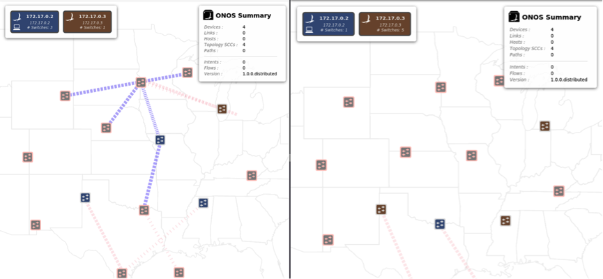
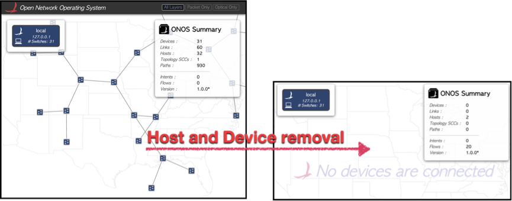
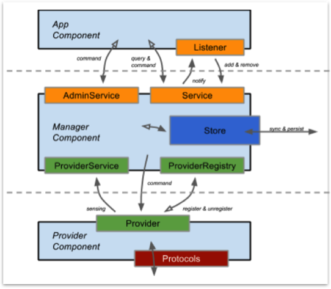
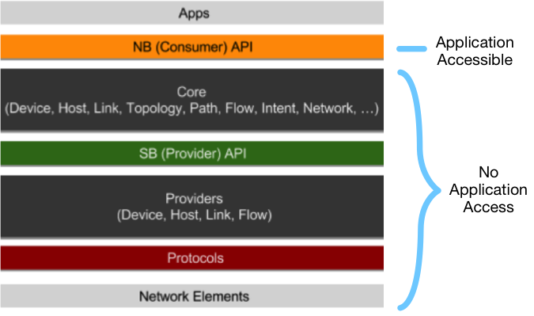
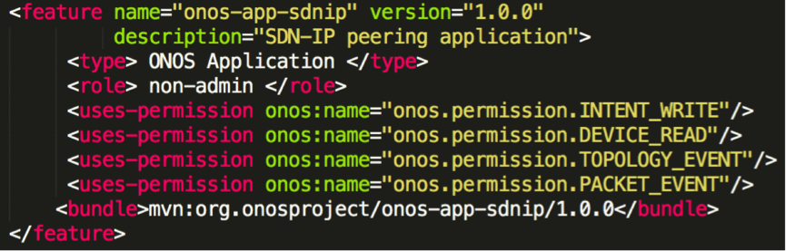
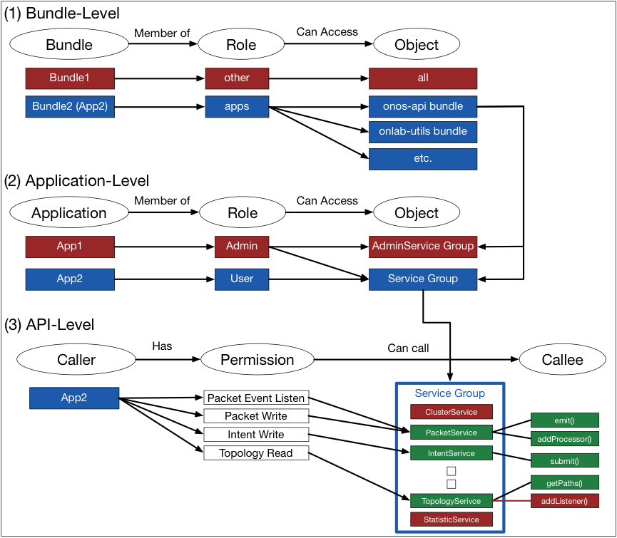
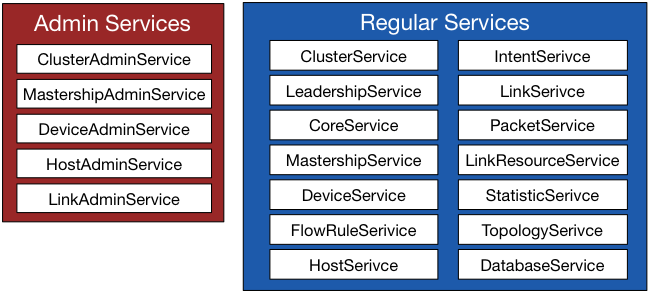

# Introduction

## **Introduction**

ONOS provides “useful Northbound abstractions and APIs to enable easier application development”. Such abstractions and APIs are not only easy to use but also powerful as they basically allow ONOS applications to do anything desired, and it is indeed necessary to grant such a powerful authority to applications to offer as much network programmability as possible.

Such powerful capabilities of ONOS applications may introduce potential misuse opportunities or software failures, and eventually affect the behavior of the managed network. In the case of the network with certain requirements (e.g., mission-critical networks), the network operators may want to configure the controller environment to be a bit more conservative by restricting the capability of the applications.

For those who wish to configure ONOS to behave in a conservative manner, we propose two features that could be applied to ONOS.

1. Application Authentication
2. Role-based/ Permission-based Access Control (Least privileged applications)

## **Motivating Example**

To illustrate how an ONOS application API misuse may affect the behavior of the managed network, we composed two ONOS applications.

The first ONOS application consistently generates the DeviceDisconnected events, which notifies the device manager component of a device disconnection. This application eventually modifies the network topology, and thereby, affects the behavior of the other applications that make decisions based on the topology.

Figure 1 shows how the application modifies the network topology information that other applications may depend on.

Figure 1. An ONOS application generates DeviceDisconnected events to modify the network topology.  Due to the behavior of this application, network topology view consistently changes as shown (on left and right).

The second ONOS application modifies the network topology by removing all of the existing devices and hosts, as shown in Figure 2.

Figure 2. An ONOS application can remove the devices and hosts on the network. The figure on the left illustrates the topology before the removal, and the figure on the right  illustrates the topology after the removal.

The second application also modifies the network topology and, like the first application, it causes a problem. For example, if this application were deployed along with the forwarding application (onos.fwd), which issues the flow rules based on the network topology information to establish network connections on the data plane, the latter may not function correctly as it makes decisions based on the corrupted network topology information.

As shown in the examples, any misused APIs may put the managed network in an unpredictable state. For the network administrators who wish to avoid such circumstances by restricting the behavior of ONOS applications according to a certain conservative permission model, we propose *Security-mode*ONOS.

## **Security-mode ONOS**

In the case of the example applications introduced in the previous section, the first application uses DeviceProviderService on the Southbound (SB) API tier. As shown in the ONOS subsystem structure (Figure 3), ONOS applications should not use the services in the SB API tier. However, the first example application was able to access and use those APIs.

Figure 3. The subsystem structure of ONOS

The second example application used one of the Admin Services, which resides in the Northbound API tier. However, Admin Services contain very sensitive operations like removing network components. In some cases, a network operator may want disallow the applications’ access to those administrative APIs.

Figure 4. The system architecture of ONOS: NB API is the only layer that ONOS applications can access to

To prevent ONOS applications from accessing sensitive tiers of the ONOS architecture or administrative APIs, we propose *Security-mode*ONOS.

In *Security-mode* ONOS, the following access control mechanisms are enabled: (1) Bundle-level Role-based Access Control, and (2) Application-level Role-based Access Control.

**Bundle (Application) Authentication**

Before we apply any access control features, the application bundle’s meta-information must specify permission-related information. An example is shown below.

Figure 5. Example policy file for ONOS application

As shown in Figure 5, the developer must specify the bundle <type>. This type field indicates that the bundle is an ONOS application or other type of ONOS bundle (e.g., provider, services or etc.). Those bundles specified as ONOS application will only be allowed to access the NB API bundles and selected utility packages.

If a bundle is an ONOS application, developer must specify the application <role>. The role field can be either “admin” or “non-admin”, where the former allows an ONOS application to access the Admin Services.

Also, an ONOS application developer has to specify the <permissions> that are going to be given to the application. For example, if an ONOS application needs to issue the Intents, it is going to give that application “onos.permission.INTENT\_WRITE” permission.

Based on such three types of meta-information given via policy file, ONOS application access control can be realized. Since access control is applied to the ONOS application according to the policy specifications, the integrity of not only the application itself but also the policy file has to be guaranteed. For this reason, we recommend using the JDK’s *jarsigner* to do this.

In addition, by signing ONOS applications, ONOS may also restrict the deployment of potentially unsafe applications from untrusted source.

**An Overview of the ONOS Application Access Control Mechanism**

The ONOS application access control mechanism consists of the following three steps: (1) Bundle-level Role-based Access Control, (2) Application-level Role-based Access control, and (3) API-level Permission-based Access Control.

The overall mechanism of the ONOS Application Access Control is illustrated in Figure 6, and we elaborate on each of the three access control mechanisms.

Figure 6. An overview the mechanism of ONOS Application Access Control

### **(1) Bundle-level Role-based Access Control**

The network operator, who is managing a sensitive or mission-critical network, may want to make sure ONOS applications only access the NB API tier of the ONOS architecture.

We propose that all the bundles have one of two roles:  “apps”, and “non-apps”. As mentioned previously, this role is specified in the policy file.

Based on the role assignment, the role-based access control is applied to each bundle as shown in Figure 6 (1). Such coarse-grained access control only allows the bundles with “apps” role to access the NB API bundles and selected utility APIs.

### **(2) Application-level Role-based Access Control**

As aforementioned, there are administrative APIs (or Admin Services) that perform network sensitive operations, in the NB API layer, which a network operator may also want to prevent ONOS applications from accessing.

According to the <role> specified in an application bundle’s policy file, application-level access control is applied. If an ONOS application role is “admin”, it can access both the Admin Services and the regular Services as shown in Figure 6 (2). Conversely, if an ONONS application role is “non-admin”, it can only access the regular services.

The Admin Services and regular Services as of ONOS Avocet (version 1.0.0) are shown in Figure 7.

Figure 7. Admin Services and Regular Services

### **(3)****API-level Permission-based Access Control**

In addition to the previous coarse-grained access control, a fine-grained API-level Permission-based Access Control is applied as well. The permissions specified in the policy file are utilized here.

To implement this API-level access control, the permission model for ONOS must be defined in the application bundle’s policy file. Specifically, each of the permissions should logically represent each network operation, and it should be mapped to a set of APIs as illustrated in Figure 6 (3). For example, as shown in Figure 5, the permission to allow the intent submissions can be expressed as “onos.permission.INTENT\_WRITE”.
