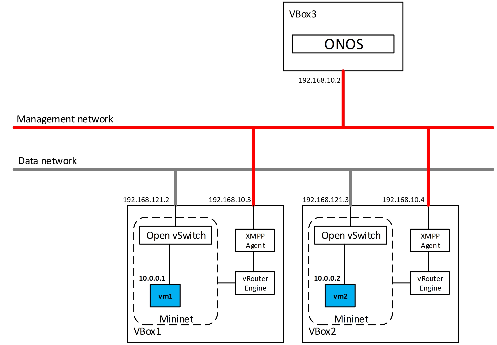

# XMPP as SBI

|  |  |  |
| --- | --- | --- |
| **Abstract** This project implements a new SBI for ONOS and allows new deployment use-cases. The main goal is to support the L3 multi-tenants isolation in a cloud network and routing system in a simple, a stable and a scalable way. In fact, a BGP/MPLS IP VPNs solution can be used and extended via the XMPP protocol to provide a Virtual Network service to end-systems (compute nodes or virtual machines). These compute nodes may host end-user applications and can provide network services. | **Team**  * Project owner: **Abdulhalim Dandoush**, ESME Sudria engineering school, France   contact: abdulhalim.dandoush at esme.fr     * Main developer: **Tomasz Osinski**, Orange Labs & Warsaw University of Technology, Warsaw, Poland   Contact: tomasz.osinski2@orange.com, osinstom@gmail.com     * Mentor: **Andrea Campanella**, ONF engineer,CA, USA   Contact: andrea at opennetworking.org | **Status** ACTIVE |

| **Problem space** | |
| --- | --- |
| Why are we doing this? | **Problem statement** The BGP protocol is widely used in the networks and recently it has received a lot of attention in the context of Routing solution for Large-Scale Data Center [1]. However, it is not widely deployed in hosts/hypervisors. The IETF draft [1] discusses how the control plane for BGP IP VPNs [RFC4364] can be used and extended via the XMPP protocol to provide a solution for large-scale data centers that meets some key requirements, e.g., accommodating application bandwidth and latency. This solution provides an IP service to end-system virtual interfaces and improves network stability and scalability, as a result of confining L2 broadcast domains and isolating the different tenants at L3 level. The XMPP protocol (with Publish/Subscribe extension) is used in this solution to distribute routing information over the network. However, the ONOS controller does not support XMPP implementation as SBI, thus the usage of ONOS in the described framework is not possible so far. Moreover, as the XMPP protocol is highly extensible it may be used in various applications, so it may be used as general-purpose message bus in SDN/Cloud network. **Impact of this problem** The implementation of XMPP as SBI will allow the deployment of ONOS in new use cases and the consideration of the architecture described in [2] as the networking solution for the OpenStack-based clouds. It will provide L3VPN or EVPN network isolation between tenants. Moreover, the XMPP is easily extensible and may be used to design future network configuration strategies. |
| How do we judge success? | The goal of the project is to provide XMPP protocol support for ONOS controller. The XMPP implements the  IETF draft “BGP-signaled End System IP VPNs” architecture and then ONOS can communicate with any virtualization hypervisor with a vRouter support as the case of Compute Nodes that have a vRouter support at the KVM hypervisor level proposed by Juniper via the OpenContrail project. The validation of all control plane scenarios defined in [2] is required. The first implementation will support XEP0060 (Publish/Subscribe) described in [3]. Moreover, the implementation will be designed to provide extensibility of XMPP, so the new XMPP extensions may be implemented by new OSGi module in Protocols layer. |

| **Ready to make it** | |
| --- | --- |
| What are we doing? | The XMPP protocol is XML-based data exchange protocol. The main feature of XMPP is extensibility and payload-agnosticism. The XMPP Core as explained in the RFC6120 [4] describes the basics of XMPP, while the communication model is defined in XEP (XMPP Extension Protocol) specifications. We have designed the XMPP protocol implementation in the extensible manner, so the core XMPP implementation may be extended by the new XEPs seamlessly.    The project will deliver the extensible implementation architecture of XMPP for ONOS. Moreover, the PoC of architecture [2] will be presented as the use case (Intra-DC L3VPN/EVPN) for XMPP implementation. |
| Why will a customer want this? | The project results will provide one more protocol to build SDN control plane by using XMPP protocol. It may drive a new innovations in the area of SDN by applying XMPP protocol to new use cases. The usage of XMPP allows to build the novel data center multi-tenancy technology as an alternative to classical OpenStack mechanism or ONOS SONA. |
| Perspective | Integrate the work with the Gluon project |

## **Implementation details and user guide**

This section provides an overview on the XMPP protocol implementation in ONOS. In order to understand XMPP-specific terminology please refer to <https://xmpp.org/rfcs/rfc6120.html#streams-fundamentals>. 

### Model architecture and abstraction

The eXtensible Messaging and Presence Protocol (XMPP) is a general-purpose, universal protocol. The main feature of XMPP is its extensibility and payload-agnosticism, what makes XMPP very powerful and high-level protocol that may carry various information such as routing, configuration or monitoring.

The main assumption of XMPP protocol implementation design for ONOS was to provide extensibility of XMPP protocol, as Publish/Subscribe extension is not the only use case for XMPP. The current implementation allows to re-use the core implementation of basic XMPP mechanisms (such as stream establishment or handling of basic XML stanzas) and based on that develop the new XEPs that are needed for particular use case. Our implementation design of XMPP functionality for ONOS controller is depicted below. It is composed of two main parts: the XMPP Providers and Route Server application. The XMPP Providers implement XMPP SBI, while Route Server application realizes BGP-VPN system using data abstractions provided by XMPP Providers.The XMPP Providers translates XMPP objects into three ONOS abstractions: Device, Route and Flow.


#### XMPP Providers

We have made decision to divide Protocols layer into two components: XMPP Controller and XMPP PubSub Controller. Such a decision is due to the nature of XMPP protocol. XMPP may be extended by new XEPs, so that we provide a possibility to build new extensions in future without modyfing already existing implementation. The implementation of core XMPP is provided by XMPP Controller, which is responsible for:

* Establishing XMPP stream
* Stream errors handling
* Decoding/encoding XMPP Stanzas
* Maintaining the state of connected XMPP devices

Based on core XMPP implementation we have developed XMPP PubSub Controller implementing Publish/Subscribe (XEP-0060) extension. The XMPP PubSub Controller listens to IQ stanzas and:

* parses XMPP messages into ONOS abstractions.
* handles PubSub errors
* constructs XMPP Event Notification messages and sends them to underlaying XMPP devices

The XMPP PubSub Controller produces notifications, that can be handled by higher layers. The Providers layer includes the XMPP Device Provider and XMPP EVPN Provider. The XMPP Device Provider listens to notification from XMPP Controller and creates a new Device object, when a XMPP session is established. The XMPP EVPN Provider is implemented based on XMPP PubSub Controller. It listens to XMPP PubSub events (SUBSCRIBE, UNSUBSCRIBE, PUBLISH, RETRACT). These messages are handled by Route Provider, which translates PubSub attributes and payload into BGP EVPN constructs, which are provided by RouteService subsystem. The PubSub messages are handled, so that:

* According to IETF spec [2](#), SUBSCRIBE and UNSUBSCRIBE messages are translated into BGP RouteTarget configuration. Moreover, when a SUBSCRIBE/UNSUBSCRIBE message is received the XMPP Route Provider associates/deassociates Device to/from VPN instance.
* According to IETF spec [2](#), PUBLISH/RETRACT messages are translated into BGP Route objects and are stored in distributed RouteStore. Moreover, a BGP Route Update or BGP Route Delete event is generated.

The events generated by RouteService are handled by Route Server application. When new event is handled, the Route Server may install a Flow, which is constructed based on BGP Route object and translated into XMPP Event Notification (Message stanza). The Flow installation request is handled by XMPP Flow Provider, which generates XMPP Message stanza based on the Flow object and sends it to the appropriate devices.

### Key implementation pieces of code

The code implementing XMPP protocol is located in Protocols and Providers layers. The source code of XMPP Core controller is already integrated with ONOS master branch. The source code of XMPP PubSub Controller, EVPN Provider and Route Server is available at [https://github.com/osinstom/onos/tree/xmpp-bgpvpn.](https://github.com/osinstom/onos/tree/xmpp-bgpvpn)

The XMPP implementation follows ONOS code convention. The folder structure of Protocols layer's modules includes “api” subfolder  containing interface definitions and “ctl” containing implementation classes. The implementation uses also several external libraries:

* [Tinder](https://www.igniterealtime.org/projects/tinder/), which provides XMPP abstractions. It is also used in open source XMPP server implementations such as Openfire.
* [Aalto-XML](https://github.com/FasterXML/aalto-xml), which provides asynchronous, non-blocking XML parsing mechanism
* [Netty](https://netty.io/), which provides multi-threaded and efficient TCP Java-based server

#### Interfaces and classes

* **XmppController.java** interface implemented by **XmppControllerImpl.java** tracks all connected XMPP devices, provides interface to obtain XMPP device and register/unregister listeners.
* **XmppDevice.java** interface implemented by **AbstractXmppDevice.java** represents underlaying XMPP devices and allows to perform operations on them. With each XmppDevice.java object there is a Netty channel associated.
* **XmppDeviceId.java** class implements identifier representation based on XMPP JID address.
* The **XmppDeviceProvider.java** manages any XMPP device and its interactions with the ONOS core. It notifies ONOS Device Subsystem about already connected/disconnected devices.
* The **XmppDeviceListener.java** notifies the provider in ONOS core that XMPP device is connected/disconnected.
* **XmppServer.java** and **XmppChannelInitializer.java** implements Netty TCP server listening on XMPP connection on TCP 5269 port and configures Netty channel pipeline.
* XMPP encoding and decoding is implemented by several classes in order to provide efficient XML stream parsing. **XmlStreamDecoder.java** class reads asynchronously incoming XML data using Aalto-XML library. **XmlMerger.java** class accumulates incoming XML events from XmlStreamDecoder.java and creates XML document. The **XmppDecoder.java** class translates XML document into XMPP stanzas. The **XmppEncoder.java** class translates Tinder objects into bytes ready to send over a network socket.
* The **XmppChannelHandler.java** class implements XMPP protocol state machine.
* The **XmppPubSubController.java**interface implemented by **XmppPubSubControllerImpl.java** provides XMPP Publish/Subscribe mechanism for parsing XMPP PubSub messages and sending XMPP Event Notifications.
* The **XmppMessageListener.java**, **XmppIqListener.java** and **XmppPresenceListener.java** interfaces informs other modules of ONOS about incoming XMPP stanzas. Currently, only the XmppIqListener is implemented by **InternalXmppIqListener.java** in **XmppPubSubControllerImpl.java**, because XMPP Publish/Subscribe does not operate on the other XMPP stanzas.
* The **XmppRouteProvider.java** class implements the Route Provider. It listens to XMPP PubSub messages and translates the XML payload into BGP configuration.
* The **XmppPublishEventsListener.java** and **XmppSubscribeEventsListener.java** interfaces are used to inform other modules of ONOS about new events related to XMPP publication and subscription. These interfaces are implemented by **InternalXmppPubSubEventListener.java** internal class contained in **XmppRouteProvider.java**.
* The **XmppFlowProvider.java** class implements the Flow Provider. It is invoked by Apps layer's modules. When Flow installation request is generated, the XmppFlowProvider translates FlowRule objects into XML message and sends a Message stanza (XMPP Event Notification) to underlaying devices.

### Setting up Virtual Lab

As the main use case for XMPP implementation in ONOS, the XMPP-based BGP-signaled End-System IP/VPNs architecture has been implemented. This architecture in general consists of centralized control plane entity called End-System Route Server and distributed vRouters (or VPN Forwarders). For the experiments purposes the XMPP-enabled vRouter emulator (based on Mininet and Open vSwitch) has been implemented (<https://github.com/osinstom/vrouter-client-py>). It provides basic functionalities of VPN Forwarder such as XMPP communication with server and VXLAN encapsulation.  We have also developed the Route Server application for ONOS providing VPN membership management and BGP route distribution logic, which are the basic functionality of End-System Route Server.

In order to run a simple demo you have to set tup three VMs. We use VirtualBox to provide three VMs on local laptop. It's preferred to create two separate networks between VMs (we use VBox Host-Only Adapter networks):  management network for control plane operations and data network for connecting emulated compute nodes. The lab architecture is presented below:



#### Controller node

Before running the XMPP clients you should run ONOS controller:

* Download ONOS sources:

  ```
  mkdir onos/
  cd onos/
  git init
  git pull https://github.com/osinstom/onos.git 
  git checkout xmpp-bgpvpn
  ```
* Start ONOS:

  ```
  export ONOS_ROOT=<your-path-to-onos>/onos
  tools/build/onos-buck run onos-local -- clean debug
  ```
* Activate XMPP Provider and PoC Application:

  ```
  cd tools/test/bin
  ./onos localhost
  app activate org.onosproject.providers.xmpp.evpn org.onosproject.apps.routeserver
  ```
* You should have XMPP server listening on 5269 TCP port

**Compute nodes**

On every compute node there should be vRouter emulator deployed. The vRouter emulator is based on Mininet and allows to emulate data center compute node running VMs (Mininet hosts). The vRouter has been implemented for the L3VPN architecture testing purposes. To configure compute nodes follow the steps below:

* Download vRouter emulator. Note that it is a prototype version.

  ```
  git clone https://github.com/osinstom/vrouter-client-py.git
  ```
* Configure vRouter.

  ```
  cd vrouter-client-py
  nano config.ini
  ```

  You should configure jid, vrouter.ip and controller.ip parameters. The jid parameter identifies XMPP client and should be unique for compute node. The vrouter.ip is an IP address of data network interface. The controller.ip parameter is an IP address of ONOS controller. Sample config:

  ```
  [general]
  jid=agent2@vnsw.contrailsystems.com
  vrouter.ip=192.168.121.3
  controller.ip=192.168.10.2
  ```
* Run vRouter console.

  ```
  sudo python vrouter.py
  ```
* The vRouter emulator should establish XMPP stream with controller. You can choose the action to perform from command-line menu. Note that it is prototype (work in progress) application so far and not all function may work properly. As a result of above command you should see new device registered in the ONOS core.

### Demo and Results

A simple demo using vRouter emulator has been developed already. The PoC presents XMPP-based BGP-signaled End System IP VPN using ONOS as a control plane.

The short demo video is available at:

<https://drive.google.com/file/d/1Ru1tb_65kI7nnVpK8RLoFDTvc1iT77xy/view?usp=sharing>

**Presentation with the Technical Steering Team:**

Gerrit reviews:

<https://gerrit.onosproject.org/#/c/16781/>

### References:

[1] <https://tools.ietf.org/html/rfc7938>

[2] <https://datatracker.ietf.org/doc/draft-ietf-l3vpn-end-system/?include_text=1>

[3] <https://xmpp.org/extensions/xep-0060.html>

[4] RFC6120, <https://xmpp.org/rfcs/rfc6120.html>

Copyright © 2016 Atlassian

[](http://creativecommons.org/licenses/by-nc-sa/4.0/)  
This work is licensed under a [Creative Commons Attribution-Non Commercial-Share Alike 4.0 International License.](http://creativecommons.org/licenses/by-nc-sa/4.0/)
