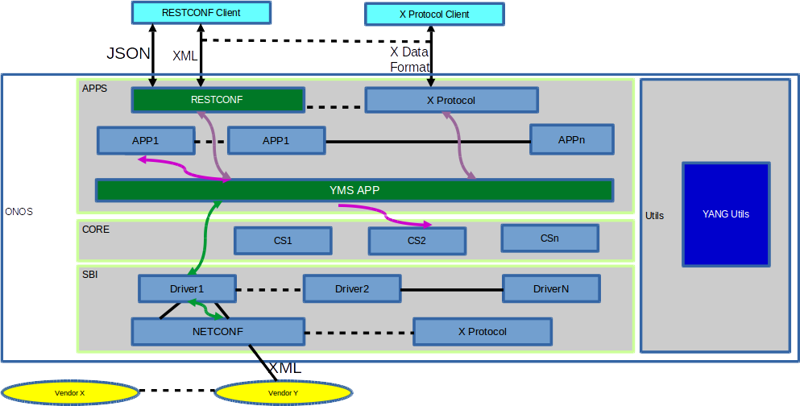
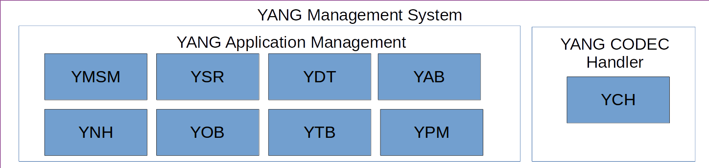
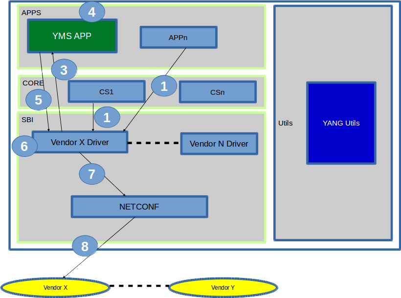
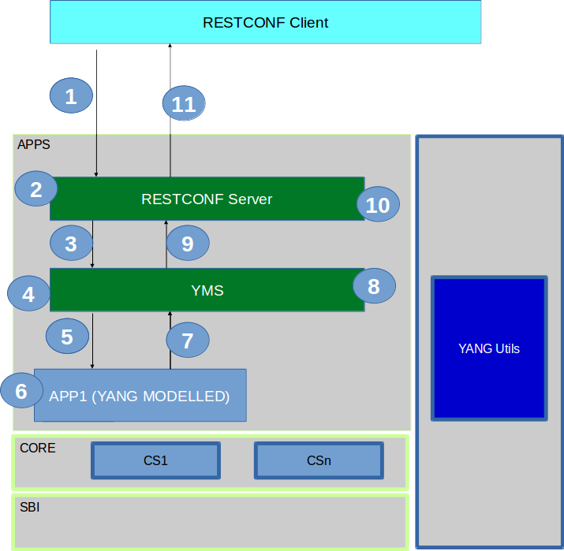

# YANG Management System

## Team

| Name | Organization | Email |
| --- | --- | --- |
| Bharat Saraswal | Huawei Technologies | [bharat.saraswal@huawei.com](mailto:bharat.saraswal@huawei.com) |
| Gaurav Agrawal | Huawei Technologies | [gaurav.agrawal@huawei.com](mailto:gaurav.agrawal@huawei.com) |
| Janani B | Huawei Technologies | [janani.b@huawei.com](mailto:janani.b@huawei.com) |
| Mahesh Poojary S | Huawei Technologies | [mahesh.poojary@huawei.com](mailto:mahesh.poojary@huawei.com) |
| Patrick Liu | Huawei Technologies | [Partick.Liu@huawei.com](mailto:Partick.Liu@huawei.com) |
| Rama Subba Reddy S | Huawei Technologies | [Rama.Subba.Reddy.S@huawei.com](mailto:Rama.Subba.Reddy.S@huawei.com) |
| Shankara | Huawei Technologies | [shankara@huawei.com](mailto:shankara@huawei.com) |
| Sonu Gupta | Huawei Technologies | [sonu.gupta@huawei.com](mailto:sonu.gupta@huawei.com) |
| Vidyashree Rama | Huawei Technologies | [vidyashree.rama@huawei.com](mailto:vidyashree.rama@huawei.com) |
| Vinod Kumar S | Huawei Technologies | [vinods.kumar@huawei.com](mailto:vinods.kumar@huawei.com) |

## Requirements for Ibis Release

| Requested By | Requirements | Suggested Priority (high - Middle -Low) | Current Status |
| --- | --- | --- | --- |
| Patrick Liu | Dynamic configuration brigade project will use L3VPN as the use case to demo how this feature works.  In this project, we will build an NeL3VPN Application and need to be hooked to YMS. the second one is to provide a configuration store in ONOS Core. The basic requirements to YMS include xml codec, app broker, and configuration store operation such as create/remove/update, etc. | high |  |

## Overview

YANG is a data modeling language used to model configuration & state data. Modelling languages such as SMI (SNMP), UML, XML Schema, and others already existed. However, they lacked critical capabilities like being easily read and understood by human implementer, and fell short in providing mechanisms to validate models of configuration data for semantics and syntax. Due to its simplicity in structure and flexibility it can be used to ease the application development by automating the code generated corresponding to defined schema.  Applications can concentrate on the business logic implementation and are being relieved from actual protocol implementation for exchanging information with external system.

YANG Utils was the first step to achieve this final goal. YANG utils is already available in ONOS (refer the wiki link for details: [YANG Compiler](../guides/developer-guide/onos-software-development/yang/yang-compiler.md))

YANG Management system will be the core of YANG in ONOS, it provides a framework for the drivers/applications to register their schema. It automates the CODEC functionality required by driver/application.

YANG Management System Architecture

 

## YMS Component Block Diagram

YANG Management System comprises of blocks as depicted in below figure

 

YANG Management System Component Block Diagram

1) YANG Application Management System: Manages YANG based applications.

* YANG Application Manager (YAM) - Manages interaction with APP and NBI protocol.

* YANG Schema Registry (YSR) - Maintains the Schema information.

* YANG Data Tree (YDT) - Data (sub)instance representation, abstract of protocol.

* YANG Application Broker (YAB) - Responsible for interaction with applications in YANG modelled objects.

* YANG notification handler (YNH) - Handles notification from the APP and provide it to the RESTCONF server.

* YANG Object Builder (YOB) - Creation of YANG modelled objects from YDT

* YANG Tree builder (YTB) - Creation of YDT from YANG modelled objects.

* YANG Protocol Metadata (YPM) - Maintains any protocol specific information for YANG modelled data.

2) YANG CODEC Handler:

* YANG Codec Handler – Handle encode/decode protocol specific data format to YANG modelled objects.

## Objective of YANG Management System in ONOS

* ## Automated code generation for YANG model.
* Automated CODEC based on YANG model.
* Automated validation of data constraints.
* Application development is abstract of protocol nuances.
* Enhance ONOS NBI capability to support Notification.

## YANG modelled Driver/Provider implementation

1) Driver/Provider uses YANG Utils to auto-generate YANG modelled JAVA classes corresponding to Device Schema

2) Driver/Provider registers its Device schema with YMS.

Example: Control flow of YANG modelled Driver

Control Flow (Example: Driver using NETCONF)

Step 1: Trigger for Driver to communicate with device.  
Step 2: Driver creates YANG modelled JAVA class object corresponding to Device schema.  
Step 3: Driver call YMS app to obtain XML corresponding to object created in previous step.  
Step 4: YMS uses device schema to generate XML corresponding to JAVA object.  
Step 5: YMS returns generated XML.  
Step 6/7/8: Driver uses NETCONF to communicate with device.

Likewise reverse flow will use YMS to obtain YANG modelled JAVA class object from a given XML.

## YANG modelled Application/Core implementation.

1) Application model it's interface in YANG.

2) Application uses YANG Utils to auto-generate YANG modelled JAVA classes.

3) Application register it's schema with YMS APP (for Core YMS provides framework by itself to avoid core dependency on YMS).

Example: Control flow of YANG modelled Application

Control Flow (Example: Application interaction via RESTCONF)  
Step 1: RESTCONF client invokes application's RESTCONF interface.  
Step 2: RESTCONF server translates JSON request to abstract data tree using YMS.  
Step 3: RESTCONF server sends abstract data tree to YMS.  
Step 4: YMS generates JAVA object corresponding to abstract data tree.  
Step 5: YMS invokes application JAVA interface.  
Step 6: Application performs the service.  
Step 7: Application returns the output JAVA object.  
Step 8: YMS translates JAVA object to abstract data tree using application schema.  
Step 9: YMS sends abstract data tree to RESTCONF server.  
Step 10: RESTCONF server translates abstract data tree to JSON response using YMS.  
Step 11: RESTCONF server responds JSON to RESTCONF client.

 

## Roadmap

Proposed Hummingbird Deliverable

* YANG Utils Enhancements for YMS.
* YMS to automate the XML CODEC for NETCONF interaction with device.
* YMS to automate the JSON CODEC for NBI interaction with external applications.

Proposed Ibis release Deliverable

* YANG Utils and YMS enhancement to support YANG 1.1 version.
* Extensions to support applications to override the generated default implementation.

Future Plan

* YANG GUI development.
* YANG based datastore.

## References

RFC6020 - <https://tools.ietf.org/html/rfc6020>
