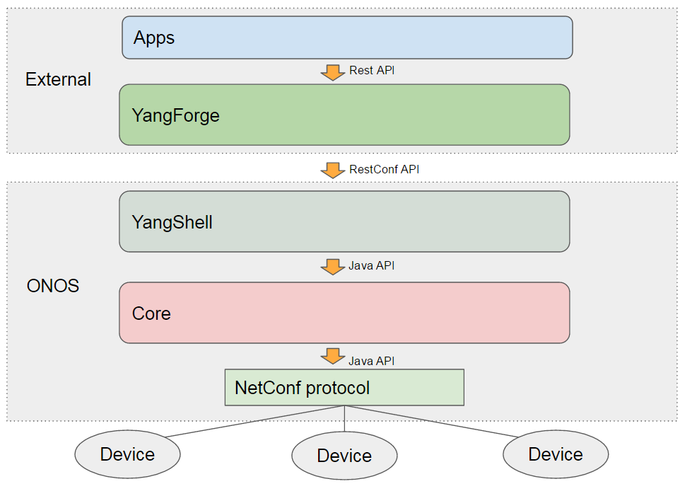
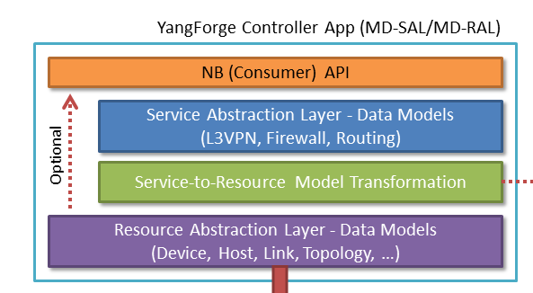
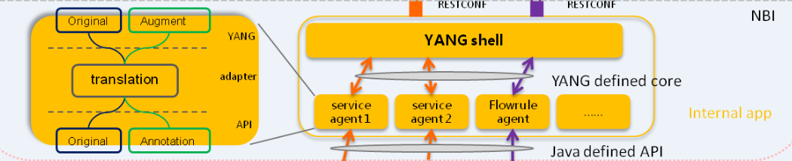

# YANG Models in ONOS

### Contributors

| name | **Organization** | **Email** |
| --- | --- | --- |
| Tom Tofigh | AT&T | [mt3682@att.com](mailto:mt3682@att.com) |
| Peter Lee | ClearPath Networks | [plee@clearpathnet.com](mailto:plee@clearpathnet.com) |
| Patrick Liu | Huawei Technologies | [Partick.Liu@huawei.com](mailto:Partick.Liu@huawei.com) |
| Liu JingLiang | Huawei Technologies | liujinliang1@huawei.com |
| Jiang ChunCheng | Huawei Technologies | jiangchuncheng@huawei.com |
| Lu kai | Huawei Technologies | lukai1@huawei.com |
| Li shuai | Huawei Technologies | lishuai2@huawei.com |
| Zhou bo | Huawei Technologies | bob.zh@huawei.com |
| Zhao ying | Huawei Technologies | ying.zhaoying@huawei.com |
| Yan lin | Huawei Technologies | yanlin1@huawei.com |

## High Level Architecture Overview

### YangForge

`YangForge` provides runtime JavaScript execution based on YANG schema modeling language as defined in IETF drafts and standards ([RFC 6020](http://tools.ietf.org/html/rfc6020)). Basically, the framework enables YANG schema language to *become* a **programming** language. It also utilizes YAML with custom tags to construct a portable module with embedded code. It is written primarily using [CoffeeScript](http://coffeescript.org/) and runs on [Node.js](http://nodejs.org/) and the **web browser** (yes, it's isomorphic). This software is **sponsored** by [ClearPath Networks](http://www.clearpathnet.com/) on behalf of the [OPNFV](http://opnfv.org/) (Open Platform for Network Functions Virtualization) community.

     You can visit [YangFore github repository](https://github.com/opnfv/yangforge).

### YangShell

 It is a internal application in ONOS.

### RoadMap

### L3VPN Demo Application

<http://github.com/saintkepha/onos-l3vpn>

The demo application is actualized using YangForge and based on following IETF YANG models:

* <https://www.ietf.org/id/draft-ietf-l3sm-l3vpn-service-model-01.txt> (published August 2015)

* <https://www.ietf.org/id/draft-ietf-netmod-routing-cfg-19.txt> (May 2015)

* <https://www.rfc-editor.org/rfc/rfc7223.txt>

### L3VPN YANG Model Sample

[l3vpn-yang-NB.rar](../../assets/l3vpn-yang-nb.rar)

[l3vpn-yang-SB.rar](../../assets/l3vpn-yang-sb.rar)

### Requirements for YANG Utils
