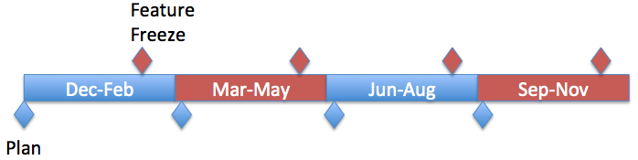
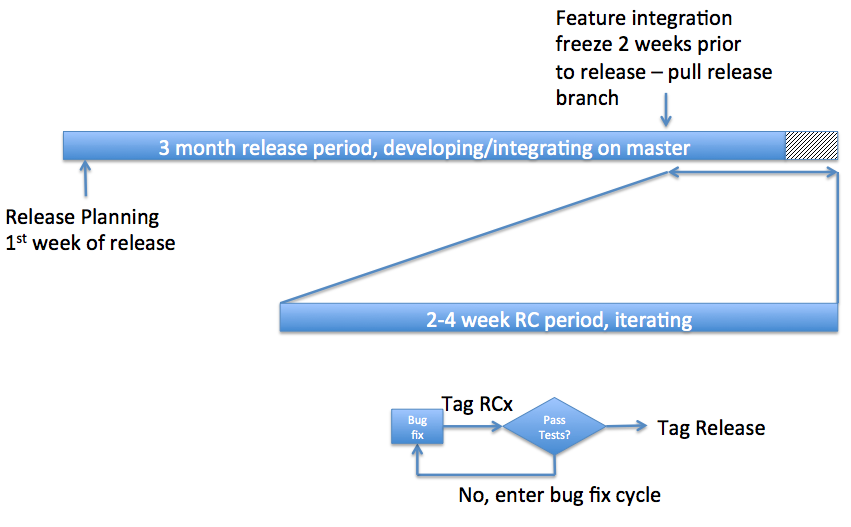

# Release Model

# Release Dates

ONOS runs "train" based releases. That means whatever is ready to board the train, does so. Whatever isn't ready, has to wait for the next train. This enables us to have a very predictable release cadence making it easy to plan around. It also puts the responsibility on project owners to make sure they have features ready for the release. ONOS releases quarterly at the end of **February, May, August, November**. It is offset from the "normal" quarters because we all know that nothing happens for half of December. At the beginning of a release cycle, we have a planning meeting and two weeks before the end of the release we freeze integration of new features:

 

# Release Cycle

Releases last 3 months. Each release starts with a planning meeting (check the ONOS calendar). After planning, development teams build their deliverables using whatever methods (scrum, kanban, waterfall...) they want but must commit their code frequently (daily?), leading up to the last 2 weeks. The project does not accept "dumps" of code at the end. Commit early and often on master. Two weeks before the release date, we halt feature integration and only allow bug fixes. At some point during those two weeks, we start the release candidate process. This process starts by pulling a branch off master that will become the release branch. That frees up master for development on the next release. On the release candidate branch we work on bug fixes, and choose "release candidate", RC, tags. The software at that tag is a candidate for release, and it is submitted to a more rigorous set of testing. If it passes, we can officially tag it as the release. If it doesn't, we enter another bug fix cycle and create a new release candidate. We iterate until we have a candidate that can be the formal release. Usually, this takes 2-3 cycles and 1-3 weeks of time. More details on branching can be found in the [contributor guide](guides/contributor-guide.md) portion of the wiki.  

Development epics, stories and bugs for each release are tracked through [JIRA](http://jira.onosproject.org/). If you are new to JIRA, you can learn more about using JIRA for ONOS on the [ONOS JIRA wiki page](guides/contributor-guide/issue-tracking-and-submission-with-jira/using-jira-to-create-an-issue-bugs-feature-requests-documentation.md).

# Release Branching, Versioning and Tags

Branches in ONOS follow this convention:

* Master branch (master): Main development will happen on the master branch. This is the latest and greatest branch, but is always "stable" and "deployable". All tests always pass on this branch.

* Maintenance branch (support): This is the long-term maintenance branch per release.

* Development branch (dev): This is a branch created for lengthy and/or involved feature development that could destabilize master. The development branches need to be proposed to and signed off by the Technical Steering Team.

Each ONOS release will have the following version format:

***Format: <major>.<minor>.<revision>***

* Either the <major> or the <minor> version will be incremented for each release. The Technical Steering Team will decide whether to increment the major or minor number for the release. This decision will depend on a number of different factors such as incompatibility with existing APIs etc.

* <revision> is incremented for a fix (or set of fixes) on a maintenance branch that justifies a new maintenance "release". Note: the revision number is optional when it is zero.

**Example:**

Here is how this versioning worked for the first open source release:

* 1.0.0rc1 - release candidate for 1.0.0. rc1 is a temporary tag that gets cleaned up after 1.0.0 is tagged final.

* 1.0.0 - Open source ONOS release on Dec 5th, 2014

* 1.0.1 - First maintenance release for 1.0.0  
  ....

# Release Maintenance

The past two releases will be supported.  The only changes allowed on these releases will be security patches and critical defects that are blocking deployments.  Security patches will be proactively applied to the supported releases, whereas critical defects will be addressed by community request.  The defects should have JIRA tickets associated with them.  Releases will be done periodically, as needed.  A release can be requested by the community by sending a request to the TST mailing list.

Defects fixes in previous versions should be ported forward to all versions released since then, including master. For example, a fix in version 1.8 should be ported to 1.9, etc... and master.  The module owner should assess the changes and drive the cherry-pick process.

Release Naming

During the development cycle and for easy identification post-release, each release is also identified by a "code" name in addition to the version. Releases are named after birds because they are beautiful, found worldwide, are colorful and graceful, make beautiful music...and because they signify something taking flight into the wild blue yonder, something we advocate for SDN and NFV. Finally, and perhaps most importantly, birds work together in flight to reduce the load on each other so that they can fly long distances (for example, the V formation)...and, we hope that everyone in the ONOS community will adopt the same philosophy of helping each other to make ONOS great. We name them in alphabetical order.

# Release Names and Versions

The following table has been discontinued. Go to

[Downloads](downloads.md)

for the most up to date release information.

| Name | VERSION | Dates | Notes | About the name | Presentation | Related Press |
| --- | --- | --- | --- | --- | --- | --- |
| Kingfisher | 1.10.0 | May 31, 2017  FF: May 12, 2017 |  |  |  |  |
| Junco | 1.9.0 | Feb. 28, 2017  FF: Feb. 10, 2017 | [Release Content](release-model/junco-release-content.md) | [About the bird](https://en.wikipedia.org/wiki/Junco) |  |  |
| Ibis | 1.8.0 | Dec. 2, 2016 | [Release Content](release-model/ibis-release-content.md) | [About the bird](https://en.wikipedia.org/wiki/Ibis) |  |  |
| Hummingbird | 1.7.0 | Aug. 31, 2016 | [Feature Summary](../assets/hummingbirdreleasecontentsummary-v2.pdf) | [About the bird](https://en.wikipedia.org/wiki/Hummingbird) | [pptx](../assets/onos-hummingbird-release-update-v2-1.pptx) | [Press](http://onosproject.org/2016/09/22/onos-project-hummingbird-release-enables-network-services-for-disruptive-and-incremental-sdn/) |
| Goldeneye | 1.6.0 | Jun. 10, 2016 | [Release Notes](../release-notes/release-notes-goldeneye-1.6.0.md) | [About the bird](https://en.wikipedia.org/wiki/Goldeneye_%28duck%29) | [pptx](../assets/onos-goldeneye-release-update-moor-insights.pptx) | [Press](http://onosproject.org/2016/06/15/onos-projects-sdn-release-goldeneye-advances-service-provider-capabilities-for-high-availability-scale-and-performance/) |
| Falcon | 1.5.0 | Mar. 10, 2016 | [Release Notes](../release-notes/release-notes-falcon-1.5.0.md) | [About the bird](https://en.wikipedia.org/wiki/Falcon) | [pptx](../assets/onos-falcon-release-update-1.pptx) | [Press](http://onosproject.org/2016/03/14/onos-releases-falcon-continuing-momentum-to-transform-service-provider-networks-with-sdn-and-nfv/) |
| Emu | 1.4.0 | Dec. 16, 2015 | [Release Notes](../release-notes/release-notes-emu-1.4.0.md) | [About the bird](https://en.wikipedia.org/wiki/Emu) | [pptx](../assets/emu-release-summary-1.pptx) | [Press](http://onosproject.org/2015/12/03/onos-releases-emu-accelerating-development-of-sdn-and-nfv-products-and-solutions/) |
| Drake | 1.3.0 | Sept. 18, 2015 | [Release Notes](../release-notes/release-notes-drake-1.3.0.md) | [About the bird](http://birding.about.com/od/Bird-Glossary-C-D/g/Drake.htm) | [pptx](../assets/onos-drake-release.pptx) | [Press](http://www.prnewswire.com/news-releases/onos-partner-involvement-accelerates-to-deliver-increased-infrastructure-functionality-for-sdn-and-nfv-use-case-enablement-300146740.html) |
| Cardinal | 1.2.2 | Sept. 1, 2015 | [Release Notes](../release-notes/release-notes-cardinal-1.2.2.md) | [About the bird](http://animals.nationalgeographic.com/animals/birds/cardinal/)  (Stanford "Cardinal" refers to the color, NOT the bird) |  |  |
| 1.2.1 | June 25, 2015 | [Release Notes](../release-notes/release-notes-cardinal-1.2.1.md) |  |
| 1.2.0 | June 5, 2015 | [Release Notes](https://wiki.onosproject.org/display/ONOS/Release+Notes+-+Cardinal) | [P](https://wiki.onosproject.org/display/ONOS/Release+Notes+-+Cardinal)[ress](http://www.prnewswire.com/news-releases/onos-accelerates-real-sdnnfv-solutions-with-deployments-in-re-networks-new-comprehensive-feature-sets-and-performance-improvements-300092416.html) |
| Blackbird | 1.1.0 | Mar. 17, 2015 | [Release Notes](https://wiki.onosproject.org/display/ONOS/Release+Notes+-+Blackbird) | [About the bird](http://en.wikipedia.org/wiki/Common_blackbird)  [The legendary Blackbird Jet](http://www.bbc.com/future/story/20130701-flying-the-worlds-fastest-plane)  [In honor of Beatles](http://en.wikipedia.org/wiki/Blackbird_%28Beatles_song%29) |  | [Press](http://www.prnewswire.com/news-releases/onos-blackbird-release-demonstrates-sdn-control-plane-performance-and-scale-leadership-300060055.html) |
| Avocet | 1.0.1 | Jan 21st, 2015 | [Release Notes](../release-notes/release-notes-avocet-1.0.1.md) | [About the bird](http://en.wikipedia.org/wiki/Avocet) |  |  |
| 1.0.0 | Dec 5th, 2014 | [Release Notes](../release-notes/release-notes-avocet-1.0.0.md) |  |

To generate release detailed notes, use <https://jira.onosproject.org/secure/ReleaseNote.jspa?projectId=10105>

---

You can find details on versioning and naming of releases [here](https://wiki.onosproject.org/display/ONOS/Release+Naming).
