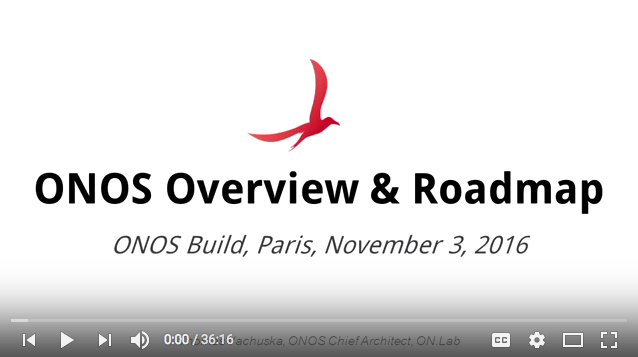

# Roadmap

**This page requires update!**

## How to Read This Document

This roadmap is intended to provide information about what is being planned for upcoming ONOS releases and to provide guidance about how you can help us with planning for and delivering these items.  If you have any questions, comments or suggestions about this document, please feel free to post to the [onos-dev mailing list](https://groups.google.com/a/onosproject.org/forum/#%21forum/onos-dev).

## How You Can Help

As an open source project, we welcome contributions from anyone in the community.  You are welcome to 'scratch your own itch' and contribute any new feature, bug fix or other contribution that you are interested in.  If you're excited about what we're planning for future releases and would like to help get these improvements out more quickly, we encourage you to [work with us to accelerate these roadmap items](../community-information/brigades.md).

## Roadmap at a Glance

Thomas Vachuska [presented information about the 2017 ONOS roadmap](https://www.youtube.com/watch?v=Qhb5nUvsbxE&list=PL81XNiHUXTjZW7Umv-sDmeUL_8bxCQH23&index=4) at the ONOS Build event in Paris in November 2016.

The major items on the roadmap are below.  For more details about each item, please scroll down the page.

* **Dynamic Configuration** - provide support for configuring devices and network-wide services via YANG model-driven interactions where YANG models can be discovered or registered at run-time
* **Virtualization** - enable use of ONOS as a network hypervisor through the creation of SDN capable virtual networks; networks whose connectivity can be programmed by applications as if they were physical SDN networks
* **GUI v2.0** - enhance the web UI to improve its usability on large-scale networks via region-based topology views with drill-down, context sensitive help, and global search
* **Deployments** - enhance the existing Intent subsystem to enable ONOS to be deployed in networks around the world by providing the required layer 1-3 functionality
* **Intent v2.0** - re-design the intent framework to optimize scale and performance, enable conversational style feedback for error resolution on intent install, and add support for domain specific intent definitions and installation
* **P4** - support awareness of P4 programs including ability to deploy them, and facilitate applications to interact with the program-specific abstractions and controls
* **Disaggregation of ONOS code-base** - separate the network-agnostic distributed applications platform from the network-aware core subsystems
* **In-Service Software Upgrade** - design a mechanism for upgrading ONOS cluster without requiring downtime of control functionality where nodes can be upgraded one at a time
* **gRPC APIs** - provide an efficient API to enable off-platform applications to have access to fine-grained control functionality and to allow off-platform applications to be written in languages other than Java
* **Federation** - provide coordination mechanism for multiple ONOS clusters using either peer-to-peer or hierarchical arrangements to facilitate interactions between different administrative domains
* **Build & Package infrastructure** - tools and processes for building ONOS and publishing the artifacts
* **OpenFlow 1.5** - upgrade libraries and providers to take advantage of the OF 1.5 protocol and updated libraries
* **LISP** - continue adding support for LISP as SB protocol
* **Internationalization/Localization (I18N/L10N)** - develop a framework for localization of the GUI and produce a set of localized message bundles
* **ONAP/MANO Integration** - integrations with various orchestrator platforms
* **OpenStack Integration** - Improve the existing OpenStack networking application to work more efficiently; Support SW/HW network functions; Enhance deployment and operation

We also maintain a set of '[bounty bugs](http://bounty.onosproject.org)' in JIRA that are issues we want in upcoming releases but don't have owners assigned to them yet.  Please feel free to take one of those and we'll be happy to thank you with ONOS swag after completing those tasks.

## Motivations

The following are the high-level drivers/requirements which determine the priority of the major initiatives shown above.

### Dynamic Configuration

* AT&T, Verizon, partners are requesting ability to configure devices using a model-driven approach that somewhat mimics the ODL MD-SAL approach
* AT&T wants off-platform apps to drive device configuration and service configuration via RESTCONF at the NB
* Generic request to support device configuration via YANG/NETCONF

### Virtualization

* Verizon, SKT want support of network “slicing” via virtual networks for MCORD
* Operators need to support IaaS (like MVNO in the mobile world) - being able to share their infrastructure with other operators. There is not yet a driving partner/use case for this but it has been stated by multiple operators.
* Users of OVX (mostly research) want support for SDN capable virtual networks

### GUI Scalability

* Improve ability to demonstrate use-cases by removing the limitation of showing only one topology layout for the entire network
* Generic request to improve usability of visualizing large networks

### Deployments

* ubiquitous

### Intents v2.0

* Internal/TST: Address several known limitations of existing intent framework, e.g. lack of conversational API, lack of intent stackability, domain-specific intents
* E-CORD: Use same intent primitives in both packet and optical segments of the network, while providing different low-level handling as appropriate for the different regions of the network.

### P4

* As we show leadership in delivering the promise of SDN - programmable networks - it is important for us to be aligned with and be a first supporter of programmable data planes. We do not have the operator driving a use case yet, so this is purely engineering leadership driven.

### In-Service Software Upgrade

* Generic request to allow ONOS deployments in production environments where loss-of-control for off-line upgrade is not acceptable

### gRPC

* Generic request to allow development of ONOS off-platform apps written in other languages

### Federation

* No active operator requests for federation. It seems federation is assumed to be at the orchestration layer. There is mainly research interest.

### Disaggregation of ONOS code-base

* Internal/TST: Better scale code contribution process and project lifecycles
* Internal: Better support building & packaging different flavours of ONOS

## Initiatives

The following are high-level narratives describing the use-cases and features comprising the various ONOS platform initiatives. After each narrative is also the proposed breakdown of work into buckets that are scoped to fit inside a single release and that illustrate the progression towards the goal set for each initiative. Each of these buckets will be tracked as a JIRA Epic within an ONOS release.

### Dynamic Configuration

Provide a YANG model-driven configuration architecture to enable declarative data and service definitions.  This work would encompass an auto-generated RESTCONF NB, a distributed tree-based datastore in the Core, and a vendor agnostic SB that would enable ease of interactions with NETCONF devices.  It will leverage the YANG Utils and YMS work previously contributed to enable parsing of the YANG definitions to provide auto-generated Java constructs.

Phase 1: Target ONS 2017 (April, 2017) - Demo 1, Demo 2

Junco

* + YANG Runtime, Compiler and base model implementation
  + Dynamic Config Manager and Store implementation
  + RESTCONF NB

Phase 2: Demo 3 (Multi Vendor Device)

Kingfisher

* + JSON & XML Serializers
  + RESTCONF NB, RESTCONF SB (post-ONS)
  + NETCONF SB
  + “Live” Compilation of YANG models (post-ONS)
  + RPC Support (post-ONS)
  + YANG Notifications (post-ONS)
  + Support L3VPN service using IETF L3VPN YANG model
  - L3VPN service model and internal device model (YANG models), model registering utilities

  - L3VPN service and device model based NetL3VPN application (service implementation)
  - L3VPN service and device model based Huawei driver+ End to end integration of components for ONS Demos
  - Demo1 (Bring up new devices to be managed by ONOS, just by registering the models with ONOS and issuing RESTCONF request to push the base  config to the device)
  - Demo2 (Activate L3VPN service by registering L3VPN service and internal device model and issuing RESTCONF requests to push service and device models [using an L3VPN service model based application and driver])

             “L”

* + Transaction and rollback support with the store
  + Filtering of Queries
  + Enhancements /modifications to model implementation (ResourceId annotations, metadata structure etc)
  + Sharding of subtrees

#### Demos

Demo 1: Single vendor’s device configuration

* The configuration of devices by supporting arbitrary device models.  Shows that framework can digest any device model and allow configuration via a NB.  Does not provide multiple vendor device abstraction support via NB.

* Demonstrate:

+ Ingestion of arbitrary device models
+ Support for distributed persistence (sharding of device data on device mastership)
+ Support configuration & operational data/subtrees

Demo 2: Single service on single vendor’s device configuration.

* The initial thought on service is L3VPN.

* Demonstrate

+ Definition of service via a YANG model
+ Installation of application that supports that model
+ Interacting with application using RESTCONF

#### Brigade

There is an active brigade around this roadmap item.  See the [Dynamic Configuration Brigade](../community-information/brigades/dynamic-configuration-brigade.md) wiki page for more details.

### Virtualization

Virtualization focuses on enabling the creation of SDN capable virtual networks, allowing them to fully participate in control plane policies with southbound abstractions optimizing application to the physical topology.

Use Cases

1. Creating virtual SDN networks for tenants
2. Slicing regions of networks for use by different tenants (M-CORD)
3. Federation - exposing abstracted view to peer/parent controllers (E-CORD)

Junco

* + Complete support of OF as the first realization of a southbound implementation of a VN.

Kingfisher

* + Support OF agent as NBI for external controllers
  + External connectivity (e.g. Internet) for VNs
  + Automated virtual network mapping and embedding

"L"

* + Openstack integration - adapting the Neutron APIs to the Virtual Networks APIs
  + Add support for virtual network pausing and snapshotting to enable backup and restore of a VN.
  + Support additional southbound implementations of a VN
  + Virtual network resilience

#### Brigade

There is an active brigade around this roadmap item.  See the [Virtualization Brigade](../community-information/brigades/virtualization-brigade.md) wiki page for more details.

### GUI v2.0

GUI 2.0 will provide enhancements to the WebUI to support enhanced scale and usability via region-based topology views, context sensitive help, and global search.  Additional incremental changes will be made to improve overall user experience.

Junco

* + Region-aware Topology View -- reinstatement of Traffic Overlay

    - Available as development feature, with general availability in K
  + Implement Partitions View (visualization of cluster partitioning)

Kingfisher

* + Reimplement "dark" theme

    - Dark theme was available previously, but disabled in Hummingbird pending redefinition of palette by graphic designer
  + Completion of the Region-aware Topology View

"L"

* + Keyboard navigation of tables (*Up/Down-arrow* row selection; *Enter* for item selection)
  + Enhance Intent table with detailed panel for selected item
  + Investigate design for indexed-global-search subsystem (GUI, CLI, REST)
  + Implementation of the indexed-global-search subsystem

NOTE: The WebUI is intended to be a tool that provides read-only/limited config feature state/preview, not intended to be at parity with the CLI.

 

#### Brigade

 There is an active brigade around this roadmap item.  See the [GUI Brigade](../community-information/brigades/gui-brigade.md) [wiki page for more details.](../community-information/brigades/virtualization-brigade.md)

### In-Service Software Upgrade

* Mechanism for gradually upgrading an ONOS cluster

+ upgrades cluster one node at a time without downtime

* Requires portable serialization for cluster comms

+ upgraded nodes must be able to speak the “old” language (possible dependency/relationship on gRPC)

### gRPC APIs

* Allow fine-grained & high-performance interactions between ONOS and off-platform apps

+ presently available only for on-platform apps via Java API
+ REST API suitable only for relatively low-frequency & coarse interactions

* Enables apps to be run on or off platform

* + permits compute resource isolation
  + off-platform apps as micro-services
  + Allows ONOS apps to be written in other languages

Kingfisher

* + gRPC northbound for significant subset of services
  + Demonstration of app written in python communicating with ONOS core

“L” 

* + gRPC northbound for all core services
  + Native language libraries for several languages (topology representations etc.)
  + Explore automated generation

#### Brigade

 There is an active brigade around this roadmap item.  See the [gRPC Brigade](../community-information/brigades/grpc-brigade.md) wiki page for more details. 

### Federation

* Coordination mechanism for multiple ONOS clusters

+ permits peer-to-peer & hierarchical arrangements
+ aims to support different administrative domains

* Peer-to-peer variant being developed by GEANT

### Deployments

The goal of the deployment brigade is to create a concrete stack of software that can be deployed in networks, around the world. The stack would provide Layer 1-3 functionalities, convergence of packet-optical resources, compatibility with the MEF standards for the allocation and management of Layer2 VPNs, compatibility with the NSI framework - commonly used by RENs for multi-domain resource provisioning.

Kingfisher

* + Northbound improvements lead by the northbound brigade (support for groups, BW allocation refactoring, BW enforcement, resource service transactional updates support and performance improvements, ...)
  + ONOS in a box (ONOS on Accton switches with OFDPA) - implies some intent framework improvements (above)
  + GEANT: Test BoD, VPLS with CORSA devices

#### Brigade

 There is an active brigade around this roadmap item.  See the [Deployments Brigade](../community-information/brigades/deployment-brigade.md) wiki page for more details.

### Northbound

Northbound will focus on improving the existing ONOS northbound feature enhancements and bug fixes.

Kingfisher

* + New intent installers (design document: <https://goo.gl/OJ7fuu>)
  + Resource service transactional updates
  + Resource service performance improvements
  + BW allocation refactoring in intent framework
  + BW enforcement in intent framework (together with meter improvements in ONOS SB)
  + Flow objective compilers and drivers refactoring to support resource groups and OF groups

#### Brigade

 There is an active brigade around this roadmap item.  See the [Northbound Brigade](../community-information/brigades/northbound-brigade.md) wiki page for more details.

### Intent v2.0

Intent 2.0 will focus on enhancing the intent framework to optimize scale and performance, enable conversational style feedback for error resolution on intent install, and add support for domain specific intent definitions and installation.

### Build and Package Infrastructure

 

* + Make sure that ONOS code-base(s) can be built efficiently, reliably and consistently into a small set of distributable artifacts to make it easy to distribute and deploy ONOS
  + Make sure that ONOS SDK can be built and released efficiently, reliably and consistently as a set of published artifacts on Maven Central and ONOS project site
  + Maintenance of the build and release process documentation
  + Maintenance of the corresponding user (network administrator) documentation
  + Maintenance of the corresponding developer SDK documentation
  + Development and maintenance of the build, test and run-time tool kits for developers, testers and users (network administrators)
  + Development and maintenance of the CI process and release process and supporting tools and working with the team managing the infrastructure
  + Integration of CI with basic functionality tests (STC) as part of the build & release processes
  + Maintenance and upstreaming of Gerrit plugins (Module Owner, Stats, Project Lock)
  + Maintenance of [Shared Cells](https://docs.google.com/document/d/1Hdl-ZsttECXZEucskoPNghwsv_H68dtnTnRZrDWgVsg/edit?usp=sharing) Warden
  + Investigation (and later execution) of how to disaggregate the ONOS code-base, while continuing the ability to build & release with regular (and frequent) cadence
  + Development and maintenance of the ONOS archetypes (Maven + Buck)
  + Deprecation and removal of the legacy build framework
  + Move artifacts versions to follow semantic versioning

 

Kingfisher

1. POM obsolescence activity

1. Deliverable : Fix pending BUCK issues and facilitate developers in migrating their apps from mvn to BUCK.

1. Research, Design & Implement proof of concept on disaggregation of ONOS code base and assembling using repo

1. Deliverable : Apps in separate repo ( in incubation mode )

2. Identify simple freestyle jenkins job and convert to Jenkins pipeline ( pipeline as code )

1. Deliverable : Nightly build job converted into Jenkins pipeline

3. Identify , Aggregate information regarding build & release process and kickstart documentation using gitbook

1. Deliverable : Initial version of GitBook about how to build ONOS using Buck.

#### Brigade

 There is an active brigade around this roadmap item.  See the [Build and Package Infrastructure Brigade](../community-information/brigades/build-and-package-infrastructure-brigade.md) wiki page for more details.

### Disaggregation of ONOS code-base

* Separate the distributed network-agnostic platform from the network-aware core subsystems

+ presently the separation is logical, but there exist some (albeit weak) ties between the two

* Separate contributing projects into their own repositories

+ provides basis for various flavours of ONOS
+ provides basis for better scaling ONOS code-base which also spans various contributing projects

* Requests for such platform from Fermi & Oakridge Labs, among others

+ provides significant benefits in context of SDN as well

NOTE: This is being delivered as part of the charter for the Build and Package Infrastructure brigade.

### Teaching

Continually enhance and improve the future of ONOS through education, growth and a skilled knowledgeable community. To that end, we aim at providing and re-organizing open source modular teaching materials in different levels so that it can be used for courses targeted for different types of audience. The brigade will try as well to create evaluation materials and provide certification services in collaboration with ONF and other partners.

Kingfisher

* + Documents that describe the whole big picture of virtualization/NFV/SDN including Docker, Openstack, ONOS and X-CORD organized into three training levels (beginners, engineers or intermediate users, and developers or advanced users).
  + Modular materials for beginner’s level

“L”

* + Provide dedicated materials for ONOS basic workshops held at “ONOS Build” with evaluation/test/quiz materials
  + Modular materials for intermediate level

#### Brigade

 There is an active brigade around this roadmap item.  See the [Teaching Brigade](../community-information/brigades/teaching-brigade.md) wiki page for more details.

### Security and Performance Analysis

* Assess controller robustness against attacks and bundle-level failures
* Assess control-plane performance in challenging contexts
* Compare with alternative controllers
* Produce a sec&perf report for each new ONOS release to raise specs

 

Forthcoming actions

* kick-off meeting late march
* hackathons at RESCOM 2017, NoF 2017
* first report during summer 2017

#### Brigade

 There is an active brigade around this roadmap item.  See the [Performance and Security Analysis Brigade](../community-information/brigades/security-performance-analysis-brigade.md) wiki page for more details. 

### Packet Optical

Service Provider Networks are complex and multi-layer in nature. Each of these layers, including packet and optical, is provisioned and managed independently. Sometimes, the provisioning and adding of capacity or new services requires order of days if not months. A converged SDN control plane for packet and optical networks can help address all of these inefficiencies. Service providers can optimize across packet and optical layers in real-time for availability and economics, thereby reducing over-provisioning. They can add capacity based on traffic and other considerations in minutes instead of days or months.

Our goal is to build an open source solution that allows effective multi-layer network programmability using novel abstractions such as intent-based networking and converged topology graphs.

Kingfisher

* + OpenROADM

    - Add support for [OpenROADM.org](http://OpenROADM.org) YANG model
  + Planning mobile fronthaul / backhaul PoC (AT&T)

The Packet Optical team will also be collaborating with the Northbound brigade for an NTT field trial.

### OpenStack Integration

The goal of OpenStack integration is to make the existing OpenStack support modules(SONA project) production ready. It would encompass enhancing the existing implementation, adding more features, and improving deployment and operation.

Junco

* + Refactor to cache network states in local store for better performance
  + Improve gateway node setup procedures

Kingfisher

* + Add support of security group
  + Improve NAT performance with support of OVS NAT
  + Add support of VLAN mode
  + Add support of VM and Container mixed workloads
  + Add more unit tests and automated tests
  + Provide automated deployment of OpenStack + SONA with [Kolla-Kubernetes](https://github.com/openstack/kolla-kubernetes) (Kubernetes deployment of OpenStack)

"L"

* + Add support of container based software VNFs (LB, FW, VPN)
  + Add support of HW appliances (LB, FW)
  + Provide control plane and data plane monitoring tools

### LISP Subsystem Support

The goal of this project is to add Locator/Identifier Separation Protocol (LISP) as a southbound plugin for ONOS controller.   
With this southbound, ONOS can talk with LISP routers, and manage the mapping information of RLOC and EID for all LISP routers.

Kingfisher

* + Mapping Management Application

    - Implement MappingStore and MappingStoreDelegate
    - Implement MappingService and MappingProviderService
    - Add CLI, REST, GUI to query mapping information
    - Add mapping programmability through LISP driver
  + Provide mastership service for LISP controller

"L"

* + Implement DelegateDatabaseTree (DDT)
  + Integrate programmable mapping with FlowObjective

### Security Mode ONOS

The goal of this project is to provide access control to restrict application access to the northbound APIs.

Kingfisher

* + Fully supporting BUCK
  + Automatic permission grant for pre-authorized apps (ONOS-5857)

    - Maintaining review data on a distributed storage
    - Checking the security policy integrity on an activation time
  + Annotated permission checking

"L"

* + Performance improvement
