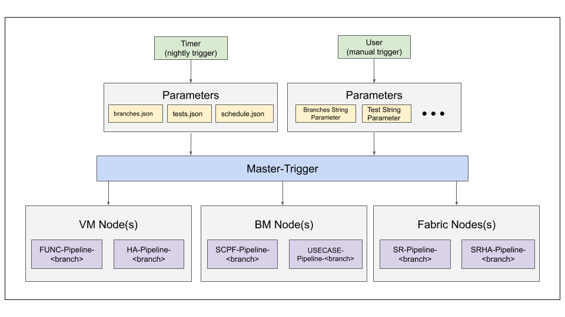

# QA Jenkins Structure

## Test Triggering Structure

ONOS System Testing Jenkins: <https://jenkins.onosproject.org/view/QA/>

[Master-Trigger](https://jenkins.onosproject.org/view/QA/job/bm-pipeline-trigger/) is a Jenkins job that will automatically call any TestON test on any branch.  The job is triggered nightly at 7:30pm PDT to run a [set of tests](automated-test-schedule.md) on a specific branch.  However, developers may run the job manually if needed.

When triggered nightly, Master-Trigger reads 3 files: branches.json, tests.json, and schedule.json, to determine the tests to run on a specified branch on a given day.  Then, depending on the selected tests, Master-Trigger will trigger various test category-branch downstream jobs on respective nodes to run the tests.  For example, if FUNCflow and SCPFcbench are scheduled to run today on the onos-1.15 branch, Master-Trigger will pass these tests to FUNC-Pipeline-1.15 on the VM and SCPF-Pipeline-1.15 on the BM, which will run FUNCflow and SCPFcbench, respectively.

## Post Test Execution Details

After a test finishes running (in a test category pipeline), test failures are posted to Slack, test results (passed, planned, and failed data) are uploaded to the database, detailed test results containing each case results are posted to the wiki, and a plot of the test's results trend is generated and uploaded to the wiki.
