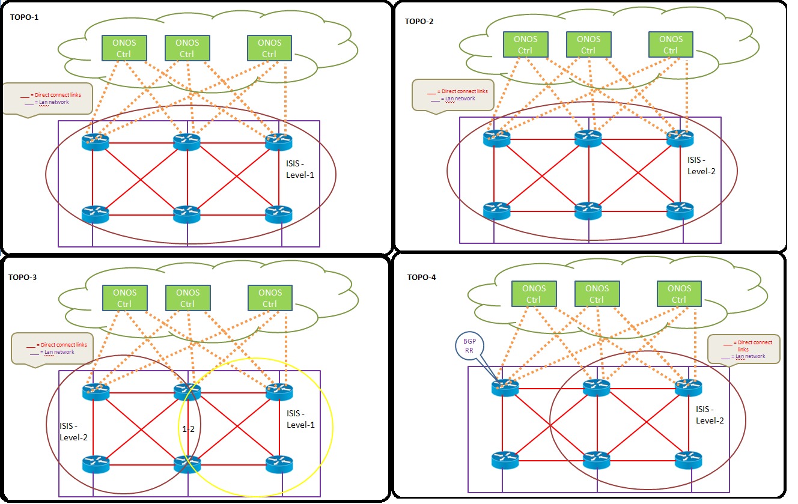

# Test Plan - BGP-LS

**Feature Details :**  [BGP protocol with Link-State Distribution](../../../new-projects/bgp-protocol-with-link-state-distribution.md)

**BGP-LS Test Topology**

**ONOS BGP-LS TestCase**

|  |  |  |  |  |  |
| --- | --- | --- | --- | --- | --- |
| **ID** | **Title** | **Test Env** | **Preparation** | **Test Steps** | **Expected Result** |
| ONOS\_BGPLS\_1 | Check the installation of BGP-LS Plugin | TOPO1 | Onos Controller is up and running | 1] Check whether the BGP-LS plugin is installed by Default 2] Uninstall the BGP-LS plugin. Check the Logs 3] Query the BGP-LS plugin in the feature list 4] Install the BGP-LS plugin. Check the Logs | 1] BGP-LS plugin should be installed by default. 2] UnInstalling the BGP-LS plugin should be successfull. No Exception or Assert should be observed. 3] BGP-LS plugin should be displayed on querying the feature list. 4] Installing the BGP-LS plugin should be successfull. No Exception or Assert should be observed. |
| ONOS\_IBGPLS\_1 | Check the IBGP peer Establishment | TOPO1 | 1] Onos Controller is up and running 2] IGP should be running in the network [for BGP-LS use IS-IS] | 1] Configure IBGP in the ONOS controller and in the NE. Check the BGP State. 2] Enable BGP-LS capability in the NE. Check whether BGP-LS capability negotiation is successfull between ONOS and NE | 1] Configuration should be successfull and the IBGP Peer should be Established. 2] BGP-LS capability negotiation should be successfull. The Peers should be in Established State |
| ONOS\_IBGPLS\_2 | Check the BGP-LS update message using IBGP | TOPO1 | 1] Onos Controller is up and running 2] IGP should be running in the network [for BGP-LS use IS-IS] 3] Entire Topology should be learned using ISIS. 4] Configure Advertise Topology under ISIS | 1] ISIS LSDB will be advertised to BGP. Check whether BGP-LS update is send to ONOS controller 2] Check whether all the LS information are updated in the ONOS controller 3] Check whether BGP-LS Node information and Link information is send to ONOS controller and check ONOS updated in GUI | 1] BGP should sent the BGP-LS infomation to ONOS controller.The topology information should be populated in the GUI 2] The GUI should be update with the correct information. 3] Node information and Link information should be update in the ONOS controller GUI |
| ONOS\_IBGPLS\_3 | Addition and deletion of IGP/BGP protocol in NE | TOPO1 | 1] Onos Controller is up and running 2] IGP should be running in the network [for BGP-LS use IS-IS] 3] Entire Topology should be learned using ISIS. 4] Configure Advertise Topology under ISIS | 1] Delete the IGP protocol(ISIS). Check the Link information in ONOS controller 2] Add the IGP protocol(ISIS). Check the Link information in ONOS controller 3] Delete the BGP protocol. Check the Link information in ONOS controller 4] Add the BGP protocol. Check the Link information in ONOS controller | 1] Deletion of IGP(ISIS), BGP should withdraw the Link information from ONOS, that it learn from BGP 2] Addition of IGP(ISIS), BGP should update the Link information ,to the ONOS controller 3] Deletion of BGP, BGP should withdraw the Link information that was sent to the ONOS Controller 4] Addition of BGP, BGP should update the Link information to the ONOS controller |
| ONOS\_IBGPLS\_4 | Addition and withdrawal of IGP Node and Links | TOPO4 | 1] Onos Controller is up and running 2] IGP should be running in the network [for BGP-LS use IS-IS] 3] Entire Topology should be learned using ISIS. 4] Configure Advertise Topology under ISIS | 1] Add a new network to IS-IS. Check whether BGP updates the newly added BGP-LS information to the ONOS controller 2] Delete a network from IS-IS. Check whether BGP withdraws thats BGP-LS information | 1] BGP should update the newly added LS information to the ONOS controller. 2] BGP should withdraw the deleted LS information |
| ONOS\_IBGPLS\_5 | Reset the BGP Peer | TOPO1 | 1] Onos Controller is up and running 2] IGP should be running in the network [for BGP-LS use IS-IS] 3] Entire Topology should be learned using ISIS. 4] Configure Advertise Topology under ISIS | 1] Reset the BGP peer in the NE 2] Reset the BGP peer in ONOS controller. 3] Restart the NE that is connected the ONOS controller. | 1] All the BGP LS in the ONOS controller should be withdrawn and once the BGP Peer is up, the LS should be updated. 2] All the BGP LS in the ONOS controller should be withdrawn and once the BGP Peer is up, the LS should be updated to the ONOS controller. 3] All the BGP LS in the ONOS controller should be withdrawn and once the NE and BGP Peer is up, the LS should be updated. |
| ONOS\_IBGPLS\_6 | Reset the BGP Peer with Multiple BGP connections | TOPO1 | 1] Onos Controller is up and running 2] IGP should be running in the network [for BGP-LS use IS-IS] 3] Entire Topology should be learned using ISIS. 4] Configure Advertise Topology under ISIS | 1] Configure multiple Parallel BGP connection between ONOS and NE. 2] BGP\_LS information should be send to ONOS. 3] Perform BGP reset in any one of the Link.  4] Check BGP\_LS information in ONOS 5] Perform Step3-Step4 multiple times, | 4] BGP\_LS information should NOT be withdrawn from ONOS.  5] Same result as 4. |
| ONOS\_EBGPLS\_1 | Check the EBGP peer Establishment | TOPO2 | 1] Onos Controller is up and running 2] IGP should be running in the network [for BGP-LS use IS-IS] | 1] Configure EBGP in the ONOS controller and in the NE. 2] Enable BGP-LS capability in the NE. Check whether BGP-LS capability negotiation is successfull between ONOS and NE | 1] Configuration should be successfull and the EBGP Peer should be Established. 2] BGP-LS capability negotiation should be successfull. The Peers should be in Established State |
| ONOS\_EBGPLS\_2 | Check the BGP-LS update message using EBGP connection | TOPO3 | 1] Onos Controller is up and running 2] IGP should be running in the network [for BGP-LS use IS-IS] 3] Entire Topology should be learned using ISIS. 4] Configure Advertise Topology under ISIS | 1] ISIS LSDB will be advertised to BGP-LS. Check whether BGP-LS update is send to ONOS controller 2] Check whether all the LS information are updated in the ONOS controller 3] Check whether BGP-LS Node information and Link information is send to ONOS controller and check ONOS updated in GUI according | 1] BGP should sent the BGP-LS infomation to ONOS controller.The topology information should be populated in the GUI 2] The GUI should be update with the correct information. 3] Node information and Link information should be update in the ONOS controller |
| ONOS\_EBGPLS\_3 | Addition and withdrawal of IGP Node and Links | TOPO4 | 1] Onos Controller is up and running 2] IGP should be running in the network [for BGP-LS use IS-IS] 3] Entire Topology should be learned using ISIS. 4] Configure Advertise Topology under ISIS | 1] Add a new network to IS-IS. Check whether BGP updates the newly added BGP-LS information to the ONOS controller 2] Delete a network from IS-IS. Check whether BGP withdraws thats BGP-LS information | 1] BGP should update the newly added LS information to the ONOS controller. 2] BGP should withdraw the deleted LS information |
| ONOS\_EBGPLS\_4 | Addition and deletion of IGP/EBGP protocol in NE connected to ONOS | TOPO1 | 1] Onos Controller is up and running 2] IGP should be running in the network [for BGP-LS use IS-IS] 3] Entire Topology should be learned using ISIS. 4] Configure Advertise Topology under ISIS | 1] Delete the IGP protocol(ISIS). Check the Link information in ONOS controller 2] Add the IGP protocol(ISIS). Check the Link information in ONOS controller 3] Delete the BGP protocol. Check the Link information in ONOS controller 4] Add the BGP protocol. Check the Link information in ONOS controller | 1] Deletion of IGP(ISIS), BGP should withdraw the Link information that it learn from BGP 2] Addition of IGP(ISIS), BGP should update the Link information to the ONOS controller 3] Deletion of BGP, BGP should withdraw the Link information that was sent to the ONOS Controller 4] Addition of BGP, BGP should update the Link information to the ONOS controller |
| ONOS\_EBGPLS\_5 | Reset the BGP Peer with EBGP | TOPO1 | 1] Onos Controller is up and running 2] IGP should be running in the network [for BGP-LS use IS-IS] 3] Entire Topology should be learned using ISIS. 4] Configure Advertise Topology under ISIS | 1] Reset the BGP peer in the NE 2] Reset the BGP peer in ONOS controller. 3] Restart the NE that is connected the ONOS controller. | 1] All the BGP LS in the ONOS controller should be withdrawn and once the BGP Peer is up, the LS should be updated. 2] All the BGP LS in the ONOS controller should be withdrawn and once the BGP Peer is up, the LS should be updated to the ONOS controller. 3] All the BGP LS in the ONOS controller should be withdrawn and once the NE and BGP Peer is up, the LS should be updated. |
| ONOS\_BGPLS\_2 | Addition and deletion of BGP protocol in ONOS | TOPO2 | 1] Onos Controller is up and running 2] IGP should be running in the network [for BGP-LS use IS-IS] 3] Entire Topology should be learned using ISIS. 4] Configure Advertise Topology under ISIS | 1] Delete the BGP protocol in the ONOS controller. Check whether the BGP-LS information is withdrawn from the ONOS. 2] Addition of BGP protocol in the ONOS controller. Check whether the BGP-LS information is updated to ONOS. | 1] Deletion of BGP protocol in ONOS should be successful. On deletion of BGP, the BGP-LS information should be withdrawn. 2] Re-Addition of BGP protocol in ONOS should be successful. On addition of BGP, the BGP-LS information should be updated to the ONOS controller. |
| ONOS\_BGPLS\_3 | Change of domain identifier in the NE and Router ID | TOPO1 | 1] Onos Controller is up and running 2] IGP should be running in the network [for BGP-LS use IS-IS] 3] Entire Topology should be learned using ISIS. 4] Configure Advertise Topology under ISIS | 1] BGP-LS information should be update to the ONOS controller. 2] Change the BGP domain identifier value in the NE. Check the BGP-LS information 3] Change the BGP Router-ID in the NE. Check the BGP-LS information. 4] Change the BGP Router-ID in the ONOS. Check the BGP-LS information. | 1] All the BGP-LS Message should be update to the controller. 2] The BGP connection will be resetted, and the new identifier will be send in the BGP-LS message 3] The BGP connection will be resetted, and the new Router-ID will be send in the BGP-LS message 4] The BGP connection will be resetted, and the new Router-ID should be sent down to the NE |
| ONOS\_BGPLS\_4 | Check the mandatory attributed handled by ONOS controller | TOPO1 | 2] Onos Controller is up and running2] IGP should be running in the network [for BGP-LS use IS-IS]3] Entire Topology should be learned using ISIS. | 1. Check whether ONOS handles the Origin attribute correctly- State IGP. 2. Check whether ONOS handles the Origin attribute correctly- State INCOMPLETE 3. Check whether ONOS handles the AS-SET attribute corrrectly 4. Check whether ONOS handles the AS-SEQUENCE attribute corrrectly 5. Check whether ONOS handles the next hop attirbute correctly | Common output: All the mandatory attributes should be handled without any error message. No assert or exception should occur in the Controller |
| ONOS\_BGPLS\_5 | Check the BGP\_LS functionality with RR | TOPO4 | 1] Onos Controller is up and running 2] IGP should be running in the network [for BGP-LS use IS-IS] 3] Entire Topology should be learned using ISIS. 4] Configure Advertise Topology under ISIS | 1] Check whether BGP(RR) , send BGP-LS information to the ONOS controller. 2] Add ISIS Node and Links, check whether BGP-LS information is send to the ONOS controller. 3] Delete ISIS Node and Links, check whether BGP-LS information is withdrawn from ONOS controller. 4] Check the RR functionality, Keep the ONOS controller as client. Check the behaviour 5] Check the RR functionality, Keep the ONOS controller as NON-client. Check the behaviour | 1]BGP LS information from the BGP RR should be sent to the ONOS controller. The Same should be reflected in the GUI. 2] On deletion of ISIS route, the same should be withdrawn from the ONOS controller. 3] On addtion of ISIS route, the BGP RR should sent the BGP-LS information to the ONOS controller 4] If the ONOS is client, RR it will send the both Non-client and client information as BG-LS information. 5] If the ONOS is NON-client, RR it will send only client information as BG-LS information. |
| ONOS\_BGPLS\_6 | Check the TE information is populated in ONOS | TOPO1 | 1] Onos Controller is up and running 2] IGP should be running in the network [for BGP-LS use IS-IS] 3] Entire Topology should be learned using ISIS. 4] Configure Advertise Topology under ISIS | 1] Configure TE metric for ISIS routes. Check whether those TE metric informations are send with BGP-LS information to the ONOS controller 2] Check Extended IS Reachability TLV. [  Administrative Group (color, resource class)  IPv4 Interface Address  IPv4 Neighbor Address  Maximum Link Bandwidth  Maximum Reservable Link Bandwidth  Unreserved Bandwidth  Traffic Engineering Default Metric] | 1] TE related informations should be sent via BGP-LS to the ONOS controller. 2] BGP-LS contains these TE related informations, then these values should be shown in ONOS |
| ONOS\_BGPLS\_7 | Check BGP FSM state | TOPO1 | 1] Onos Controller is up and running 2] IGP should be running in the network [for BGP-LS use IS-IS] | 1. Check the BGP FSM state before it goes to Established state. 2. Check each and every stage and check whether the parameters are exhanged as per RFC-4271 3. If there is a state mismatch, check whether notification is generated. | 1] IDLE-->Connect-->Active-->Opensent-->Openconfirm-->Established. 2] Should be as per RFC per RFC-4271 3] If there is a state mismatch flow, Notification should be generated according |
| ONOS\_BGPLS\_8 | Check with Different Address families | TOPO1 | 1] Onos Controller is up and running 2] IGP should be running in the network [for BGP-LS use IS-IS] 3] Entire Topology should be learned using ISIS. 4] Configure Advertise Topology under ISIS | 1] Configure Address family ipv4. NE send the Address family information to ONOS. Check how ONOS handles IPv4 address families.  2] Configure Address family ipv6. NE send the Address family information to ONOS. Check how ONOS handles IPv6 address families. | 1 -2 ] Currently ONOS should drop all the address family. NO Crash should occur |
| ONOS\_BGPLS\_9 | Addition of multiple BGP routes | TOPO1 | 1] Onos Controller is up and running 2] IGP should be running in the network [for BGP-LS use IS-IS] 3] Entire Topology should be learned using ISIS. 4] Configure Advertise Topology under ISIS | 1] Pump more BGP routes, with IBGP peers. Check the stablity of ONOS controller 2] Pump more BGP routes, with EBGP peers. Check the stablity of ONOS controller | 1-2] ONOS controller should be stable. There shouldn’t be any Assert or Crash. |
| ONOS\_BGPLS\_10 | Check IBGP & Ebgp peer with 4 octet bgp AS number | TOPO1 | 1] Onos Controller is up and running 2] IGP should be running in the network [for BGP-LS use IS-IS]. Use 4 octet bgp AS number between ONOS and NE 3] Entire Topology should be learned using ISIS. 4] Configure Advertise Topology under ISIS | 1] Form the IBGP peer using 4 Octet AS number. Check whether BGP-LS is send to ONOS and ONOS published the topology  1] Form the eBGP peer using 4 Octet AS number. Check whether BGP-LS is send to ONOS and ONOS published the topology | 1] BGP-LS information should be learn with 4 octet AS number .  2] BGP-LS information should be learn with 4 octet AS number . |
| ONOS\_BGPLS\_11 | Addition/withdrawal/summarization of IGP routes | TOPO3 | 1] Onos Controller is up and running 2] IGP should be running in the network [for BGP-LS use IS-IS] 3] Entire Topology should be learned using ISIS. 4] Configure Advertise Topology under ISIS | 1] Add a new network to IS-IS. Check whether BGP updates the newly added BGP-LS information to the ONOS controller 2] Delete a network from IS-IS. Check whether BGP withdraws thats BGP-LS information 3] Configure summary routes in ISIS. Check whether BGP updates the newly added summary routes in BGP-LS information to the ONOS controller | 1] BGP should update the newly added LS information to the ONOS controller. 2] BGP should withdraw the deleted LS information 3] BGP should update the newly added LS information to the ONOS controller. |
| ONOS\_BGPLS\_12 | Changing the ISIS Level | TOPO3 | 1] Onos Controller is up and running 2] IGP should be running in the network [for BGP-LS use IS-IS] 3] Entire Topology should be learned using ISIS. 4] Configure Advertise Topology under ISIS | 1] Initially the ISIS is level2. Change the ISIS to Level1. Check whether Level1 LSDB is advertised to BGP.Check whether BGP LS update is send 2] Change the ISIS to Level1-2 in the entire topology. Check whether Level1-2 LSDB is advertised to BGP.Check whether BGP LS update is send | 1] ISIS connection should be successfully reset. BGP LS update message should be send to ONOS controller successfully 2] ISIS connection should be successfully reset. BGP LS update message should be send to ONOS controller successfully |
| ONOS\_BGPLS\_13 | Change ISIS parameters | TOPO3 | 1] Onos Controller is up and running 2] IGP should be running in the network [for BGP-LS use IS-IS] 3] Entire Topology should be learned using ISIS. 4] Configure Advertise Topology under ISIS | 1] Undo the advertise Topology CLI under ISIS. Check whether LS information is withdrawn from ONOS GUI. 2] Add the advertise Topology CLI under ISIS. Check whether LS information is updated to the ONOS GUI 3] Change the NET value for ISIS instance. Check the LS information in ONOS 4] Change the cost style,between wide,wide-compatible,compatible and others like narrow if supported | 1] LS information should be withdrawn on deletion of Advertise topology under ISIS. 2] LS information should be updated to ONOS, on addition of Advertise topology under ISIS. 3] ISIS should disconnect and connect again. LS information should be withdrawn from ONOS and again updated. 4] ISIS should disconnect and connect again. LS information should be withdrawn from ONOS and again updated. |
| ONOS\_BGPLS\_14 | Check scenarios with DIS | TOPO3 | 1] Onos Controller is up and running 2] IGP should be running in the LAN network [for BGP-LS use IS-IS]. DIS should be elected based on priority or MAC address.  3] Entire Topology should be learned using ISIS. 4] Configure Advertise Topology under ISIS | 1] Check whether DIS send the ISIS LSDB to BGP, and BGP send the BGP-LS information to ONOS controller.  2] Disable the DIS and check whether BGP-LS information is getting withdrawn from the ONOS Controller.  3] Change the priority of the interface and make anothe router as DIS in the LAN network. Check whether BGP Ls information should be withdrawn from the ONOS controller 4] Perform testing with the above steps, with LEVEL-1 and LEVEL-2 ISIS. | 1] ONOS Controller should be able to process the BGP-LS information that is send by DIS to BGP. 2] On disabling the DIS, the BGP Ls information should be withdrawn from the ONOS controller 3] On Chaning the DIS priority, the BGP Ls information should be withdrawn from the ONOS controller |
| ONOS\_BGPLS\_15 | Reset ISIS process | TOPO1 | 1] Onos Controller is up and running 2] IGP should be running in the network [for BGP-LS use IS-IS] 3] Entire Topology should be learned using ISIS. 4] Configure Advertise Topology under ISIS | 1] Reset the ISIS process. Check whether the LS information is withdrawn and again updated once the ISIS is up 2] Shut the interface where ISIS is enabled. Check whether the LS information is withdrawn and again updated once the ISIS is up 3] Unshut the interface where ISIS is enabled. Check whether the LS information is updated once the interface is up | 1] LS information should be withdrawn on resetting of ISIS process. Once the ISIS is up and once the BGP gets the LS information, It should send to the ONOS controller 2] LS information should be withdrawn on shutting the interface. 3] LS information should be updated to the ONOS once the interface is up |
| ONOS\_BGPLS\_16 | ONOS Cluster functionality | TOPO3 | 1] Onos Controller is up and running 2] IGP should be running in the network [for BGP-LS use IS-IS] 3] Entire Topology should be learned using ISIS. 4] Configure Advertise Topology under ISIS | 1] As the topology lets have three clusters. 1 Master and Two Slaves. Disable the Master and check the functioanlity 2] Make the Master ONOS UP. Check the functionality. | 1] Once the Master is down, the Slave should become the Master and the BGP-LS information should be sync with it.  2] Once the Master is up, it will remain as Slave. Its shouldn’t become Master, BGP-LS updateds should be sent to the Master and slave in BPG-LS |
| ONOS\_BGPLS\_Notification\_1 | Check Open message Error code | TOPO1 | 2] Onos Controller is up and running2] IGP should be running in the network [for BGP-LS use IS-IS]3] Entire Topology should be learned using ISIS. | 1] Check whether BGP notification is generated , when Bad Peer AS is configured from ONOS controller 2] Check whether BGP notification is generated , when Bad BGP Identifier is configured from ONOS controller 3] Check whether BGP notification is generated , when Unsupported Optional Parameter is configured from ONOS controller | 1] Bad Peer AS Error notification should be generated from the ONOS controller. 2] Bad BGP Identifier notification should be generated from the ONOS controller. 3] Unsupported Optional Parameter should be generated from the ONOS controller. |
| ONOS\_BGPLS\_Notification\_2 | Check Cease Error Code | TOPO1 | 2] Onos Controller is up and running2] IGP should be running in the network [for BGP-LS use IS-IS]3] Entire Topology should be learned using ISIS. | 1] Delete the BGP instance in the ONOS controller. Check the notification message 2] Reboot the ONOS controller and check the notification, check for Assert, exceptions | 1] Cease notification message should be generated. 2] Cease notification message should be generated, and no assert or exceptions should be generated. |
| ONOS\_BGPLS\_Notification\_3 | Configure the keepalive to "0" and hold timer to minimum | TOPO1 | 2] Onos Controller is up and running 2] IGP should be running in the network [for BGP-LS use IS-IS] 3] Entire Topology should be learned using ISIS. | 1] Configure the Keepalive time to “0” and configure the hold timer to minimum, Eg: 3sec. Check the error code hold timer is expired 2] Re-configure the Keepalive and the hold timer interval to the default value and check the bgp-ls update message | 1] Hold Timer Expired Error Notifications should be sent from the ONOS controller. 2] BGP peer should be established, and BGP-LS information should be update in the ONOS controller. |
