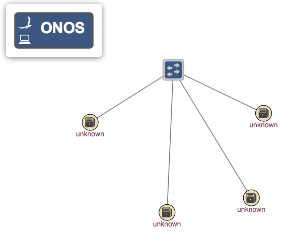

# Test Plan - Flows

Test suite for Flow rule-based functionality through REST

### Purpose

The purpose of this test suite is to verify that the Flow Subsystem is compiling flows correctly.

### Test Overview

We verify the flow subsystem by checking if each flow is correctly compiled on the device. We do this by using the REST API to add flows with specific selectors and treatments and test them by using a packet generation tool called Scapy. This tool allows us to construct a packet that is tailor made for each flow, e.g., if a flow has only IP selectors specified, we can construct a packet with just an IP frame and send it across the device. If the packet was received, we can verify the flow subsystem is working properly. By using a very simple topology shown below, with only one ONOS controller, we can minimize any possible environment variables that might skew the results of the test.

| Test Cases # | Description | Pass/Fail Criteria |
| --- | --- | --- |
| 1 | Set up test parameters | pass: if params are set |
| 2 | Set cell and build, uninstall, and install ONOS | pass: If sets cell correctly and build, uninstall, and install passes |
| 10 | Setup Mininet (start mn, assign mastership to switches, and compares topology) | pass: if Mininet, switch assignment and topology comparison all pass |
| 66 | Tests Scapy by sending a simple packet | pass: if packet was read |
| 1000 | Adds a flow with only the MAC address selector specified and tests if the flow was compiled correctly by sending a packet with only the ethernet frame. | pass: if packet was caught by filtering for only the MAC address |
| 1100 | Adds a flow with the VLAN selector specified and tests if the flow was compiled correctly by sending a packet on the VLAN interface with only the ethernet frame and VLAN tag. | pass: if packet was caught by filtering on the VLAN interface and for packets with a VLAN tag. |
| 1200 | Adds a flow with the ARP selector specified and tests if the flow was compiled correctly by sending a packet on the ARP interface with only the ethernet frame and ARP tag. | pass: if packet was caught by filtering on the ARP interface and for packets with a ARP tag. |
| 1300 | Adds a flow with the MPLS selector specified and tests if the flow was compiled correctly by sending a packet with an ethernet frame and MPLS label. | pass: if packet was caught by filtering for the specified MPLS label |
| 1400 | Adds a flow with an IPv4 src, dst, and ethernet type selectors specified and tests if the flow was compiled correctly by sending a packet with only the ethernet frame and IP frame. | pass: if packet was caught by filtering for only IP packets |
| 1500 | Adds a flow with an IPv6 src, dst, and ethernet type selectors specified and tests if the flow was compiled correctly by sending a packet with only the ethernet frame and IP frame. | pass: if packet was caught by filtering for only IPv6 packets |
| 1600 | Adds a flow with the UDP dst, ethernet type, and ip protocol selectors specified and tests if the flow was compiled correctly by sending a packet with an ethernet, IP, and UDP frame | pass: if packet was caught by filtering for only UDP packets |
| 1700 | Adds a flow with the TCP dst, ethernet type, and ip protocol selectors specified and tests if the flow was compiled correctly by sending a packet with an ethernet, IP, and TCP frame | pass: if packet was caught by filtering for only TCP packets |
| 1800 | Adds a flow with the SCTP dst, ethernet type, and ip protocol selectors specified and tests if the flow was compiled correctly by sending a packet with an ethernet, IP, and SCTP frame | pass: if packet was caught by filtering for only SCTP packets |
| 1900 | Adds a flow with the ICMPv4 dst, ethernet type, and ip protocol selectors specified and tests if the flow was compiled correctly by sending a packet with an ethernet, IP, and ICMPv4 frame | pass: if packet was caught by filtering for only ICMP packets |
| 2000 | Adds a flow with the ICMPv6 dst, ethernet type, and ip protocol selectors specified and tests if the flow was compiled correctly by sending a packet with an ethernet, IPv6, and ICMPv6 frame | pass: if packet was caught by filtering for only ICMPv6 packets |
| 3000 | Delete flows that were added through the REST API | pass: HTTP response is 204 |
