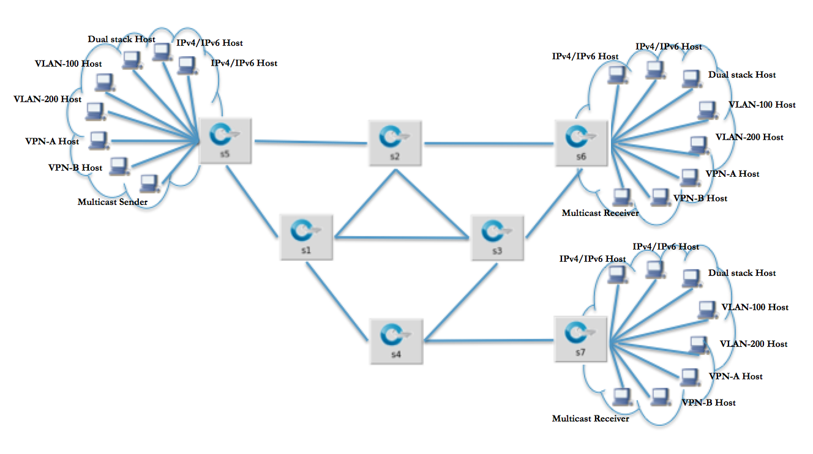

# Test Plan - Intents

# Intent Functionality Test Suite

### Purpose

 This test ensures the functionality of intent framework application. The script focuses on the northbound with high level verification included in the CLI and the REST api in FUNCintent and FUNCintentRest respectively.

### Test Overview

This test uses a topology shown in the figure below emulated via Mininet. The topology has 7 switches, each end switch consist of multiple hosts that has different configuration. The remaining core switches are used to test rerouting by bringing links up and down. The test combines single and multi node testing using OF 1.0 and 1.3 OVS. Test configuration will vary in the values inside params file.

### Test Strategy

The test heavily depends on connectivity of the devices under test. High level verification such as verifying states are done multiple times before and after events. Connectivity and state verification determines the passing criteria of each test case.

### Test Assumption

* A test bench that has ONOS package deployed
* Requires at least a single node cluster
* Mininet topology included in the test dependency folder should run without errors
* Stable ONOS build ( v1.3 and up )
* VLAN module installed

*NOTE: Please read README file in the test folder for more information about dependencies.*

| Test Suite | Test Cases | Passing Criteria |
| --- | --- | --- |
| Intent Functionality (FUNCintent) | Host intent | * Intents can be installed between network nodes * Connectivity between hosts when intents are installed * Intent state is in INSTALLED state for each active instances * All devices that are being used are in ACTIVE state * Each active device is assigned to one master controller * Network topology from Mininet is equivalent to ONOS view for each active instances * Flows should be in its appropriate state before and after an event such as intent installation, rerouting flows etc. * System state is consistent to all active ONOS instance * Connectivity is preserved in rerouting flows when particular links are down * Every match action given when adding intents should correctly stored in each of intents status * Network nodes ( switch and host ) information are consistent such as MAC, IPs, IDs, Ports. * All steps and verification should pass with different types of host: Dual stack, IPV4, VLAN etc. * Completely remove or purge all intents that have been installed * Point-to-Point intent supports protection intent |
|  | Point intent |
|  | Multi-to-single point intent |
|  | Single-to-multi point intent |
|  | Host Mobility | * Hosts connections can be moved between switches |
|  | Single-to-multi point intent  Multi-to-single point intent  Partial failure | * As with single-to-multi and multi-to-single intent tests but including * Connectivity is preserved when a part of the intent is isolated from the network is partial failure flagsare set |

### Test Principle

* Test will only use all the functionality related to intents and other sub system in the CLI application or REST api
* There will be repetitive verification before and after an event
* Use of dependency python files to extend the test script functions for code reusability
* The test can be extended for more low-level verification
* Testing disregards performance of any application or subsystem used and focused entirely on the functionality of the system
* Passing criteria of each cases should always include device connectivity
