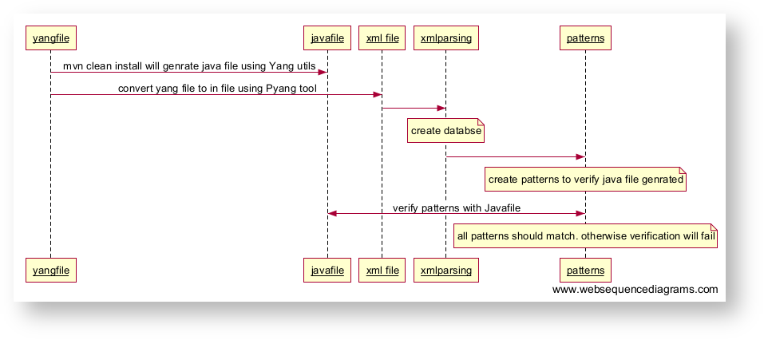

# Test Plan - Yang-tools

1. #### Purpose

   YANG Tools  are the basic building block to achieve the final goal of abstracting the language based Syntax/Semantics processing by APPs.  
     The YANG modeled interfaces need to be implemented by corresponding application component. There are 2 parts in implementing the interface:

   1. syntax/semantics processing of the request/response being exchanged.
   2. business logic to compute the request.

   We intend to abstract the applications from syntactic processing of information encoding with external world.We intend to provide a framework in which the applications only need to implement the business logic and seamlessly support any interface language like REST, NETCONF etc.
2. #### **Contributors**

   | Name | Company | Email-d |
   | --- | --- | --- |
   | Adarsh | Huawei Technologies | [Adarsh.m@huawei.com](mailto:Adarsh.m@huawei.com) |
   | SathishKumar | Huawei Technologies | [Sathishkumar.m@huawei.com](mailto:Sathishkumar.m@huawei.com) |
   | Chidambar Babu | Huawei Technologies | [Chidambar.babu@huawei.com](mailto:Chidambar.babu@huawei.com) |
   | Antony Silvester | Huawei Technologies | [Antony.Silvester@huawei.com](mailto:Antony.Silvester@huawei.com) |
3. #### **Test Methodology**

   The below flow diagram, describes the TEST implementation  of Yang Automation.

   
4. #### Test Plan

   The expected output of all cases is that compilation should be successful without any errors and should generate necessary Java code.

   |  |  |  |  |
   | --- | --- | --- | --- |
   | **[Sl.no](http://Sl.no)** | **Statement** | **yang to java mapping status** | **Standard Yang file mapping to statements** |
   | 1 | anyxml | not supported |  |
   | 2 | argument | Supported | ietf-complex-types.yang, ietf-yang-smiv2.yang |
   | 3 | augment | Supported | ietf-ip.yang, ietf-netconf-time.yang, ietf-netconf-with-defaults.yang, ietf-snmp-community.yang, ietf-snmp-engine.yang, ietf-snmp-notification.yang, ietf-snmp-proxy.yang, ietf-snmp-ssh.yang, ietf-snmp-target.yang, ietf-snmp-tls.yang, ietf-snmp-tsm.yang, ietf-snmp-usm.yang, ietf-snmp-vacm.yang, ietf-template.yang |
   | 4 | base | Supported | iana-if-type.yang, ietf-complex-types.yang, ietf-inet-types.yang, ietf-interfaces.yang, ietf-ip.yang, ietf-ipfix-psamp.yang, ietf-netconf-acm.yang, ietf-netconf-monitoring.yang, ietf-netconf-notifications.yang, ietf-netconf-time.yang, ietf-netconf.yang, ietf-snmp-community.yang, ietf-snmp-engine.yang, ietf-snmp-target.yang, ietf-snmp-tls.yang, ietf-snmp-tsm.yang, ietf-snmp-usm.yang, ietf-snmp-vacm.yang, ietf-system.yang, ietf-x509-cert-to-name.yang, ietf-yang-library.yang, ietf-yang-smiv2.yang, ietf-yang-types.yang, |
   | 5 | belongs-to | Supported | ietf-snmp-common.yang, ietf-snmp-community.yang, ietf-snmp-engine.yang, ietf-snmp-notification.yang, ietf-snmp-proxy.yang, ietf-snmp-ssh.yang, ietf-snmp-target.yang, ietf-snmp-tls.yang, ietf-snmp-tsm.yang, ietf-snmp-usm.yang, ietf-snmp-vacm.yang |
   | 6 | bit | Supported | iana-if-type.yang, ietf-netconf-acm.yang, |
   | 7 | case | Supported | ietf-netconf-acm.yang, ietf-netconf-notifications.yang, ietf-snmp-community.yang, ietf-snmp-engine.yang, ietf-snmp-ssh.yang, ietf-snmp-target.yang, ietf-snmp-tls.yang, ietf-snmp-tsm.yang, ietf-snmp-usm.yang, ietf-system.yang, |
   | 8 | choice | Supported | ietf-ip.yang, ietf-ipfix-psamp.yang, ietf-netconf-acm.yang, ietf-netconf-monitoring.yang, ietf-netconf-notifications.yang, ietf-netconf.yang, ietf-snmp-community.yang, ietf-snmp-engine.yang, ietf-snmp-target.yang, ietf-snmp-usm.yang, ietf-system.yang |
   | 9 | config | Supported | ietf-interface1s.yang, ietf-ip.yang, ietf-ipfix-psamp.yang, ietf-netconf-acm.yang, ietf-netconf-monitoring.yang, ietf-system.yang, ietf-yang-library.yang, |
   | 10 | contact | Supported | Supported in all Yang Files |
   | 11 | container | Supported | ietf-interfaces.yang, ietf-ip.yang, ietf-ipfix-psamp.yang, ietf-netconf-acm.yang, ietf-netconf-monitoring.yang, ietf-netconf-notifications.yang, ietf-netconf-time.yang, ietf-netconf.yang, ietf-snmp-common.yang, ietf-snmp-community.yang, ietf-snmp-engine.yang, ietf-snmp-ssh.yang, ietf-snmp-target.yang, ietf-snmp-tls.yang, ietf-snmp-tsm.yang, ietf-snmp-usm.yang, ietf-snmp-vacm.yang, ietf-system.yang, ietf-yang-library.yang |
   | 12 | default | Supported | ietf-inet-types.yang, ietf-interfaces.yang, ietf-ip.yang, ietf-ipfix-psamp.yang, ietf-netconf-acm.yang, ietf-netconf-notifications.yang, ietf-netconf-time.yang, ietf-netconf-with-defaults.yang, ietf-netconf.yang, ietf-snmp-community.yang, ietf-snmp-engine.yang, ietf-snmp-notification.yang, ietf-snmp-ssh.yang, ietf-snmp-target.yang, ietf-snmp-tls.yang, ietf-snmp-tsm.yang, ietf-snmp-usm.yang, ietf-snmp-vacm.yang, ietf-system.yang, ietf-yang-smiv2.yang, ietf-yang-types.yang, |
   | 13 | description | Supported | Supported in all Yang Files |
   | 14 | deviate | not supported |  |
   | 15 | deviation | not supported |  |
   | 16 | enum | Supported | ietf-inet-types.yang, ietf-interfaces.yang, ietf-ip.yang, ietf-ipfix-psamp.yang, ietf-netconf-acm.yang, ietf-netconf-monitoring.yang, ietf-netconf-notifications.yang, ietf-netconf-with-defaults.yang, ietf-netconf.yang, ietf-snmp-common.yang, ietf-snmp-community.yang, ietf-snmp-notification.yang, ietf-snmp-proxy.yang, ietf-snmp-vacm.yang, ietf-system.yang, ietf-yang-library.yang, |
   | 17 | error-app-tag | supported | ietf-isis.yang |
   | 18 | error-message | supported | ietf-packet-fields.yang |
   | 19 | extension | not supported |  |
   | 20 | feature | Supported | iana-crypt-hash.yang, ietf-complex-types.yang, ietf-interfaces.yang, ietf-ip.yang, ietf-ipfix-psamp.yang, ietf-netconf.yang, ietf-snmp-notification.yang, ietf-snmp-proxy.yang, ietf-snmp-ssh.yang, ietf-snmp-tls.yang, ietf-snmp-tsm.yang, ietf-system.yang, |
   | 21 | fraction-digits | supported | ietf-te-topology.yang,ietf-ipfix-psamp |
   | 22 | grouping | Supported | ietf-ipfix-psamp.yang, ietf-netconf-monitoring.yang, ietf-netconf-notifications.yang, ietf-netconf-time.yang, ietf-netconf-with-defaults.yang, ietf-snmp-community.yang, ietf-snmp-tls.yang, ietf-snmp-tsm.yang, ietf-snmp-usm.yang, ietf-template.yang, ietf-x509-cert-to-name.yang, ietf-yang-library.yang, |
   | 23 | identity | Supported | iana-if-type.yang, ietf-interfaces.yang, ietf-ipfix-psamp.yang, ietf-netconf-monitoring.yang, ietf-netconf-notifications.yang, ietf-system.yang, ietf-system.yang, ietf-x509-cert-to-name.yang, ietf-yang-smiv2.yang, |
   | 24 | if-feature | Supported | ietf-interfaces.yang, ietf-ip.yang, ietf-ipfix-psamp.yang, ietf-netconf.yang, ietf-snmp-community.yang, ietf-snmp-notification.yang, ietf-snmp-proxy.yang, ietf-snmp-ssh.yang, ietf-snmp-tls.yang, ietf-snmp-tsm.yang, ietf-system.yang, ietf-system.yang, |
   | 25 | import | Supported | iana-if-type.yang, ietf-interfaces.yang, ietf-ip.yang, ietf-ipfix-psamp.yang, ietf-netconf-acm.yang, ietf-netconf-monitoring.yang, ietf-netconf-notifications.yang, ietf-netconf-time.yang, ietf-netconf-with-defaults.yang, ietf-netconf.yang, ietf-snmp-common.yang, ietf-snmp-community.yang, ietf-snmp-engine.yang, ietf-snmp-ssh.yang, ietf-snmp-target.yang, ietf-snmp-tls.yang, ietf-snmp-usm.yang,ietf-system.yang, ietf-template.yang, ietf-x509-cert-to-name.yang, ietf-yang-library.yang, |
   | 26 | include | Supported | ietf-inet-types.yang, ietf-interfaces.yang, ietf-ipfix-psamp.yang, ietf-snmp-community.yang, ietf-snmp-engine.yang, ietf-snmp-notification.yang, ietf-snmp-proxy.yang, ietf-snmp-ssh.yang, ietf-snmp-target.yang, ietf-snmp-tls.yang, ietf-snmp-tsm.yang, ietf-snmp-usm.yang, ietf-snmp-vacm.yang, ietf-snmp.yang, |
   | 27 | input | Supported | ietf-netconf-monitoring.yang, ietf-system.yang, ietf-netconf-partial-lock.yang, ietf-netconf-time.yang, ietf-netconf-with-defaults.yang, ietf-netconf.yang, ietf-system.yang, |
   | 28 | key | Supported | ietf-interfaces.yang, ietf-ip.yang, ietf-ipfix-psamp.yang, ietf-netconf-acm.yang, ietf-netconf-monitoring.yang, ietf-snmp-community.yang, ietf-snmp-engine.yang, ietf-snmp-notification.yang, ietf-snmp-proxy.yang, ietf-snmp-target.yang, ietf-snmp-usm.yang, ietf-snmp-vacm.yang, ietf-system.yang, ietf-x509-cert-to-name.yang, ietf-yang-library.yang, |
   | 29 | leaf | Supported | ietf-interfaces.yang, ietf-ip.yang, ietf-ipfix-psamp.yang, ietf-netconf-acm.yang, ietf-netconf-monitoring.yang, ietf-netconf-notifications.yang, ietf-netconf-partial-lock.yang, ietf-netconf-time.yang, ietf-netconf-with-defaults.yang, ietf-netconf.yang, ietf-snmp-community.yang, ietf-snmp-engine.yang, ietf-snmp-notification.yang, ietf-snmp-proxy.yang, ietf-snmp-ssh.yang, ietf-snmp-target.yang, ietf-snmp-tls.yang, ietf-snmp-tsm.yang, ietf-snmp-usm.yang, ietf-snmp-vacm.yang, ietf-system.yang, ietf-x509-cert-to-name.yang, ietf-yang-library.yang, |
   | 30 | leaf-list | Supported | ietf-interfaces.yang, ietf-ipfix-psamp.yang, ietf-netconf-acm.yang, ietf-netconf-monitoring.yang, ietf-netconf-notifications.yang, ietf-netconf-partial-lock.yang, ietf-snmp-notification.yang, ietf-snmp-target.yang, ietf-snmp-vacm.yang, ietf-system.yang, ietf-yang-library.yang, |
   | 31 | length | Supported | ietf-inet-types.yang, ietf-interfaces.yang, ietf-ip.yang, ietf-ipfix-psamp.yang, ietf-netconf-acm.yang, ietf-snmp-common.yang, ietf-yang-types.yang, |
   | 32 | list | Supported | ietf-interfaces.yang, ietf-ip.yang, ietf-ipfix-psamp.yang, ietf-netconf-acm.yang, ietf-netconf-monitoring.yang, ietf-netconf-notifications.yang, ietf-snmp-community.yang, ietf-snmp-engine.yang, ietf-snmp-notification.yang, ietf-snmp-proxy.yang, ietf-snmp-target.yang, ietf-snmp-usm.yang, ietf-snmp-vacm.yang, ietf-system.yang, ietf-x509-cert-to-name.yang, ietf-yang-library.yang, |
   | 33 | mandatory | Supported | ietf-interfaces.yang, ietf-ip.yang, ietf-ipfix-psamp.yang, ietf-netconf-acm.yang, ietf-netconf-monitoring.yang, ietf-netconf-notifications.yang, ietf-netconf.yang, ietf-snmp-community.yang, ietf-snmp-engine.yang, ietf-snmp-notification.yang, ietf-snmp-proxy.yang, ietf-snmp-ssh.yang, ietf-snmp-target.yang, ietf-snmp-tls.yang, ietf-snmp-tsm.yang, ietf-snmp-usm.yang, ietf-system.yang, ietf-x509-cert-to-name.yang, ietf-yang-library.yang, |
   | 34 | max-elements | Supported | ietf-erp.yang |
   | 35 | min-elements | Supported | ietf-ipfix-psamp.yang, ietf-netconf-monitoring.yang, ietf-netconf-partial-lock.yang, ietf-snmp-vacm.yang |
   | 36 | module | Supported | Supported in all Yang Files |
   | 37 | must | Supported | ietf-snmp-usm.yang, ietf-system.yang, |
   | 38 | namespace | Supported | Supported in all Yang Files |
   | 39 | notification | Supported | ietf-netconf-notifications.yang, ietf-netconf-time.yang, ietf-snmp-notification.yang, ietf-yang-library.yang |
   | 40 | ordered-by | not supported |  |
   | 41 | organization | Supported | Supported in all Yang Files |
   | 42 | output | Supported | ietf-netconf-monitoring.yang, ietf-netconf-partial-lock.yang, ietf-netconf-time.yang, ietf-netconf.yang |
   | 43 | path | Supported | ietf-interfaces.yang, ietf-snmp-notification.yang |
   | 44 | pattern | Supported | iana-crypt-hash.yang, ietf-inet-types.yang, ietf-ipfix-psamp.yang, ietf-netconf-acm.yang, ietf-netconf-time.yang, ietf-snmp-common.yang, ietf-x509-cert-to-name.yang, ietf-yang-library.yang, ietf-yang-types.yang, |
   | 45 | position | Supported | ietf-entity.yang |
   | 46 | prefix | Supported | iana-crypt-hash.yang, iana-if-type.yang, ietf-complex-types.yang, ietf-inet-types.yang, ietf-interfaces.yang, ietf-ip.yang, ietf-ipfix-psamp.yang, ietf-netconf-acm.yang, ietf-netconf-monitoring.yang, ietf-netconf-notifications.yang, ietf-netconf-time.yang, ietf-netconf-with-defaults.yang, ietf-netconf.yang, ietf-snmp-common.yang, ietf-snmp-community.yang, ietf-snmp-engine.yang, ietf-snmp-notification.yang, ietf-snmp-proxy.yang, ietf-snmp-ssh.yang, ietf-snmp-target.yang, ietf-snmp-tls.yang, ietf-snmp-tsm.yang, ietf-snmp-usm.yang, ietf-snmp-vacm.yang, ietf-snmp.yang, ietf-system.yang, ietf-template.yang, ietf-x509-cert-to-name.yang, ietf-yang-library.yang, ietf-yang-smiv2.yang, ietf-yang-types.yang |
   | 47 | presence | supported | ietf-te-topology.yang |
   | 48 | range | Supported | ietf-inet-types.yang, ietf-interfaces.yang, ietf-ip.yang, ietf-ipfix-psamp.yang, ietf-netconf-monitoring.yang, ietf-netconf.yang, ietf-snmp-common.yang, ietf-snmp-community.yang, ietf-system.yang, |
   | 49 | reference | Supported | iana-crypt-hash.yang, iana-if-type.yang, ietf-complex-types.yang, ietf-inet-types.yang, ietf-interfaces.yang, ietf-ip.yang, ietf-ipfix-psamp.yang, ietf-netconf-monitoring.yang, ietf-netconf-notifications.yang, ietf-netconf-time.yang, ietf-netconf-with-defaults.yang, ietf-netconf.yang, ietf-snmp-common.yang, ietf-snmp-community.yang, ietf-snmp-engine.yang, ietf-snmp-notification.yang, ietf-snmp-proxy.yang, ietf-snmp-ssh.yang, ietf-snmp-target.yang, ietf-snmp-tls.yang, ietf-snmp-tsm.yang, ietf-snmp-usm.yang, ietf-snmp-vacm.yang, ietf-snmp.yang, ietf-system.yang, ietf-x509-cert-to-name.yang, ietf-yang-library.yang, ietf-yang-smiv2.yang, ietf-yang-types.yang, |
   | 50 | refine | not supported |  |
   | 51 | require-instance | supported | ietf-network-topology.yang |
   | 52 | revision | Supported | Supported in all Yang Files |
   | 53 | revision-date | Supported | Supported in all Yang Files |
   | 54 | rpc | Supported | ietf-netconf-monitoring.yang, ietf-netconf-partial-lock.yang, ietf-netconf-time.yang, ietf-netconf.yang, ietf-system.yang, |
   | 55 | status | Supported | iana-if-type.yang, ietf-snmp-common.yang |
   | 56 | submodule | Supported | ietf-snmp-common.yang, ietf-snmp-community.yang, ietf-snmp-engine.yang, ietf-snmp-notification.yang, ietf-snmp-proxy.yang, ietf-snmp-ssh.yang, ietf-snmp-target.yang, ietf-snmp-tls.yang, ietf-snmp-tsm.yang, ietf-snmp-usm.yang, ietf-snmp-vacm.yang, |
   | 57 | type | Supported | iana-crypt-hash.yang, iana-if-type.yang, ietf-complex-types.yang, ietf-inet-types.yang, ietf-interfaces.yang, ietf-ip.yang, ietf-ipfix-psamp.yang, ietf-netconf-acm.yang, ietf-netconf-monitoring.yang, ietf-netconf-notifications.yang, ietf-netconf-time.yang, ietf-netconf-with-defaults.yang, ietf-netconf.yang, ietf-snmp-common.yang, ietf-snmp-community.yang, ietf-snmp-engine.yang, ietf-snmp-notification.yang, ietf-snmp-proxy.yang, ietf-snmp-ssh.yang, ietf-snmp-target.yang, ietf-snmp-tls.yang, ietf-snmp-tsm.yang, ietf-snmp-usm.yang, ietf-snmp-vacm.yang, ietf-snmp.yang, ietf-system.yang, ietf-template.yang, ietf-x509-cert-to-name.yang, ietf-yang-library.yang, ietf-yang-smiv2.yang, ietf-yang-types.yang |
   | 58 | typedef | Supported | iana-crypt-hash.yang, iana-if-type.yang, ietf-complex-types.yang, ietf-inet-types.yang, ietf-interfaces.yang, ietf-ip.yang, ietf-ipfix-psamp.yang, ietf-netconf-acm.yang, ietf-netconf-monitoring.yang, ietf-netconf-notifications.yang, ietf-netconf-time.yang, ietf-netconf-with-defaults.yang, ietf-netconf.yang, ietf-snmp-common.yang, ietf-snmp-community.yang, ietf-snmp-engine.yang, ietf-snmp-notification.yang, ietf-snmp-proxy.yang, ietf-snmp-ssh.yang, ietf-snmp-target.yang, ietf-snmp-tls.yang, ietf-snmp-tsm.yang, ietf-snmp-usm.yang, ietf-snmp-vacm.yang, ietf-snmp.yang, ietf-system.yang, ietf-template.yang, ietf-x509-cert-to-name.yang, ietf-yang-library.yang, ietf-yang-smiv2.yang, ietf-yang-types.yang |
   | 59 | unique | Supported | ietf-routing.yang |
   | 60 | units | Supported | ietf-interfaces.yang, ietf-ip.yang, ietf-ipfix-psamp.yang, ietf-netconf-notifications.yang, ietf-netconf.yang, ietf-snmp-target.yang, |
   | 61 | uses | Supported | ietf-ipfix-psamp.yang, ietf-ipfix-psamp.yang, ietf-netconf-monitoring.yang, ietf-netconf-notifications.yang, ietf-netconf-time.yang, ietf-netconf-with-defaults.yang, ietf-snmp-community.yang, ietf-snmp-tls.yang, ietf-snmp-tsm.yang, ietf-snmp-usm.yang, ietf-yang-library.yang, |
   | 62 | value | Supported | ietf-inet-types.yang, ietf-interfaces.yang, ietf-snmp-common.yang, ietf-snmp-community.yang, ietf-snmp-notification.yang, ietf-snmp-proxy.yang, ietf-snmp-vacm.yang, |
   | 63 | when | supported | ietf-ipfix-psamp.yang, ietf-netconf-notifications.yang, ietf-snmp-community.yang, ietf-snmp-proxy.yang, ietf-x509-cert-to-name.yang, |
   | 64 | yang-version | Supported | Supported in all Yang Files |
   | 65 | yin-element | not supported |  |

   P.S : Java Code reference can be found at [YANG Compiler](../../../guides/developer-guide/onos-software-development/yang/yang-compiler.md)
5. #### How Automation tool works

     With yang utils Rules, generic template for Yang statement can be created.

   ****Using yang files, database can be created.

   ******** Java code is generated using the database and template.

   ************ Comparison is done between the Test framework Java Code and yang utils generated Java code.

   **************** Summary report is generated highlighting the mismatch's

   **************** Find the Yang automation tool link under the reference section.
6. #### Reference

  **Standard Yang Files**:  <https://github.com/huawei-adarsh/Onos_Standard_yang>

   **Yang Automation Tool :** **Will be updated shortly**

   

 The following page will be update with YMS details with NBI and SBI app in future. Currently in coding phase.
