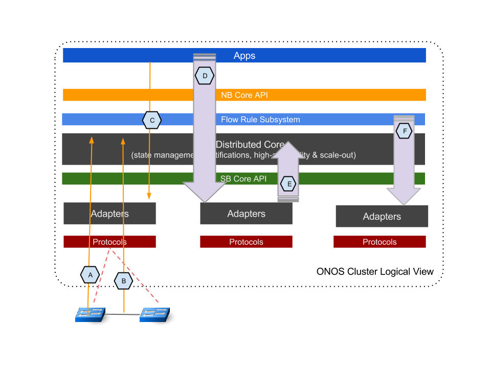

# Test Plan - Performance and Scale-out (SCPF*)

### Objectives:

ONOS is a network controller. Applications interact with ONOS through its intent APIs. ONOS controls data networks (e.g. an Openflow network) through its adapter layer on the southbound. In between, ONOS’ flow subsystem is the key component for translating application intents into Openflow flow rules. ONOS is also a distributed system and it is essential that ONOS' distributed architecture shows performance gains as its cluster size increases.  This evaluation takes an external view of ONOS as a clustering system and aims to characterize its performance from the perspective of applications and the operational environment.

We designed a set of experiments to characterize ONOS' latencies and throughput under various application and network environments. By analyzing the results, we hope to provide network operators and application developers with a "first look" of ONOS’ performance capability. In addition, the performance results should help developers gain insights for identifying performance bottlenecks and optimization opportunities. The following diagram illustrates the key performance evaluation points, viewing ONOS' distributed system as a whole.

The performance evaluation points indicated in the diagram include:

**Latencies**:

* A - Switch Connect/Disconnect
* B - Link Up/Down
* C - Intent Batch Install/Withdraw/Re-Route
* I - Flow Batch Installation from REST API
* L - Host Add
* M - Mastership Failover

**Throughput**:

* D - Intent Operations
* F - Burst Flow Rule Installation
* G - Flow-Mod (Cbench)

**Capacities**

* E - Topology Scaling Operation
* H - Max Intent Installation

### General Experiment Setup:

Performance Measured at Increasing Scale:

ONOS’ most prominent characteristic is in its distributed system architecture. A key aspect of characterizing ONOS’ performance is to analyze and compare performance at various scales.  The general theme of all test cases is to make measurements on ONOS as it scales from 1 node to 3, 5, 7, nodes.

Measurement Instrumentation:

In order to characterize ONOS’ intrinsic characteristics and not to be limited by test fixture performance, we instrumented a few utilities for the experiments. 

For all experiments except switch and port related ones, which require Openflow interactions, we implemented in ONOS a set of Null Providers at the Adapter level to interact with the ONOS core. The Null Providers act as device, link, host producers as well as a sink of flow rules. By using the Null Providers, we bypass Openflow adapters and eliminate potential performance limits from having to use real or emulated Openflow devices.

We also instrumented a number of load generators so that we can generate a high-level of loading from the application or the network interfaces to stretch ONOS's performance limits.  These generators include:

* an intent performance generator, “onos-app-intent-perf” that interfaces with intent API, and generates self-adjusting intent install and withdraw operations to the highest rate ONOS can sustain;
* a flow rule installer utility python script that interfaces with ONOS flow subsystem to install and remove flow rules in the subsystem;
* a link event (flicker) generator in Null Link providers that sends link up/down descriptions to ONOS core at an elevated rate up to that which ONOS can sustain.

In addition, we utilize meters in "topology-events-metrics" and "intents-events-metrics" apps for some of the timing and rate related tests to capture key event timestamps and processing rates.

We will describe more details on utilizing the generator setup in the individual test cases.

General Test Environments:

A 7-node bare-metal server cluster is set aside for all the experiments. Each server has the following specs:

* Dual Intel Xeon E5-2670v2 2.5GHz Processors - 10 real cores/20 hyper-threaded cores per processor;
* 32GB 1600MHz DDR3 DRAM;
* 1Gbps Network interface card;
* Ubuntu 14.04 OS;
* Time synchronization amongst cluster nodes using ptpd.

ONOS specific software environment includes:

* Java HotSpot(TM) 64-Bit Server VM; version 1.8.0\_31
* JAVA\_OPTS="${JAVA\_OPTS:--Xms8G -Xmx8G}"
* Additional case-specific ONOS parameters to be described in specific case.

The following child pages describe further setup details, discuss and analyze the results from each test:

### Test Plan:

| Test | Description | Test Plan Article |
| --- | --- | --- |
| SCPFswitchLat | Measure latencies of switch connect/disconnect as onos cluster scales from 1, to 3, 5, 7 nodes. | [Experiment A&B Plan - Topology (Switch, Link) Event Latency](test-plan-performance-and-scale-out-scpf/experiment-ab-plan-topology-switch-link-event-latency.md) |
| SCPFportLat | Measure latencies of port connect/disconnect as onos cluster scales from 1, to 3, 5, 7 nodes. | [Experiment A&B Plan - Topology (Switch, Link) Event Latency](test-plan-performance-and-scale-out-scpf/experiment-ab-plan-topology-switch-link-event-latency.md) |
| SCPFintentInstallWithdrawLat | Measure latencies of installing and withdrawing intents in a batch size of 1, 100, 1000, as onos cluster scales from 1, to 3, 5, 7 nodes. Both cases when FlowObjective intent compiler is on and off are tested. | [Experiment C Plan - Intent Install/Remove/Re-route Latency](test-plan-performance-and-scale-out-scpf/experiment-c-plan-intent-installremovere-route-latency.md) |
| SCPFintentRerouteLat | Measure latencies of installed intents being rerouted, in an event of network path change, when onos cluster scales from 1 to 3, 5, 7 nodes. Both cases when FlowObjective intent compiler is on and off are tested. | [Experiment C Plan - Intent Install/Remove/Re-route Latency](test-plan-performance-and-scale-out-scpf/experiment-c-plan-intent-installremovere-route-latency.md) |
| SCPFintentEventTp | Measure onos intent operation throughput performance as onos scales form 1 to 3, 5, 7 nodes. Also tested in each scale, intent "neighboring" scenarios, i.e. when intents are installed only on the local nodes, and all nodes in the cluster. | [Experiment D Plan - Intents Operations Throughput](test-plan-performance-and-scale-out-scpf/experiment-d-plan-intents-operations-throughput.md) |
| SCPFscaleTopo | Measure the maximum size of topology that a 3-node onos cluster can discover and maintain. | [Experiment E Plan - Topology Scaling Operation](test-plan-performance-and-scale-out-scpf/experiment-e-plan-topology-scaling-operation.md) |
| SCPFflowTp1g | Measure onos flow rule subsystem throughput performance as onos scales form 1 to 3, 5, 7 nodes. Also tested in each scale flow rule "neighboring" scenarios, i.e. when flow rules are installed only on the local nodes, and all nodes in the cluster. | [Experiment F Plan - Flow Subsystem Burst Throughput](test-plan-performance-and-scale-out-scpf/experiment-f-plan-flow-subsystem-burst-throughput.md) |
| SCPFcbench | Measure Cbench performance of single-instance onos with fwd app. This test is mainly used for regression monitoring on onos openflow layers. | [Experiment G Plan - Single-node ONOS Cbench](test-plan-performance-and-scale-out-scpf/experiment-g-plan-single-node-onos-cbench.md) |
| SCPFscalingMaxIntents | Measure the maximum number of intents and corresponding flows that onos can hold as onos scales form 1 to 3, 5, 7 nodes. Both cases when FlowObjective intent compiler is on and off are tested. | [Experiment H Plan - Max Intent Installation and ReRoute](test-plan-performance-and-scale-out-scpf/experiment-h-plan-max-intent-installation-and-reroute.md) |
| SCPFbatchFlowResp | Measure the latencies of flow batch installation and deletion via REST API on a single-instance onos. | [Experiment I Plan - Single Bench Flow Latency Test](test-plan-performance-and-scale-out-scpf/experiment-i-plan-single-bench-flow-latency-test.md) |
| SCPFhostLat | Measure latencies of host discovery as onos cluster scales from 1, to 3, 5, 7 nodes. | [Experiment L Plan - Host Add Latency](test-plan-performance-and-scale-out-scpf/experiment-l-plan-host-add-latency.md) |
| SCPFmastershipFailoverLat | Masure the latencies of ONOS node recovery as ONOS cluster scales from 3, to 5, 7 nodes. | [Experiment M Plan - Mastership Failover Latency](test-plan-performance-and-scale-out-scpf/experiment-m-plan-mastership-failover-latency.md) |
