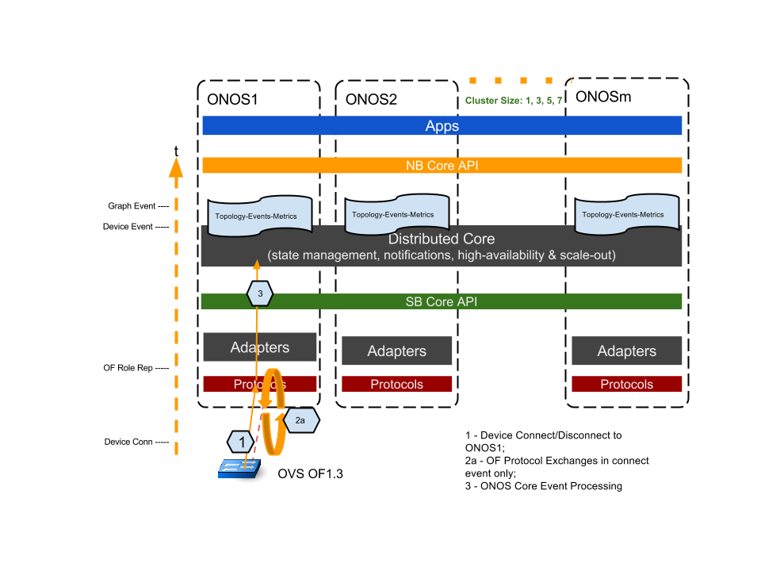
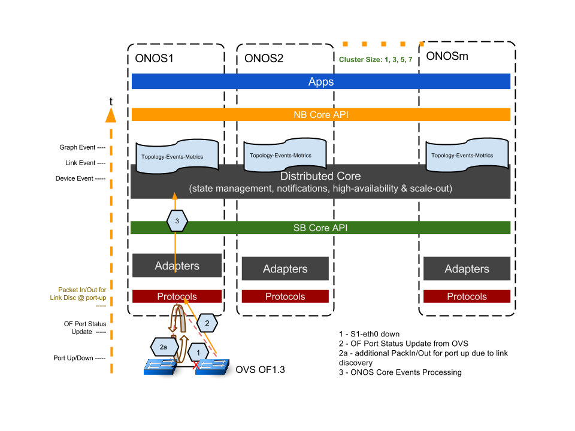

# Experiment A&B Plan - Topology (Switch, Link) Event Latency

### Goals:

This experiment is to measure how ONOS as a cluster in various sizes, reacts to a topology event. The type of topology events tested include: 1) a switch connects/disconnects to an ONOS node; 2) a link comes up and down on an exiting topology. ONOS being a distributed system architecture, may incurs additional delay to propagate a topology event when as a multi-node cluster compared with when standalone. While the latency in standalone mode should be limited, it is also desirable to reduce any additional delays incurs in a clustered ONOS due to the need of East-West wise communication of the events.

### Setup and Method - Switch Connect/Disconnect Latency:

The following diagram illustrates the test setup. A switch connect event is generated from a “floating” (i.e. no data path port and links) OVS (OF1.3) by issuing “set-controller” command for the OVS bridge to initiate connection to ONOS1.  We capture “on the wire” timestamps on the OF control network with the tshark tool, as well as ONOS Device and Graph timestamps recorded in ONOS using “topology-event-metrics” app. By collating those timestamps, we come up with a "end-to-end" timing profile of the events from initial event triggering to when ONOS registers the event in its topology.

The key timing captures are the following:

1. Device initiate connection t0, tcp syn/ack;
2. Openflow protocol exchanges:

* t0 -> OVS Features Reply;
* OVS Features Reply -> ONOS Role Request; (ONOS processing of mastership election for the device happens here)
* ONOS Role Request -> OVS Role Reply - completes the initial OF protocol exchanges;

3. ONOS core processing of the event:

* A Device Event is triggered upon OF protocol exchange completes;
* A Topology (Graph) Event is triggered from the local node Device Event.

Likewise, for testing a switch disconnect event, we use the ovs command "del-controller" to disconnect the above switch from its ONOS node. Timestamps captured are the following:

1. OVS tcp syn/fin (t0);
2. OVS tcp fin;
3. ONOS Device Event;
4. ONOS Graph Event (t1).

The switch disconnect end-to-end latency is the (t1 - t0).

As we scale ONOS cluster size, we only connect and disconnect the switch on ONOS1 and record the event timestamps on all nodes. The overall latency of the cluster is the latest node in the cluster reporting the Graph Event. In our test script, we run multiple iteration (ex. 20 iterations) of a test to gather statistical results.

### Setup and Method - Link Up/Down Latency:

When testing for a link up/down event latency, we use a similar methodology as in switch-connect test, except that we use two OVS switches to create the link (we use mininet to create a simple linear two switch topology). Both switches' masterships belongs to ONOS1 . Referring to the diagram below. After initially establish switch-controller connections. By setting one of the switches’ interface up or down, we generate the port up or down events as the trigger for this test.

Some of the key timestamps are recorded, as described below:

1. Switch port brought up/down, t0;
2. OF PortStatus Update message sent from OVS to ONOS1; 

   2a. in the case of port up, ONOS reacts with link discovery events by sending link discovery message out to each OVS switch, and receiving Openflow PacketIn’s from the other OVS switch .
3. ONOS core processing of the events:

* A Device event is generated by the OF port status message; (ONOS processing)
* On link down, a Link Event is generated locally on the nodes triggered by the Device Event; on link up, a Link Event is generated upon completion of the link discovery PacketIn/out; (mostly timing due to OFP messaging and ONOS processing)
* A Graph Event is generated locally on the nodes. (ONOS processing)

Similar to the switch-connect test, we consider the latest node in the cluster having registered the Graph event as the latency for the cluster.

