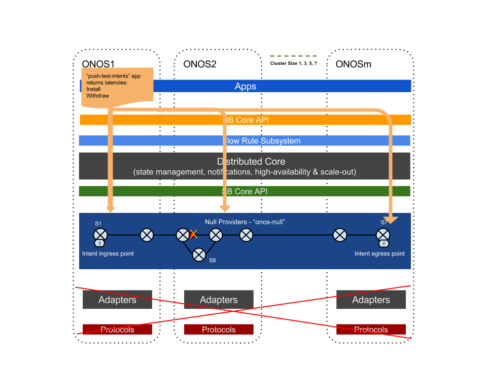
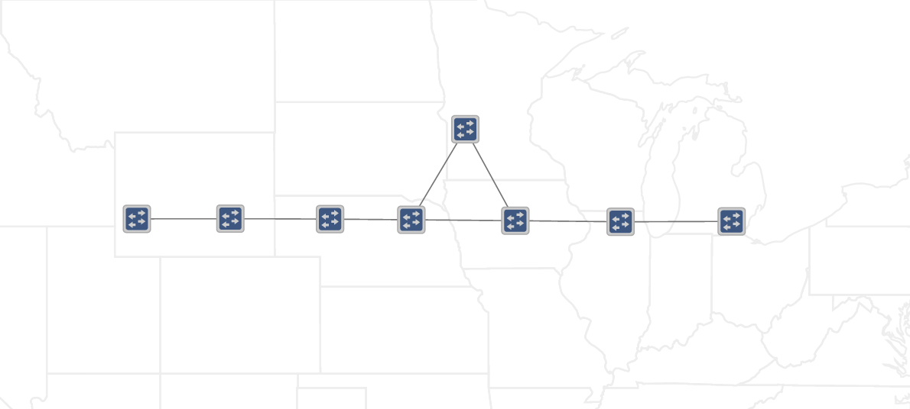
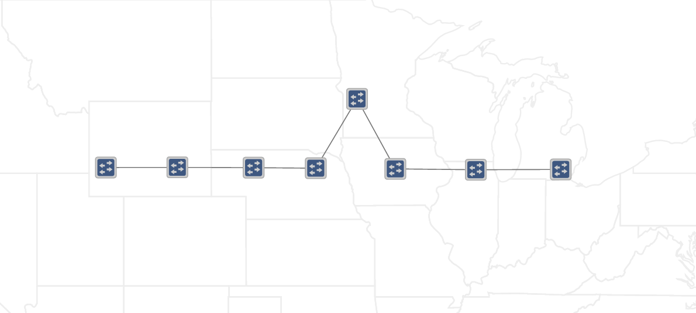

# Experiment C Plan - Intent Install/Remove/Re-route Latency

### **Goals:**

This set of tests aims to characterize ONOS' latencies (i.e. response time) when an application installs or withdraws various batch-sizes of intents. Also we characterize ONOS' response time in an event when the installed intents need to be re-routed due to a path change, e.g. the shortest path is no longer available. This is a test to exercise ONOS from the top of the stack at NB API, through intent and flow subsystems, to the bottom of the stack in SB API,  with some effects of substituting Openflow Adaptor with Null Providers. The results of this set of test should provide network operators and application developers with a "first look" of the response time applications can expect when operating intents, in terms of how large the batch intents is, and how the cluster size affect the response time.

### Setup and Method - Batch Intent Install & Withdraw:

Referring to the following diagram, we use ONOS built-in app "push-test-intent" to push a batch of point-to-point intents from ONOS1 through its intent API. The utility constructs a set of intents based on the end points , batch size, and application id. It then pushes those intents through the intent API. When all intents are successfully installed, it returns the latency (response time). It subsequently  withdraws those intents and returns a withdraw response time. When intents are pushed, ONOS internally compiles the intents to flow rules and write to the necessary distributed stores to distribute the intents and flows.

Referring to the diagram below. Particular to our experiment, the intents constructed are end-to-end on a seven linear switch configuration, i.e. ingress of all intents are from one port of S1 and their egress is a port on S7.  (We use an additional switch S8 in the topology for intent re-route tests, which is described next.) We use Null Providers to construct the switches (Null Devices) and topology (Null Links) and consume the flows (Null Flows) through them. As we scale the cluster size out, we reassign the masterships of the switches to "equally" distributed among the cluster nodes.

In this experiment, we will use the following parameters to characterize ONOS performance:

* All intents installed are 6-hops point-to-point intents;
* Intent batch sizes: 1, 100, and 1000 intents per batch;
* Test iterations: 20 for each data point (after 10 warm-up runs).
* Scale cluster size from 1 to 3, 5 and 7 nodes

### Setup and Method - Intent Re-route:

Also referring to the same diagram above, the intent re-route latency is a test to characterize ONOS performance in a event that the shortest path is no longer available, how quickly ONOS reacts to this event by reinstalling all intents to the new path. The sequence of the test are highlighted below:

1. We pre-install intents over linear shortest path (6-hops) by using "push-test-intents -i" option, which will not automatically withdraw the intents. (top image below)
2. Then we simulate the cut of the shortest path by changing the Null Provider topology definition to no longer include a link between the two nodes that are connected to S8. We take the initial event timestamp t0 by inspecting ONOS log on when the new topology description is taken in by ONOS. (bottom image below)
3. As a result of the topology change the 6-hop path is no longer available. ONOS falls back to the 7-hop backup path provided through S8. The Intent and flow system react to this event by withdrawing the old intents and removing the old flows (current implementation of ONOS, all intents and flows are no longer re-used.).
4. Subsequently, ONOS re-compiles the intents and flows, and install them.  We capture the final Intent Install timestamp(t1) from "Intents-events-metrics", after verifying all intents are indeed installed successfully.
5. We consider (t1 - t0) as the latency incurs in ONOS for re-routing the intent(s).
6. The test script iterates a few parameters:
   1. Intent Batch sizes initially installed: 1, 100, and 1000 intents;
   2. Each data point is from statistical mean of 20 runs ( after 10 warm-up runs);
   3. ONOS cluster scales from 1, to 3, 5 and 7 nodes.

