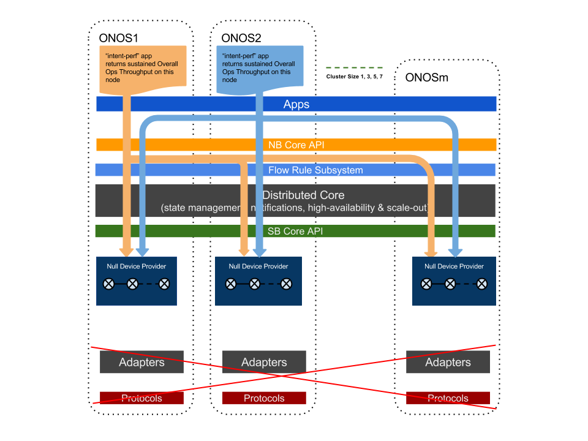

# Experiment D Plan - Intents Operations Throughput

### Goals:

We use this test to measure the level of intents operations that ONOS can sustain. One of the main use case of SDN controller is to allow agile applications to have frequent changes on network configuration through intents and flow rules. ONOS as an SDN controller should sustain a high level of intent installation and withdraw requests. ONOS as a distributed architecture, should be able to sustain higher intent operation throughput levels as the cluster scale increases.

### Setup and Method:

The following diagram depicts the test methodology.

In order to generate a high level of Intents operation, we instrumented the "intent-perf" app. This app can be activated on any ONOS node in the cluster. It has a few parameters to configure the generator behavior:

* numKeys - the number of unique intents use, default = 40,000;
* cyclePeriod - the expected cycle period of installing and withdrawing, default = 1000ms;
* numNeighbors - the number of neighboring ONOS nodes to where the app running ONOS node need to send portions of the intents for installations.

This app when run on an ONOS instance, generates constant operations of intent installations and withdraws at the highest rate that ONOS intent subsystem can sustain. It returns periodically the the overall operations throughput (in ONOS log or cli request). By running an extended period of time, we can find the "saturated" overall throughput rate for a particular node. The overall throughput includes both intent installation and withdraw operations. By aggregating the overall throughputs from all nodes running the app, we get the overall ONOS cluster throughput.

The intents generated are only "1-hop" intents, i.e. they are intents to be compiled to flow rules of ingress and egress on the same switch. Therefore, the Null providers need not form a valid topology.

Particular to this experiment, we run with two neighboring scenarios. First, numNeighbors = 0. This is the situation when each ONOS node running a generator only generates intents for local installation and withdraw, eliminating any East-West communication of intents. Secondly, we set numNeighbors equal to (cluster size -1). In this case, every generator will have to generate intents for its local installation, as well as for all other nodes. This is a case maximizing the East-West communication for intents.  We capture the cluster overall throughput at the end of a 400-second sustained load. Other parameters are at default values.
