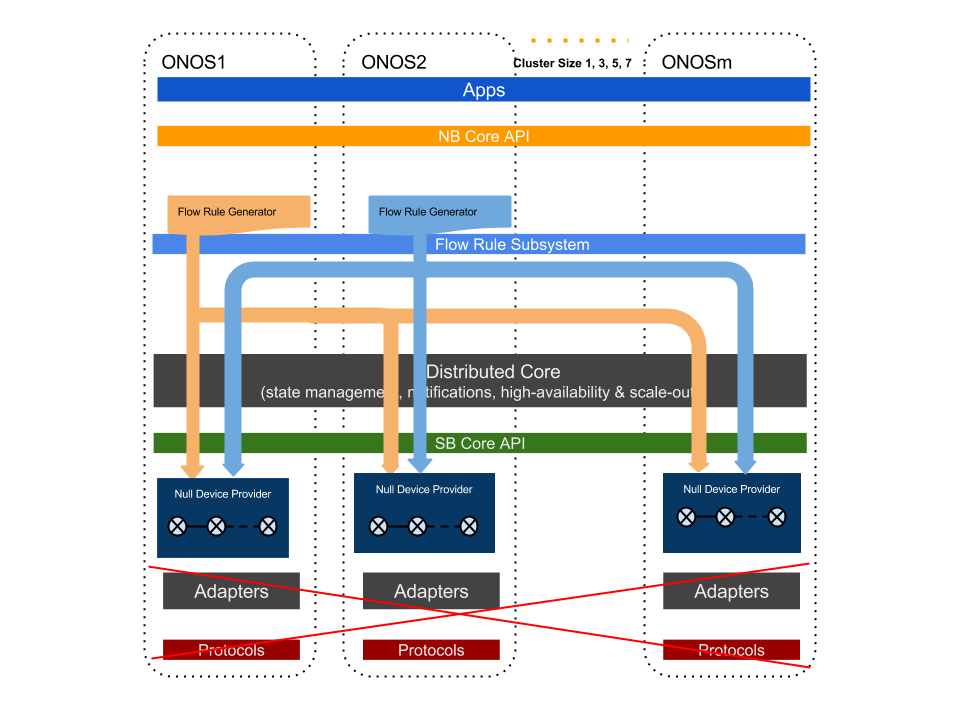

# Experiment F Plan - Flow Subsystem Burst Throughput

### Goals:

As aforementioned, the flow subsystem is the integral part of ONOS that functions to realize the Intents into flow rules that can be installed onto Openflow switches. In addition, applications can also directly call on its API to inject flow rules. It is in the critical path of the performances when applications use the Northbound API and the intent framework. This experiment should provide us a with additional performance breakdown from the end-to-end Intent performance, as well as what applications can expect when directly interfacing with the flow rule system.

### Setup and Method:

For generating a batch of flow rules to be installed and removed by ONOS, we use the "flow-tester.py" utility that is implemented as part of the ONOS tools (under $ONOS\_ROOT/tools/test/bin). This tool when executed will cause ONOS to install a set of flow rules onto the devices under controlled. It returns a response time when all flow rules installed successfully. The tool also accepts a number of parameters to vary how the test can be run (see help page on the command for more details):

* number of flow rules per switch;
* number of Neighbors - the number of ONOS nodes (other than the local ONOS node running the tool) to where the local ONOS node is required to send the flow rules to because the switch masterships is not local;
* number of Servers - the number of ONOS nodes running this tool, i.e. generating the flow rules.

The following diagram depicts the general setup. The example setup in this diagram shows ONOS1 and ONOS2 are the two servers running the tool to generate flows; when both server generating flows with two Neighbors, i.e. the flow rules generated are to be pass to two neighboring nodes for installation (because the flows belongs to switches with neighboring node masterships.)

We enable Null Providers to be the consumer of the flow rules, bypassing Openflow Adaptors and the potential performance limitation of using real or emulated switches.

For the experiment we ran for this release, we used the following parameters:

* The total number of Null Devices used is a constant, 35 - their mastership is equally assigned to all nodes in the cluster, ex. when running a 5-node cluster, each node has masterships of seven devices;
* The total number of flow rules to install for the cluster is 122,500 - this number is chosen so that it is large enough a size, and also easily split to the cluster sizes under test. From there we calculate the number of flows to be install on each switch as a argument for the "flow-tester.py" tool.
* We test two most relevant scenarios: 1) when number of Neighbors is zero, which is  the case where all flow rules are to be install locating on the generating node; 2) when number of Neighbors is (cluster size -1), i.e. each node generator generate flow rule for itself and all other nodes in the cluster.
* We run the experiment with cluster size of 1, 3, 5 and 7.
* The response time is gathered with a statistical integration of 20 (after 5 warm-up runs).
