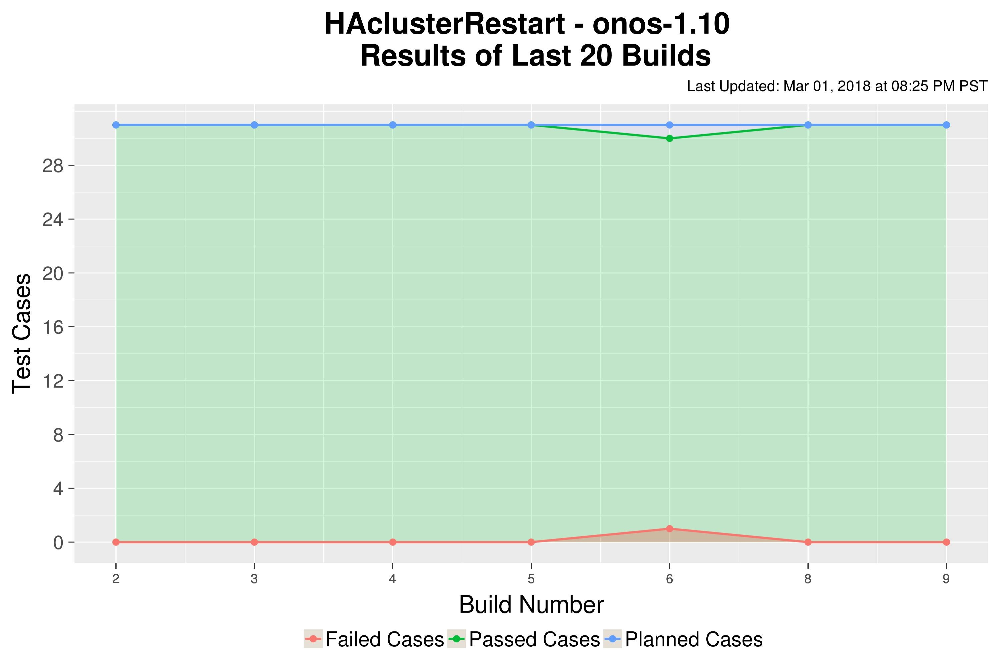
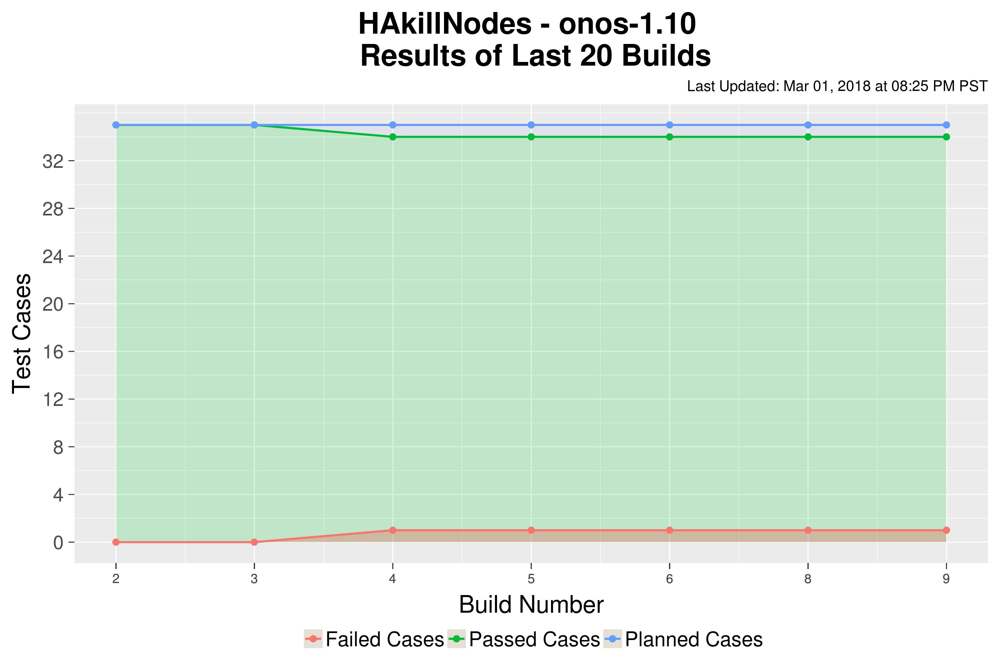
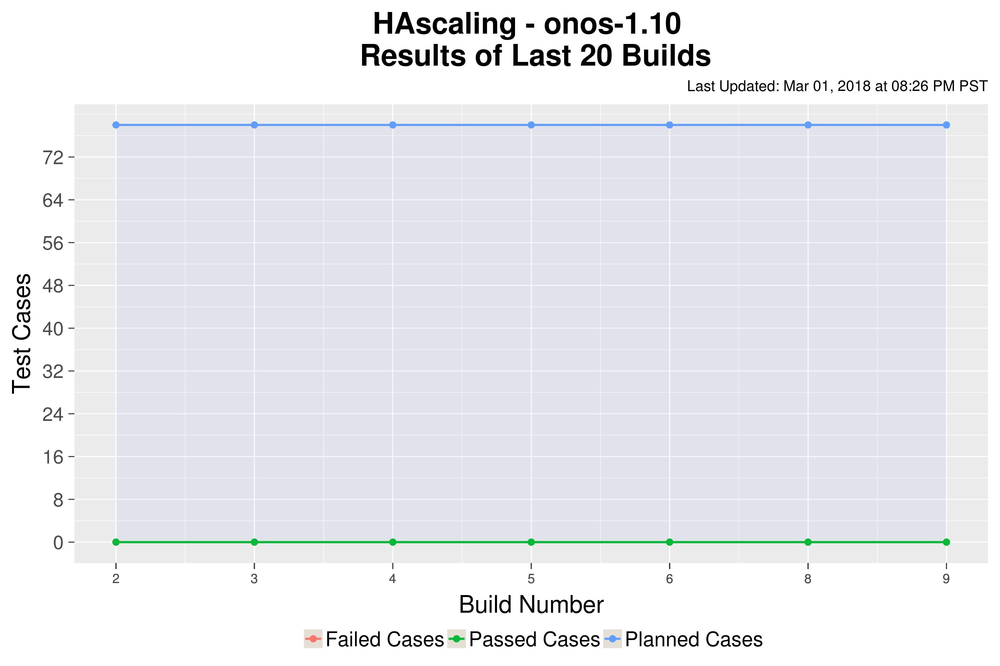
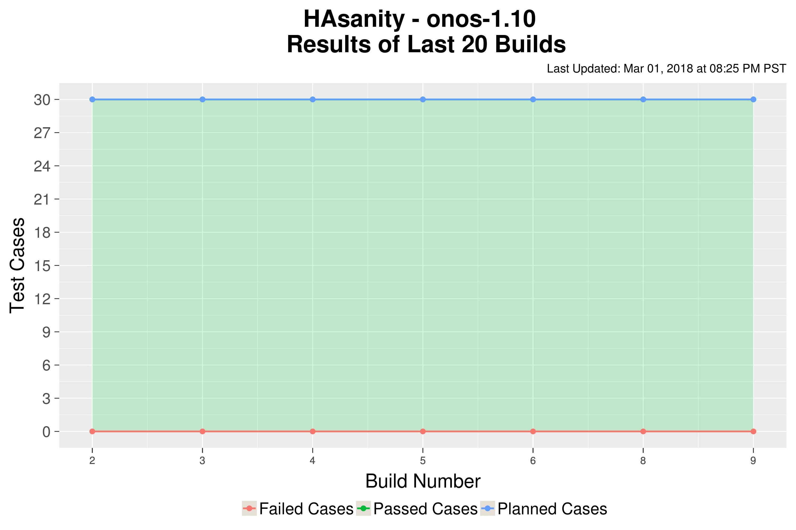
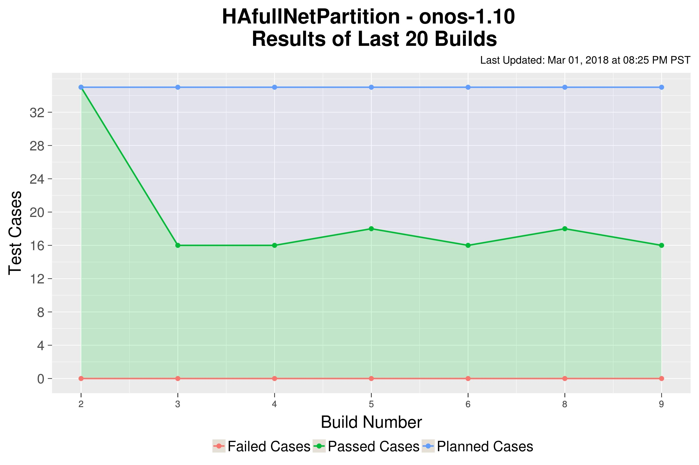
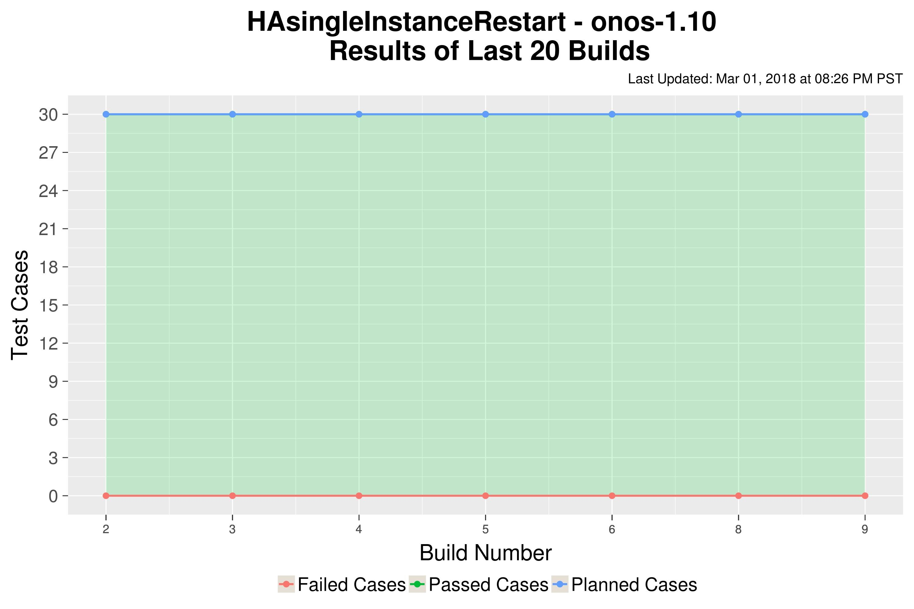
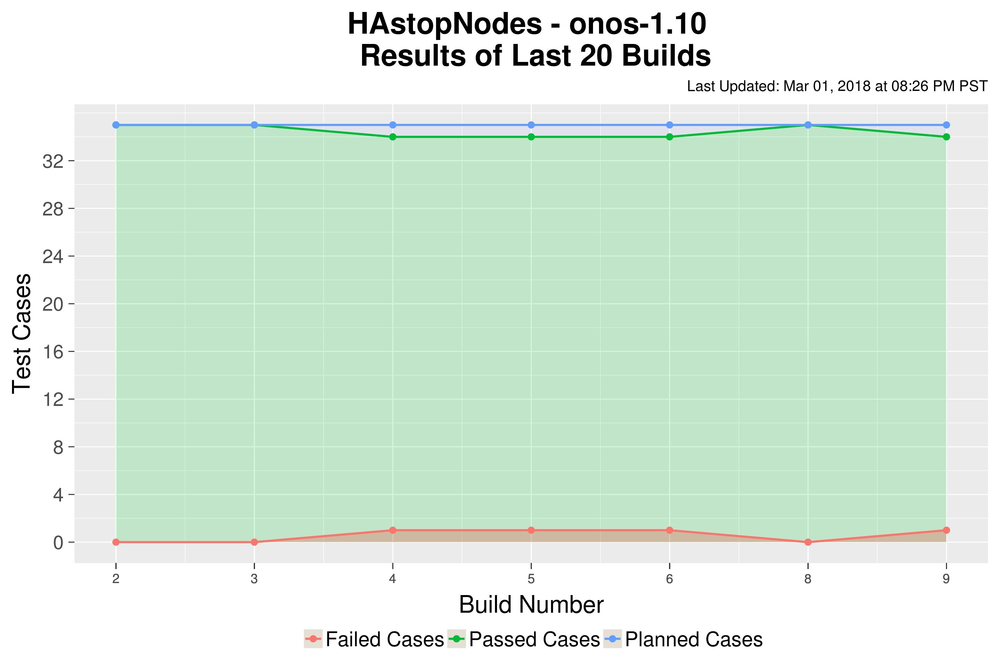
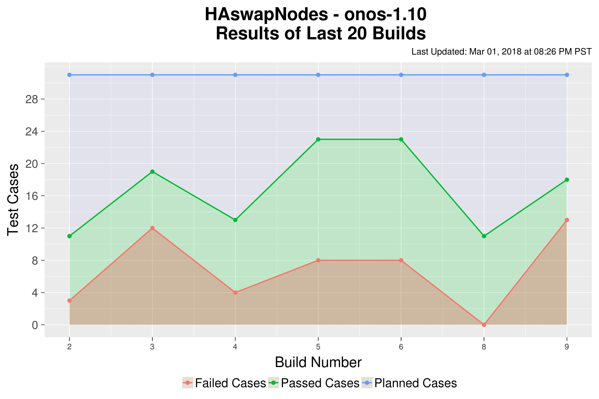

# 1.10-HA

# ONOS HA Tests

* ["Sanity" HA Test - All the checks the HA Test suite with none of the failures](1.10-ha/1.10-ha-sanity.md)
* [Single Instance Restart - Restart a single node cluster by killing the ONOS process and see how ONOS behaves](1.10-ha/1.10-ha-single-instance-restart.md)
* [Cluster Restart - Restart the entire ONOS cluster by killing the ONOS process and see how ONOS behaves](1.10-ha/1.10-ha-cluster-restart.md)
* [Kill Nodes - Restart a minority of the nodes by killing the ONOS process and see how ONOS behaves](1.10-ha/1.10-ha-kill-nodes.md)
* [Stop Nodes - Restart a minority of the nodes by stopping then starting the ONOS service and see how ONOS behaves](1.10-ha/1.10-ha-stop-nodes.md)
* [Full Network Partition - Partition the ONOS control plane into two distinct partitions](1.10-ha/1.10-ha-full-network-partition.md)
* [Dynamic Scaling - Dynamically scale the size of the ONOS cluster up and down](1.10-ha/1.10-ha-scaling.md)
* [Dynamic Swapping of nodes - Swap out two nodes in a cluster with two new nodes without restarting the cluster](1.10-ha/1.10-ha-swap-nodes.md)

[Test Plan for HA Test Cases](../../test-plans/test-plan-ha-ha.md)
