# 1.10-Performance and Scale-out

## Results at a Glance:

The purpose of this page is to track performance trend and regression through the last 50 Jenkins nightly builds on a subset of the full performance evaluation metrics.  Child pages contain full result details on the latest build. Note that results in this tracking may fluctuate from build to build, due to various experiments and changes made in ONOS.

For test details, check out the [test plans for Scale-Out and Performance](../../test-plans/test-plan-performance-and-scale-out-scpf.md).

### [Switch Latency](1.10-performance-and-scale-out/1.10-experiment-ab-topology-switch-link-event-latency.md) - Last 50 builds SwitchUp and SwitchDown Latency test  (5-node cluster):

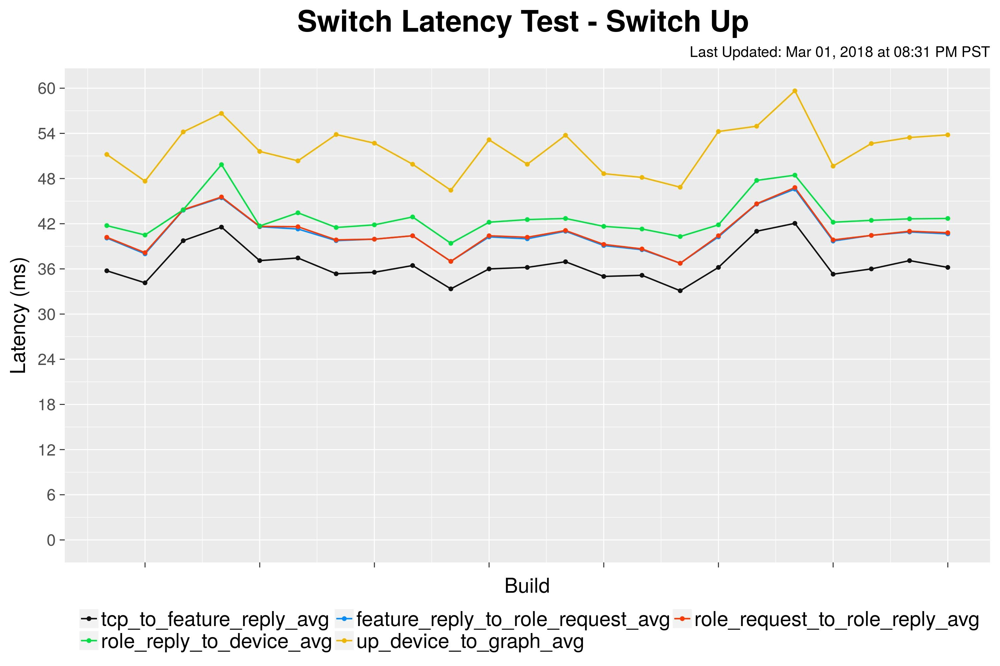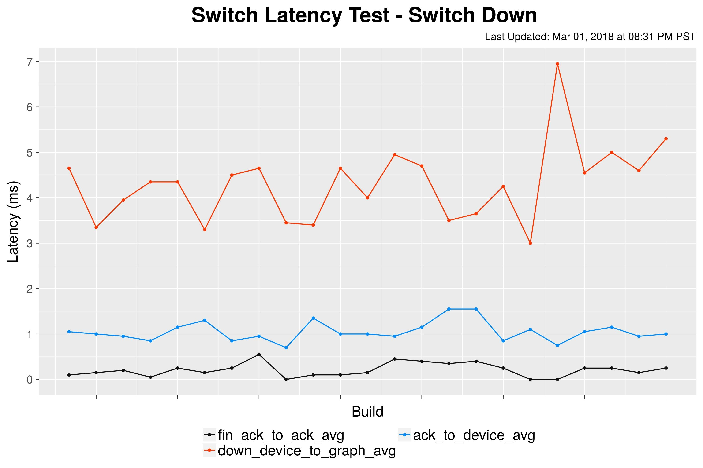

### [Port Latency](1.10-performance-and-scale-out/1.10-experiment-ab-topology-switch-link-event-latency.md) - Last 50 builds PortUp and PortDown Latency test  (5-node cluster):

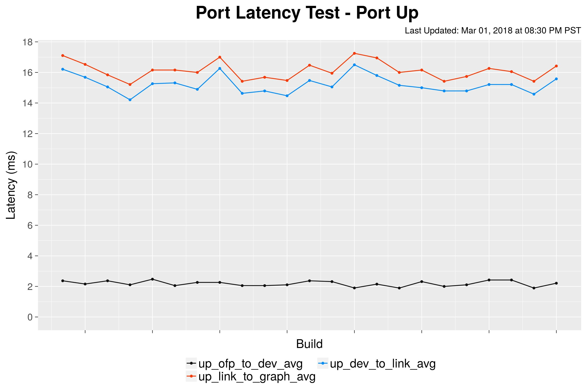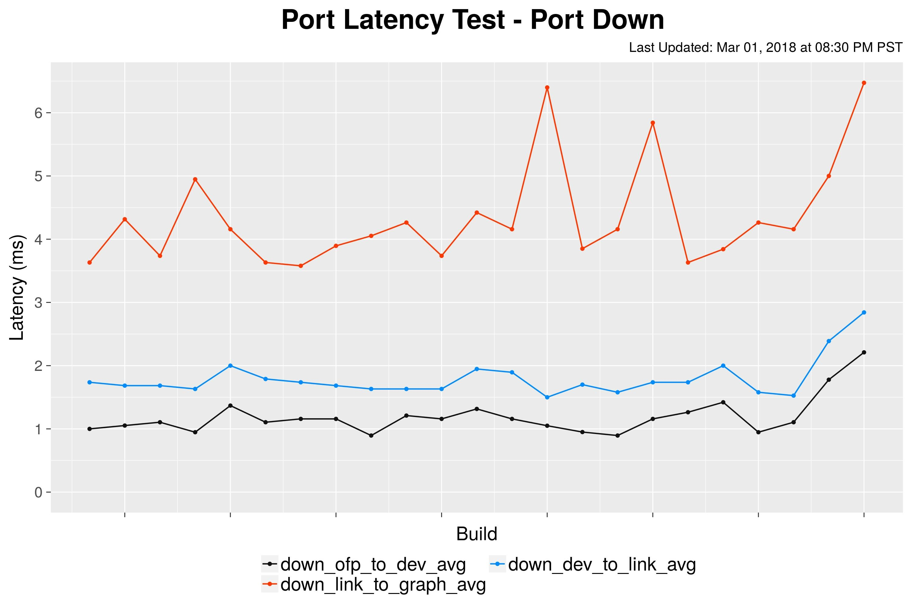

### [Intent Latency](1.10-performance-and-scale-out/1.10-experiment-c-intent-installremovere-route-latency.md) - Last 50 builds IntentInstallLat, IntentWithdrawLat and IntentRerouteLat (5-node cluster; 100 intents as batch size):

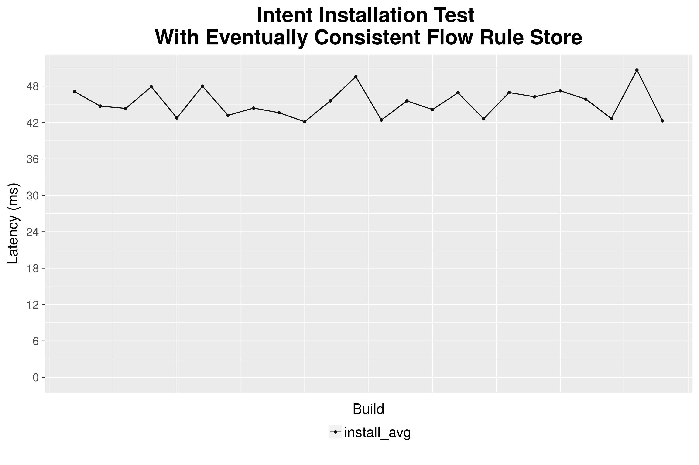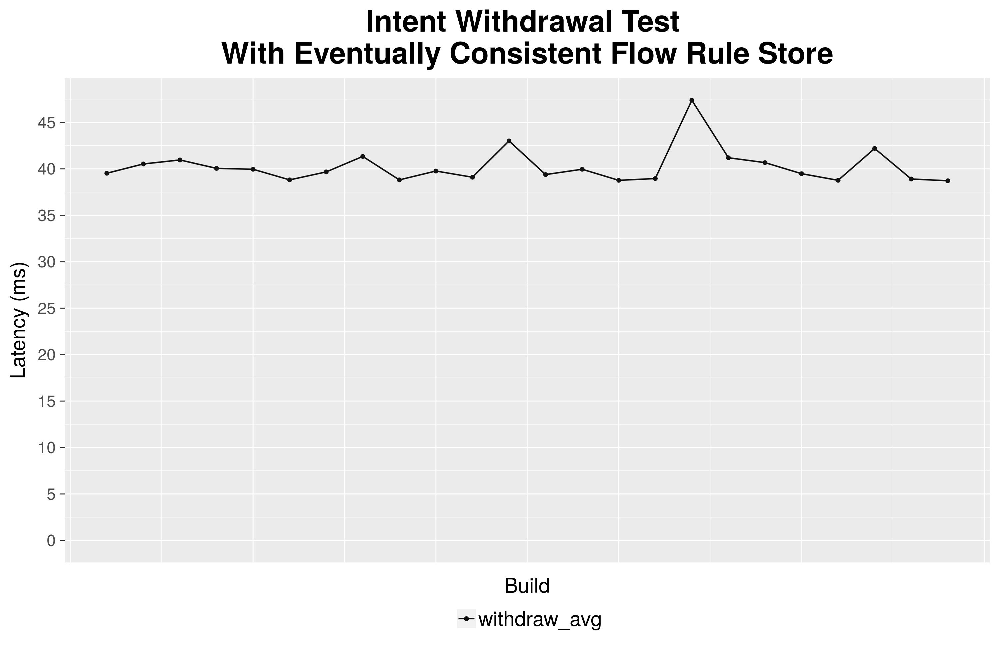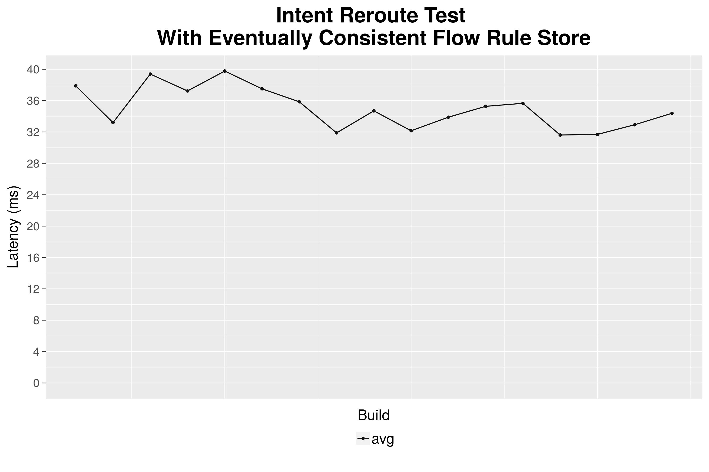

### [Intent Throughput](https://wiki.onosproject.org/display/ONOS/1.10%253A+Experiment+D+-+Intents+Operations+Throughput) - Last 50 builds "IntentEventTP" test (5-node cluster):

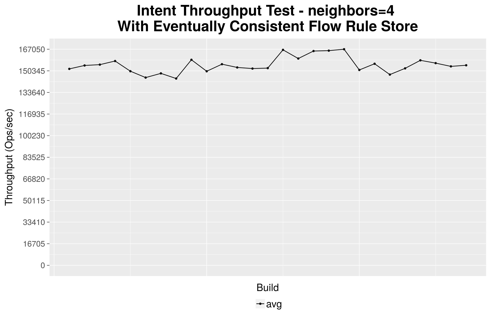

### [Scale Topo Test](https://wiki.onosproject.org/display/ONOS/1.10%253A+Experiment+E+-+Topology+Scaling+Operation) - Last 50 builds "scaleTopo" test (3-node cluster with scale = 20)

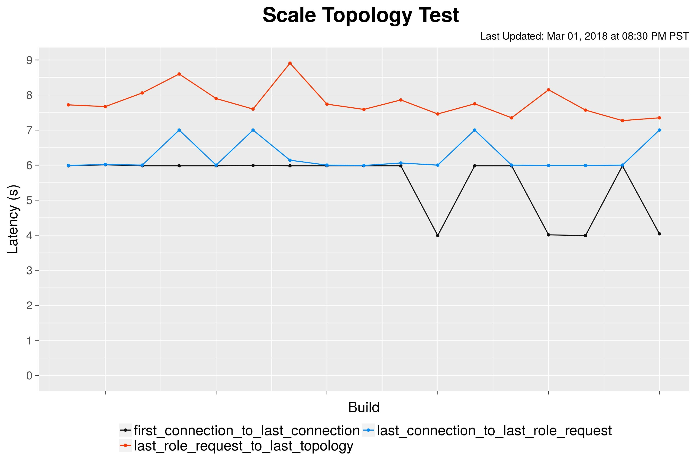

### [Flow Throughput](https://wiki.onosproject.org/display/ONOS/1.10%253A+Experiment+F+-+Flow+Subsystem+Burst+Throughput) - Last 50 builds "flowTP1g" tests (5-node cluster with neighbors=4)

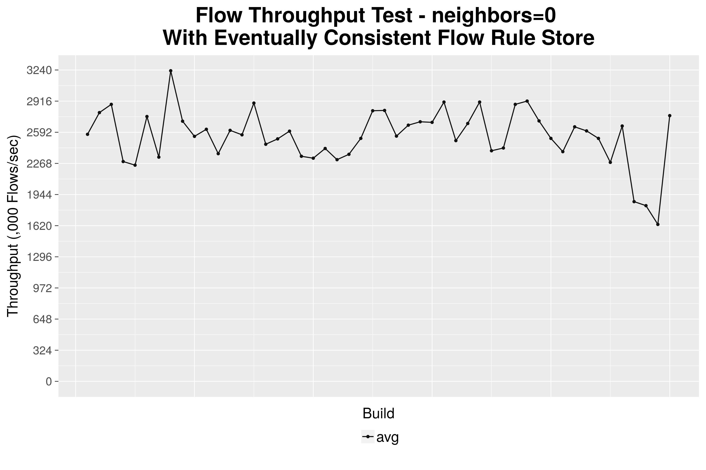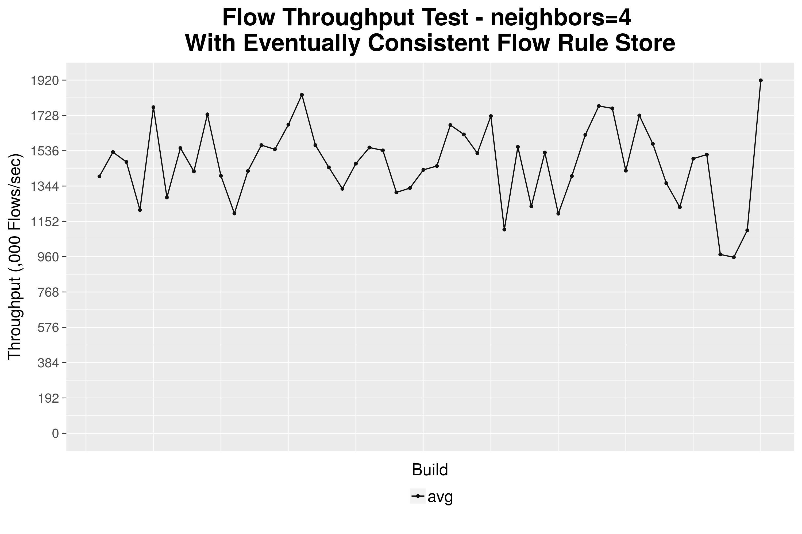

### [Cbench](https://wiki.onosproject.org/display/ONOS/1.10%253A+Experiment+G+-+Single-node+ONOS+Cbench) - Last 50 builds "CbenchBM" (single-node, throughput mode):

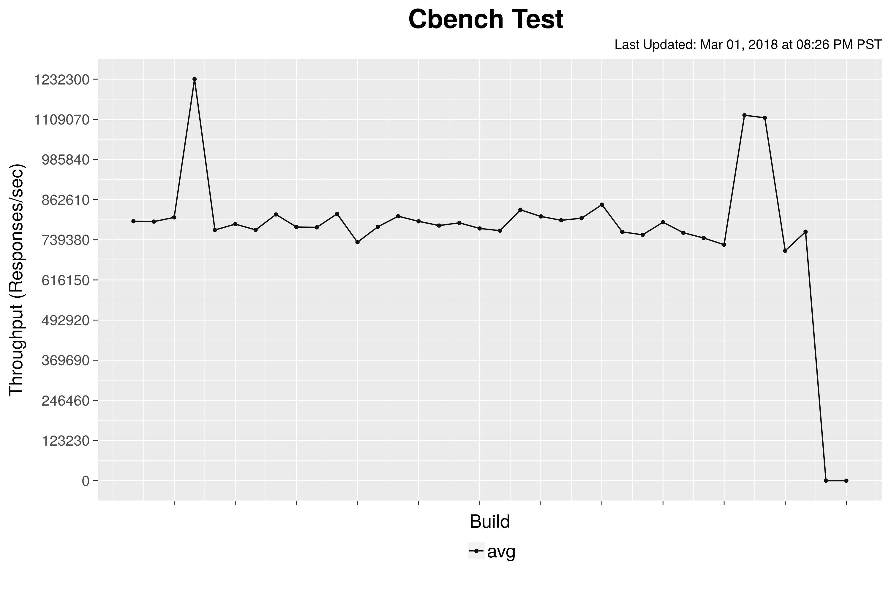

### [Single Bench Flow Latency Test](https://wiki.onosproject.org/display/ONOS/1.10%253A+Experiment+I+-+Single+Bench+Flow+Latency+Test) - Last 50 builds SingleBenchFlow Latency test:

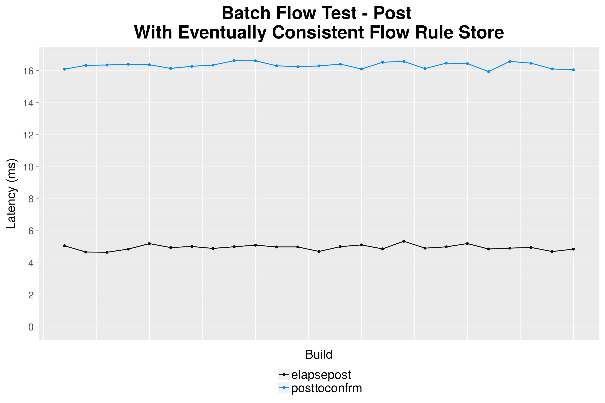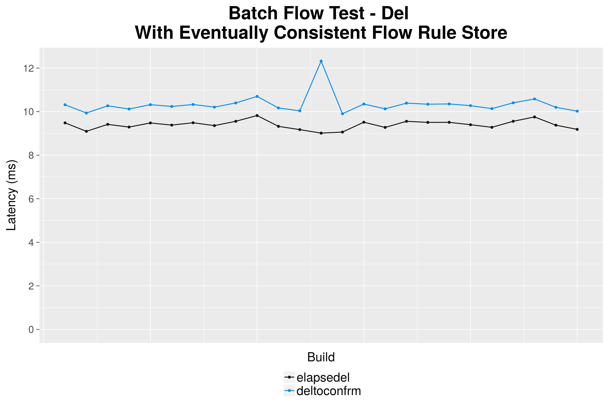

### [Host Add Latency](https://wiki.onosproject.org/display/ONOS/1.10%253A+Experiment+L+-+Host+Add+Latency) - Last 50 builds HostAdd Latency test  (5-node cluster):

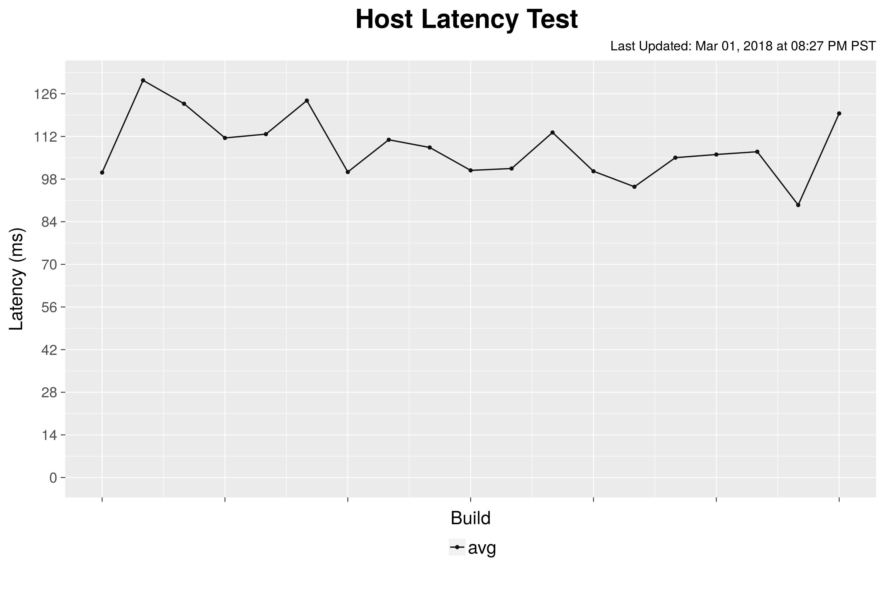
