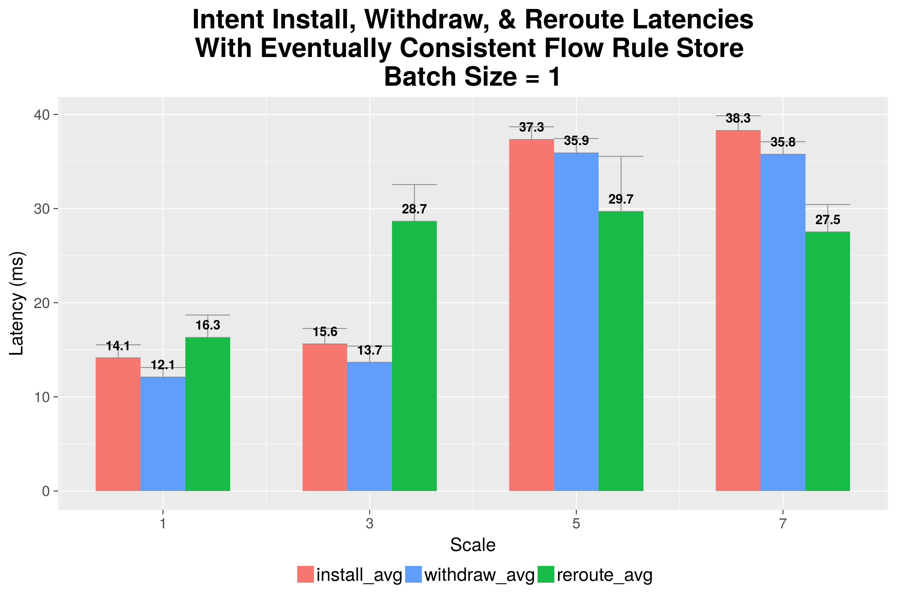
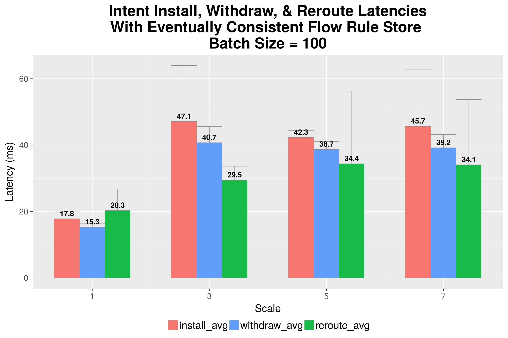
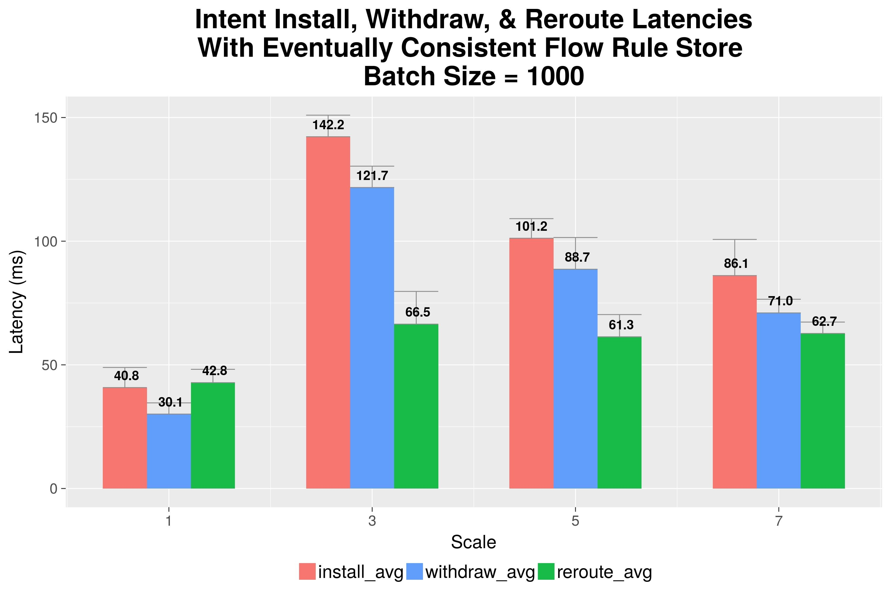
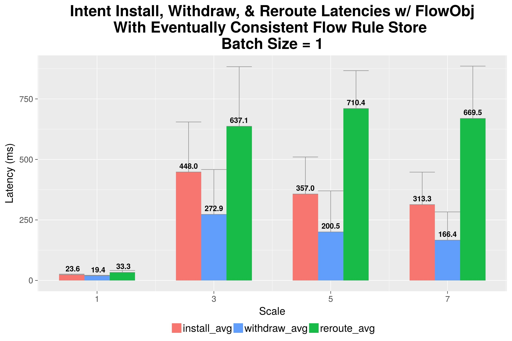
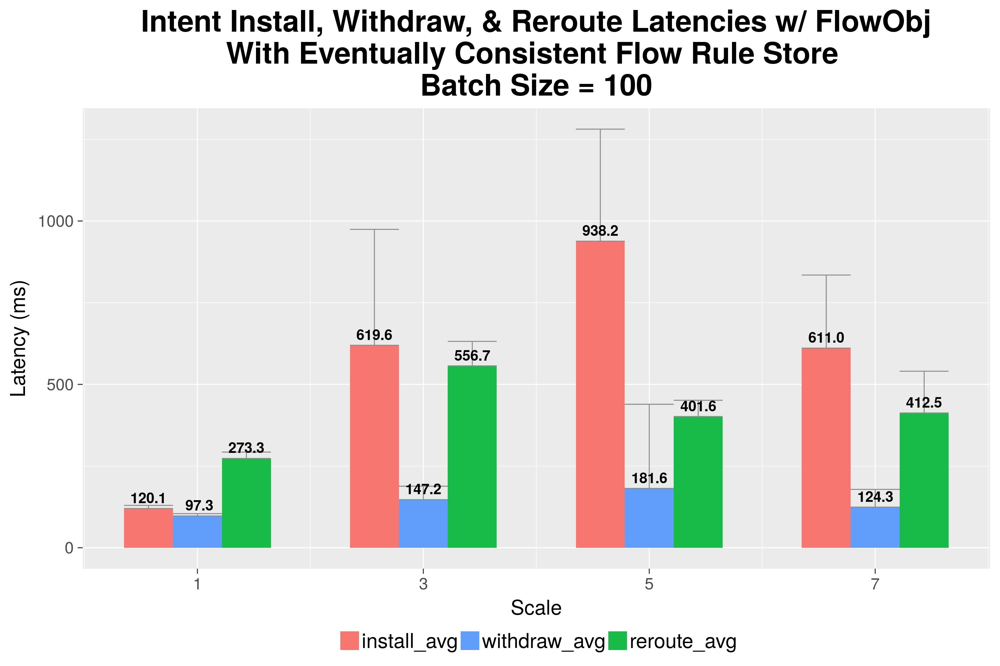
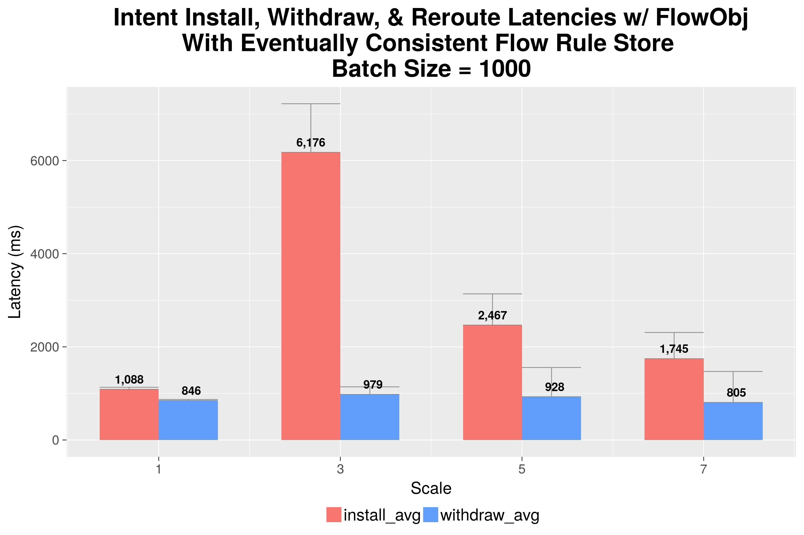

# 1.10: Experiment C - Intent Install/Remove/Re-route Latency

System Env:

* Server: Dual XeonE5-2670 v2 2.5GHz; 64GB DDR3; 512GB SSD
* 1Gbps NIC
* System clock precision is +/- 1 ms
* JAVA\_OPTS="${JAVA\_OPTS:--Xms8G -Xmx8G}"

ONOS Apps:

* drivers, null

ONOS Config:

* cfg set org.onosproject.net.intent.impl.compiler.IntentConfigurableRegistrator useFlowObjectives true (when using flow objective intents compiler)
* cfg set org.onosproject.net.intent.impl.compiler.IntentConfigurableRegistrator defaultFlowObjectiveCompiler org.onosproject.net.intent.impl.compiler.LinkCollectionIntentObjectiveCompiler (when using flow objective intents compiler)
* cfg set org.onosproject.net.intent.impl.IntentManager skipReleaseResourcesOnWithdrawal true

Test Procedure:

* Intent batch installed from ONOS1
* Record returned response time

Note: Error bars in the graphs below represent standard deviations.  Only the upper error bars are shown.

Intent Install and Withdraw:

Intent Reroute:

Intent Install and Withdraw with Flow Objectives:

Intent Reroute with Flow Objectives:

