# Kingfisher v.s. Blackbird

## Switch Up

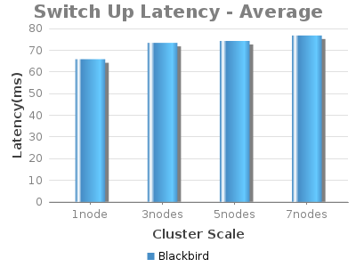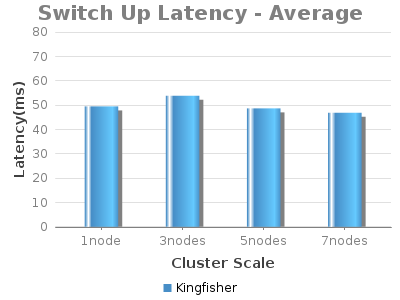

Switch Down

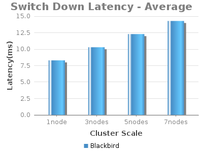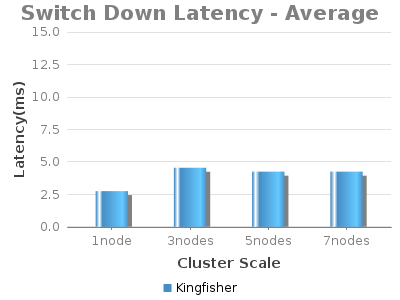

## Link Up

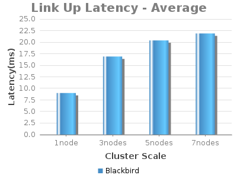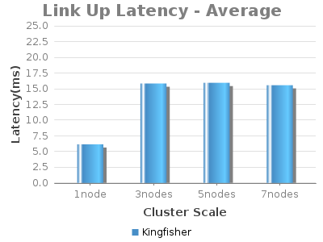

## Link Down

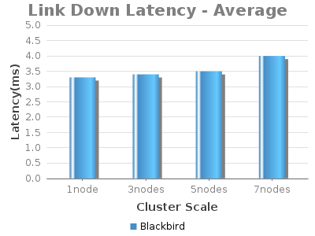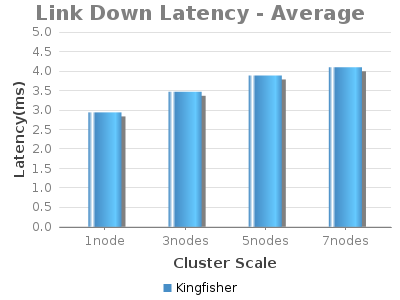

## Flow throughput

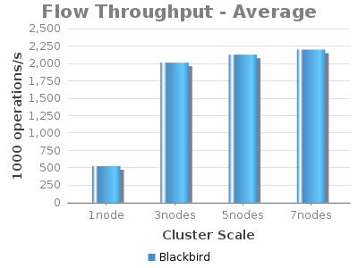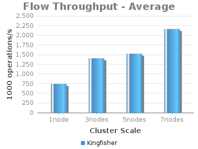

## Intent Installation

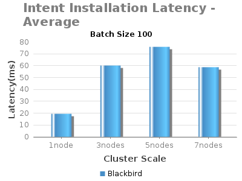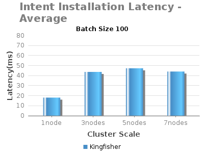

## Intent Withdrawal

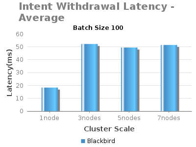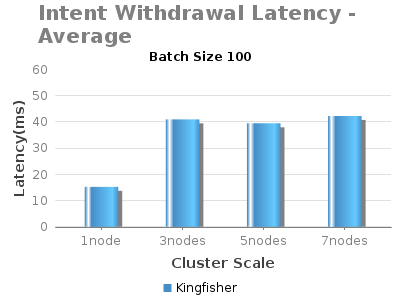

## Intent Reroute

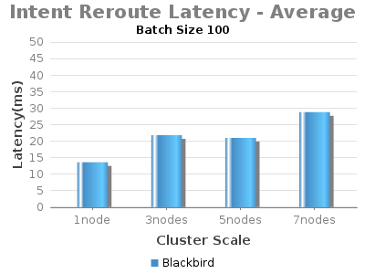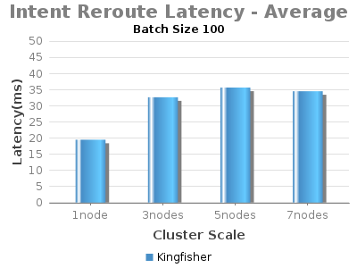

## Intent Throughput

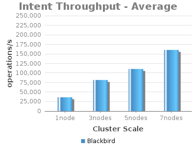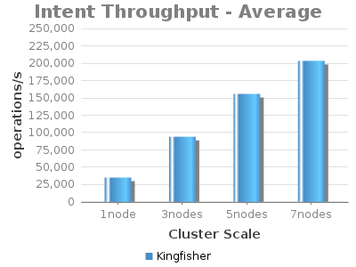
