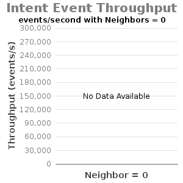
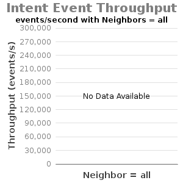

# 1.3-Experiment D - Intents Operation Throughput

Test Env:

* Server: Dual XeonE5-2670 v2 2.5GHz; 64GB DDR3; 512GB SSD
* 1Gbps NIC
* JAVA\_OPTS="${JAVA\_OPTS:--Xms8G -Xmx8G}"
* Note: Current testing has "cfg set org.onosproject.store.flow.impl.NewDistributedFlowRuleStore backupEnabled true".

