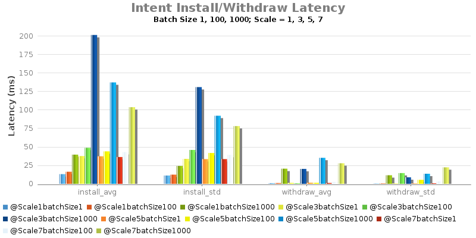
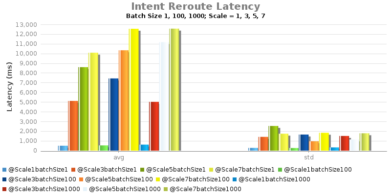

# 1.4-Experiment C - Intent Install/Remove/Re-route Latency

System Env:

* Server: Dual XeonE5-2670 v2 2.5GHz; 64GB DDR3; 512GB SSD
* 1Gbps NIC
* System clock precision is +/- 1 ms
* JAVA\_OPTS="${JAVA\_OPTS:--Xms8G -Xmx8G}"

Test Procedure:

* Intent batch installed from ONOS1
* Record returned response time

| branch | commit | build | date |
| --- | --- | --- | --- |
| onos-1.4 | 4f4d25a4b829d8a9eacff3dafd13358855f011dc | 354 | 2015-12-17 06:53:10.0 |

| branch | commit | build | date |
| --- | --- | --- | --- |
| onos-1.4 | 4f4d25a4b829d8a9eacff3dafd13358855f011dc | 371 | 2015-12-17 06:16:52.0 |

