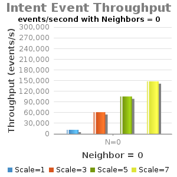
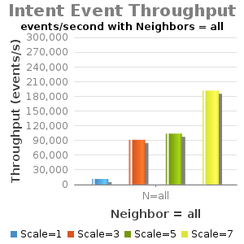

# 1.4-Experiment D - Intents Operations Throughput

Test Env:

* Server: Dual XeonE5-2670 v2 2.5GHz; 64GB DDR3; 512GB SSD
* 1Gbps NIC
* JAVA\_OPTS="${JAVA\_OPTS:--Xms8G -Xmx8G}"
* Note: Current testing has "cfg set org.onosproject.store.flow.impl.NewDistributedFlowRuleStore backupEnabled true".

| branch | commit | build | date |
| --- | --- | --- | --- |
| onos-1.4 | 1684b00a21a3f16a39f06bd16725e720d78a056e | 409 | 2015-12-18 09:16:01.0 |

