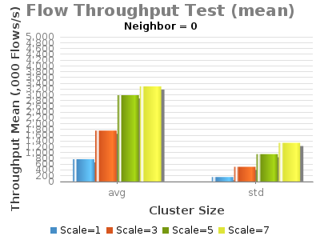
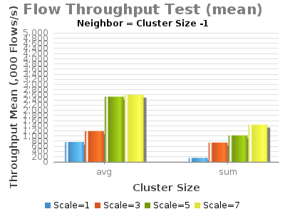

# 1.4-Experiment F - Flow Subsystem Burst Throughput

System Env:

* Server: Dual XeonE5-2670 v2 2.5GHz; 64GB DDR3; 512GB SSD
* 1Gbps NIC
* JAVA\_OPTS="${JAVA\_OPTS:--Xms8G -Xmx8G}"

* (no Hazelcast updateBackup flow rules)

"Constant-Load" Test Conditions:

* F = 122500 - total # of flows installed
* N: # of neighboring ONOS's for flows to be installed when ONOS1 is the server installing flows
* S: #servers installing flows
* SW = 35 - total # of switches (Null Devices) connected to ONOS cluster evenly distributed to active ONOS nodes
* FL: # flows to be installed on each switch

Command: python3 $ONOS\_ROOT/tools/tests/bin/flow-tester.py -f FL -n N -s servers

Note: Current testing has "cfg set org.onosproject.store.flow.impl.NewDistributedFlowRuleStore backupEnabled true".

 

| branch | commit | build | date |
| --- | --- | --- | --- |
| onos-1.4 | 1684b00a21a3f16a39f06bd16725e720d78a056e | 403 | 2015-12-18 08:06:37.0 |

 

