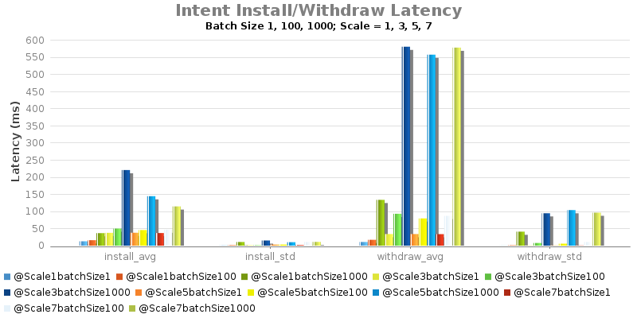
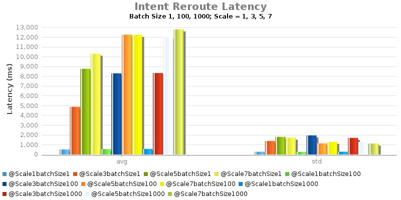

# 1.5: Experiment C - Intent Install/Remove/Re-route Latency

System Env:

* Server: Dual XeonE5-2670 v2 2.5GHz; 64GB DDR3; 512GB SSD
* 1Gbps NIC
* System clock precision is +/- 1 ms
* JAVA\_OPTS="${JAVA\_OPTS:--Xms8G -Xmx8G}"

Test Procedure:

* Intent batch installed from ONOS1
* Record returned response time

| branch | commit | build | date |
| --- | --- | --- | --- |
| onos-1.5 | 37050d98011571acd44f50b805b304dd0decdcda | 464 | 2016-03-27 13:20:36.0 |

| branch | commit | build | date |
| --- | --- | --- | --- |
| onos-1.5 | 99252f0dad5746e7b0f38f1aa234e95af1a3004a | 459 | 2016-03-18 18:06:22.0 |

