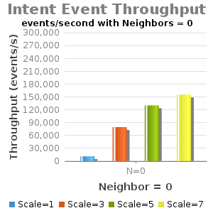
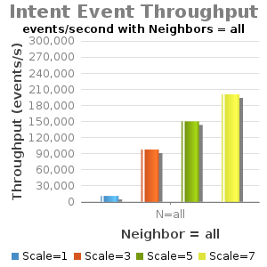

# 1.5: Experiment D - Intents Operations Throughput

Test Env:

* Server: Dual XeonE5-2670 v2 2.5GHz; 64GB DDR3; 512GB SSD
* 1Gbps NIC
* JAVA\_OPTS="${JAVA\_OPTS:--Xms8G -Xmx8G}"
* Note: Current testing has "cfg set org.onosproject.store.flow.impl.NewDistributedFlowRuleStore backupEnabled true";
* Note: Current testing has "cfg org.onosproject.net.intent.impl.IntentManager successfully set to skipReleaseResourcesOnWithdrawal true";

| branch | commit | build | date |
| --- | --- | --- | --- |
| onos-1.5 | 37050d98011571acd44f50b805b304dd0decdcda | 582 | 2016-03-27 12:43:11.0 |

