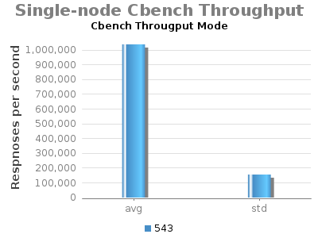

# 1.5: Experiment G - Single-node ONOS Cbench

System Env:

* Server: Dual XeonE5-2670 v2 2.5GHz; 64GB DDR3; 512GB SSD
* 1Gbps NIC
* JAVA\_OPTS="${JAVA\_OPTS:--Xms8G -Xmx8G}"

* (no Hazelcast updateBackup flow rules)

Command: cbench command: cbench -c localhost -p 6633 -m 1000 -l 70 -s 16 -M 100000 -w 10 -D 5000 -t

Note: Current testing has "cfg set org.onosproject.fwd.ReactiveForwarding packetOutOnly true".

| branch | commit | build | date |
| --- | --- | --- | --- |
| onos-1.5 | 99252f0dad5746e7b0f38f1aa234e95af1a3004a | 543 | 2016-03-20 08:15:00.0 |

 

