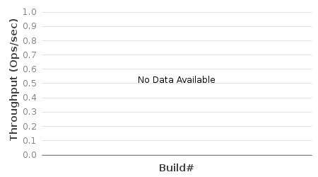
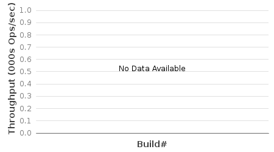
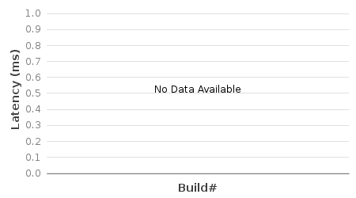
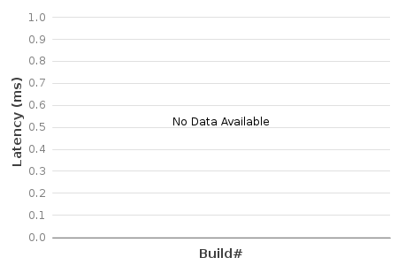
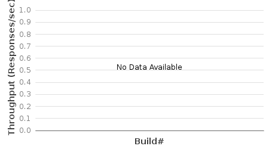

# 1.6-Performance and Scale-out

## Results at a Glance:

The purpose of this page is to track performance trend and regression through the last 20 Jenkins builds(nightly) on a subset of the full performance evaluation metrics. Refer to the regular performance test plans for test methodologies. Child pages have the full result details on the latest build. Note that results in this tracking can fluctuate from build to build, due to various of experiments and changes made in onos.

### Intent Throughput - Last 20 builds "IntentEventTP" test (5-node cluster with neighbors=4):

```
Note: Starting from build #81, NewDistributedFlowRuleStore is used and backup is enabled.
```



### Flow Throughput - Last 20 builds "flowTP1g" tests (5-node cluster with neighbors=4):

```
Note: Starting from build #90, NewDistributedFlowRuleStore is used and backup is enabled.
```



### Intent Re-route Latency - Last 20 builds "IntentRerouteLat" (5-node cluster; 100 intents as batch size):

```
Note: Starting from build #29, NewDistributedFlowRuleStore is used and backup is enabled.
```



### 

### Switch-up Latency - Last 20 builds SwitchUp Latency test  (5-node cluster):



### Cbench - Last 20 builds "CbenchBM" (single-node, throughput mode):

cbench command: cbench -c localhost -p 6633 -m 1000 -l 20 -s 16 -M 100000 -w 10 -D 5000 -t


